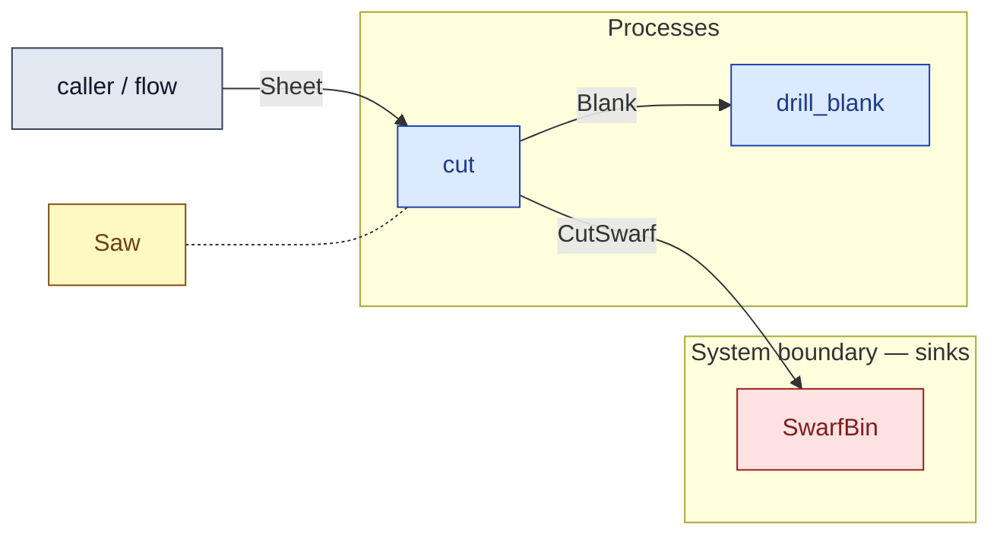

# `cut` — process (R1)

> Generated by `tools/docgen.sh` from `model/cs4-line` — **do not hand-edit**; regenerate after any model change. Links are into the defining source lines; Mermaid nodes carry absolute click urls, the legend table the same links as plain markdown.

**P2 — cut a sheet (SPEC §5): one 5000 g sheet becomes two 2250 g blanks, with the 500 g of cut swarf fed to the line's bin **inside the process** (REQ-020's collection).**

- **Crate / subsystem:** `cs4-line` — case study CS-4, the production-line subsystem
- **Source:** [model/cs4-line/src/processes.rs#L34](/model/cs4-line/src/processes.rs#L34)

## Who and with what

No person in this signature: any time cost is drawn by an **adjacent** draw process in the flow (R15/F-048), or the step needs no actor.

Reusables threaded — moved in and returned (R2): `saw: Saw`.

## Inputs

| Parameter | Declared type | Resource kind | Unit | Magnitude |
|---|---|---|---|---|
| `saw` | `Saw` | reusable (R2) | — | — |
| `sheet` | `Sheet<SHEET_G>` | continuous (container, R15) | grams | SHEET_G = 5000 |
| `bin` | consumer of CutSwarf (sink `SwarfBin`) | boundary object (R12) | — | — |

## Outputs

| Output | Resource kind | Unit | Magnitude | Routing (who takes it) |
|---|---|---|---|---|
| `Saw` | reusable (R2) | — | — | moved in and returned (R2) |
| `Blank<BLANK_G>` | continuous (container, R15) | grams | BLANK_G = 2250 | `drill_blank` (process) |
| `Blank<BLANK_G>` | continuous (container, R15) | grams | BLANK_G = 2250 | `drill_blank` (process) |
| `BinC::Next` | — | — | — | the same boundary object, returned in its advanced state (R2/R12) |

Waste routed **inside** this process (never loose in a flow):

- `bin` is a consumer parameter: **CutSwarf** is handed to `SwarfBin` **inside this process** (Consumer/ConsumeList bound, R12) — [model/cs4-line/src/resources.rs#L57](/model/cs4-line/src/resources.rs#L57)

## Balances (R1/R3/R15)

- **Inherited by composition:** this step calls [`shear_sheet`](/model/cs4-stores/src/resources.rs#L798), whose conservation asserts fire at every instantiation here (F-001):
  - `A + B + SW == SHEET`

## Where it fits (R9: needs / feeds)

The model states **connections, not sequences**: any order satisfying these dependencies is valid (R9).

**Needs:**

- **Sheet** from `caller / flow` (flow input/output)
- `Saw` (shared resource) — threaded through, returned (R2)

**Feeds:**

- **Blank** to `drill_blank` (process)
- **CutSwarf** to `SwarfBin` (boundary sink)

## Neighbourhood (one hop)

### Legend — node → source

| Node | Kind | Defined at |
|---|---|---|
| `n_cut` (cut) | process | [model/cs4-line/src/processes.rs#L34](/model/cs4-line/src/processes.rs#L34) |
| `n_drill_blank` (drill_blank) | process | [model/cs4-line/src/processes.rs#L48](/model/cs4-line/src/processes.rs#L48) |
| `n_caller` (caller / flow) | flow input/output | — |
| `n_Saw` (Saw) | shared resource | [model/cs4-line/src/resources.rs#L24](/model/cs4-line/src/resources.rs#L24) |
| `n_SwarfBin` (SwarfBin) | boundary sink | [model/cs4-line/src/resources.rs#L57](/model/cs4-line/src/resources.rs#L57) |
