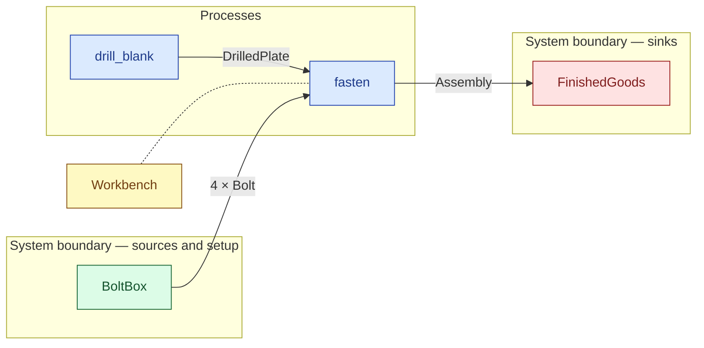

# `fasten` — process (R1)

> Generated by `tools/docgen.sh` from `model/cs4-line` — **do not hand-edit**; regenerate after any model change. Links are into the defining source lines; Mermaid nodes carry absolute click urls, the legend table the same links as plain markdown.

**P4 — fasten an assembly (SPEC §5): two drilled plates and four bolts taken from ONE supplier in a single `SupplyN<N4>` bound (R12, F-014) become one 4600 g assembly (2 × 2240 + 4 × 30, const-asserted inside the stores transform `join_assembly`).**

- **Crate / subsystem:** `cs4-line` — case study CS-4, the production-line subsystem
- **Source:** [model/cs4-line/src/processes.rs#L69](/model/cs4-line/src/processes.rs#L69)
- **Requirements bound on the signature:** REQ-019, REQ-021

## Who and with what

No person in this signature: any time cost is drawn by an **adjacent** draw process in the flow (R15/F-048), or the step needs no actor.

Reusables threaded — moved in and returned (R2): `bench: Workbench`.

Boundary objects used:

- `bolts` supplies **4 × Bolt** from `BoltBox` — [model/cs4-stores/src/resources.rs#L347](/model/cs4-stores/src/resources.rs#L347) (SupplyN bound, R12)

## Inputs

| Parameter | Declared type | Resource kind | Unit | Magnitude |
|---|---|---|---|---|
| `bench` | `Workbench` | reusable (R2) | — | — |
| `a` | `DrilledPlate<PLATE_G>` | continuous (container, R15) | grams | PLATE_G = 2240 |
| `b` | `DrilledPlate<PLATE_G>` | continuous (container, R15) | grams | PLATE_G = 2240 |
| `bolts` | supplier of 4 × Bolt | boundary object (R12) | — | — |
| `note` | `PN` → `IssueNote` (via the requirement bound) | discrete (consumable, R13) | — | — |

## Outputs

| Output | Resource kind | Unit | Magnitude | Routing (who takes it) |
|---|---|---|---|---|
| `Workbench` | reusable (R2) | — | — | moved in and returned (R2) |
| `Assembly<B, ASSEMBLY_G>` | discrete (consumable, R13) | — | ASSEMBLY_G = 4600 | `FinishedGoods` (boundary sink) |
| `S::Rest` | — | — | — | the same boundary object, returned in its advanced state (R2/R12) |
| `PN` | — | — | — | moved in and returned (R2) |

## Balances (R1/R3/R15)

- **Inherited by composition:** this step calls [`join_assembly`](/model/cs4-stores/src/resources.rs#L867), whose conservation asserts fire at every instantiation here (F-001):
  - `PA + PB + 4 * BOLT_G == OUT`

## Requirements (R10 — the compliance matrix)

| Requirement | Statement | Defined at | Satisfied by | Verified by |
|---|---|---|---|---|
| REQ-019 | Assemblies may be built only from stores-issued materials (provenance: the line cannot mint or source materials itself - enforced by the crate boundary). | [model/cs4-stores/src/requirements.rs#L36](/model/cs4-stores/src/requirements.rs#L36) | `IssuedBolt` | [`one_cycle_of_the_recursion_builds_one_assembly`](/model/cs4-line/src/batch.rs#L232), [`fasten_takes_four_bolts_and_returns_the_note`](/model/cs4-line/src/processes.rs#L127), [`the_batch_ends_fully_accounted`](/model/cs4-line/tests/flows.rs#L34), [`ui`](/model/cs4-line/tests/trybuild.rs#L20) |
| REQ-021 | The line may operate only against a current stores issue note (the subsystem interface evidence, threaded through the batch and reconciled at the end). | [model/cs4-stores/src/requirements.rs#L50](/model/cs4-stores/src/requirements.rs#L50) | `CurrentIssueNote` | [`one_cycle_of_the_recursion_builds_one_assembly`](/model/cs4-line/src/batch.rs#L232), [`fasten_takes_four_bolts_and_returns_the_note`](/model/cs4-line/src/processes.rs#L127), [`the_batch_ends_fully_accounted`](/model/cs4-line/tests/flows.rs#L34), [`ui`](/model/cs4-line/tests/trybuild.rs#L20) |

This item is doc-tagged `Satisfies: REQ-019, REQ-021`.

## Where it fits (R9: needs / feeds)

The model states **connections, not sequences**: any order satisfying these dependencies is valid (R9).

**Needs:**

- **4 × Bolt** from `BoltBox` (boundary source)
- **DrilledPlate** from `drill_blank` (process)
- `Workbench` (shared resource) — threaded through, returned (R2)

**Feeds:**

- **Assembly** to `FinishedGoods` (boundary sink)

## Neighbourhood (one hop)

### Legend — node → source

| Node | Kind | Defined at |
|---|---|---|
| `n_drill_blank` (drill_blank) | process | [model/cs4-line/src/processes.rs#L48](/model/cs4-line/src/processes.rs#L48) |
| `n_fasten` (fasten) | process | [model/cs4-line/src/processes.rs#L69](/model/cs4-line/src/processes.rs#L69) |
| `n_FinishedGoods` (FinishedGoods) | boundary sink | [model/cs4-stores/src/resources.rs#L475](/model/cs4-stores/src/resources.rs#L475) |
| `n_Workbench` (Workbench) | shared resource | [model/cs4-line/src/resources.rs#L38](/model/cs4-line/src/resources.rs#L38) |
| `n_BoltBox` (BoltBox) | boundary source | [model/cs4-stores/src/resources.rs#L347](/model/cs4-stores/src/resources.rs#L347) |
