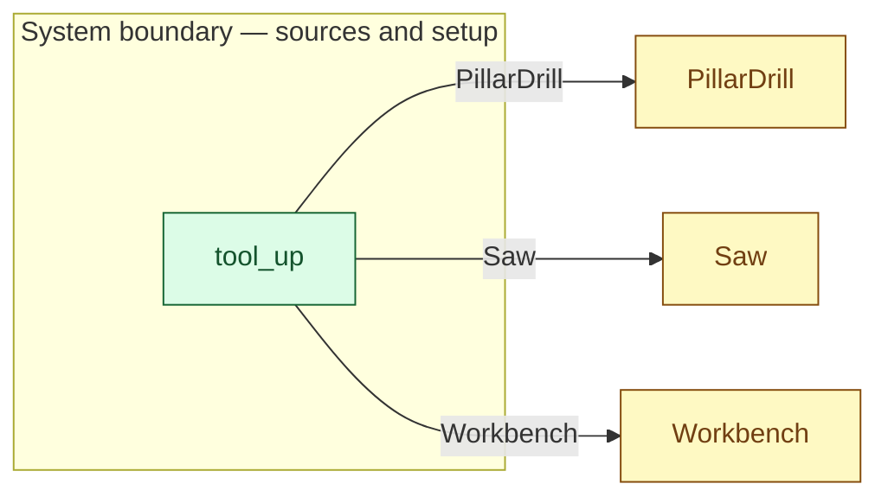

# `tool_up` — boundary function (R12)

> Generated by `tools/docgen.sh` from `model/cs4-line` — **do not hand-edit**; regenerate after any model change. Links are into the defining source lines; Mermaid nodes carry absolute click urls, the legend table the same links as plain markdown.

**The line's three reusable tools enter the model at shift start (R2, R12; SPEC §4).**

- **Crate / subsystem:** `cs4-line` — case study CS-4, the production-line subsystem
- **Source:** [model/cs4-line/src/resources.rs#L128](/model/cs4-line/src/resources.rs#L128)
- **Placeholder:** tool stores — one saw, one pillar drill, one workbench.

## Who and with what

No person in this signature: any time cost is drawn by an **adjacent** draw process in the flow (R15/F-048), or the step needs no actor.

## Inputs

| Parameter | Declared type | Resource kind | Unit | Magnitude |
|---|---|---|---|---|

## Outputs

| Output | Resource kind | Unit | Magnitude | Routing (who takes it) |
|---|---|---|---|---|
| `Saw` | reusable (R2) | — | — | `Saw` (shared resource) |
| `PillarDrill` | reusable (R2) | — | — | `PillarDrill` (shared resource) |
| `Workbench` | reusable (R2) | — | — | `Workbench` (shared resource) |

Observed leaving this step in the traced flows: `PillarDrill`, `Saw`, `Workbench`.

## Where it fits (R9: needs / feeds)

The model states **connections, not sequences**: any order satisfying these dependencies is valid (R9).

**Feeds:**

- **PillarDrill** to `PillarDrill` (shared resource)
- **Saw** to `Saw` (shared resource)
- **Workbench** to `Workbench` (shared resource)

## Neighbourhood (one hop)

### Legend — node → source

| Node | Kind | Defined at |
|---|---|---|
| `n_PillarDrill` (PillarDrill) | shared resource | [model/cs4-line/src/resources.rs#L31](/model/cs4-line/src/resources.rs#L31) |
| `n_tool_up` (tool_up) | boundary source | [model/cs4-line/src/resources.rs#L128](/model/cs4-line/src/resources.rs#L128) |
| `n_Saw` (Saw) | shared resource | [model/cs4-line/src/resources.rs#L24](/model/cs4-line/src/resources.rs#L24) |
| `n_Workbench` (Workbench) | shared resource | [model/cs4-line/src/resources.rs#L38](/model/cs4-line/src/resources.rs#L38) |

## Open items (`Placeholder:` tags, R12)

- this function is itself a placeholder (see the header above)
