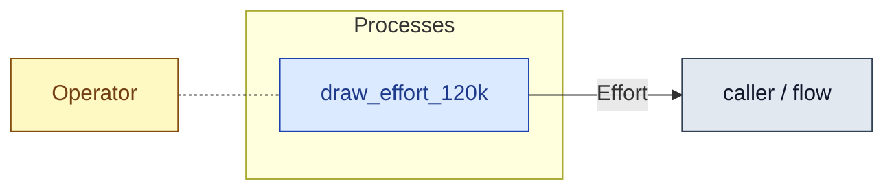

# `draw_effort_120k` — process (R1)

> Generated by `tools/docgen.sh` from `model/cs4-stores` — **do not hand-edit**; regenerate after any model change. Links are into the defining source lines; Mermaid nodes carry absolute click urls, the legend table the same links as plain markdown.

**Draws four quanta (120 000 ms): the stores-window spend of P1 and P6 (SPEC §5).**

- **Crate / subsystem:** `cs4-stores` — case study CS-4, the stores subsystem
- **Source:** [model/cs4-stores/src/resources.rs#L942](/model/cs4-stores/src/resources.rs#L942)

## Who and with what

No person in this signature: any time cost is drawn by an **adjacent** draw process in the flow (R15/F-048), or the step needs no actor.

Boundary objects used:

- `operator`: `Operator` (boundary object (R12)), threaded by value (R2) — [model/cs4-stores/src/resources.rs#L435](/model/cs4-stores/src/resources.rs#L435)

## Inputs

| Parameter | Declared type | Resource kind | Unit | Magnitude |
|---|---|---|---|---|
| `operator` | `Operator<Succ<Succ<Succ<Succ<Q>>>>>` | boundary object (R12) | — | — |

## Outputs

| Output | Resource kind | Unit | Magnitude | Routing (who takes it) |
|---|---|---|---|---|
| `Effort<120_000>` | continuous (container, R15) | person-milliseconds | 120000 | `caller / flow` (flow input/output) |
| `Operator<Q>` | boundary object (R12) | — | — | moved in and returned (R2) |

## Where it fits (R9: needs / feeds)

The model states **connections, not sequences**: any order satisfying these dependencies is valid (R9).

**Needs:**

- `Operator` (shared resource) — threaded through, returned (R2)

**Feeds:**

- **Effort** to `caller / flow` (flow input/output)

## Neighbourhood (one hop)

### Legend — node → source

| Node | Kind | Defined at |
|---|---|---|
| `n_draw_effort_120k` (draw_effort_120k) | process | [model/cs4-stores/src/resources.rs#L942](/model/cs4-stores/src/resources.rs#L942) |
| `n_caller` (caller / flow) | flow input/output | — |
| `n_Operator` (Operator) | shared resource | [model/cs4-stores/src/resources.rs#L435](/model/cs4-stores/src/resources.rs#L435) |
