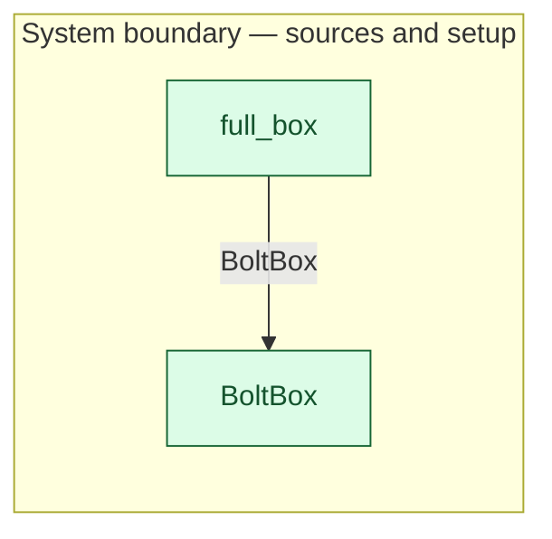

# `full_box` — boundary function (R12)

> Generated by `tools/docgen.sh` from `model/cs4-stores` — **do not hand-edit**; regenerate after any model change. Links are into the defining source lines; Mermaid nodes carry absolute click urls, the legend table the same links as plain markdown.

**A full 100-bolt box comes into existence — P1's fill (R1, R12).**

- **Crate / subsystem:** `cs4-stores` — case study CS-4, the stores subsystem
- **Source:** [model/cs4-stores/src/resources.rs#L640](/model/cs4-stores/src/resources.rs#L640)

## Who and with what

No person in this signature: any time cost is drawn by an **adjacent** draw process in the flow (R15/F-048), or the step needs no actor.

## Inputs

| Parameter | Declared type | Resource kind | Unit | Magnitude |
|---|---|---|---|---|

## Outputs

| Output | Resource kind | Unit | Magnitude | Routing (who takes it) |
|---|---|---|---|---|
| `FullBoltBox` | boundary object (R12) | — | — | `BoltBox` (boundary source) |

## Where it fits (R9: needs / feeds)

The model states **connections, not sequences**: any order satisfying these dependencies is valid (R9).

**Feeds:**

- **BoltBox** to `BoltBox` (boundary source)

## Neighbourhood (one hop)

### Legend — node → source

| Node | Kind | Defined at |
|---|---|---|
| `n_BoltBox` (BoltBox) | boundary source | [model/cs4-stores/src/resources.rs#L347](/model/cs4-stores/src/resources.rs#L347) |
| `n_full_box` (full_box) | boundary source | [model/cs4-stores/src/resources.rs#L640](/model/cs4-stores/src/resources.rs#L640) |

## Open items (`Placeholder:` tags, R12)

- `BoltBox` — stores fastener stock — goods-in out of scope (SPEC §1). ([model/cs4-stores/src/resources.rs#L347](/model/cs4-stores/src/resources.rs#L347))
