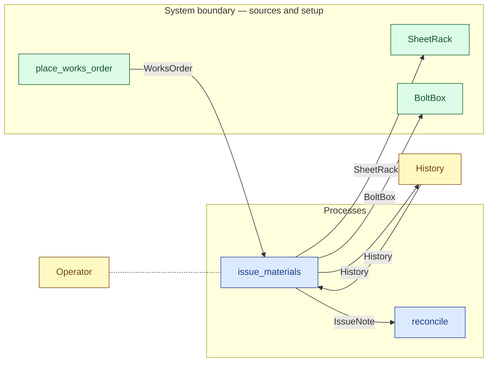

# `issue_materials` — process (R1)

> Generated by `tools/docgen.sh` from `model/cs4-stores` — **do not hand-edit**; regenerate after any model change. Links are into the defining source lines; Mermaid nodes carry absolute click urls, the legend table the same links as plain markdown.

**P1 — issue materials against the works order (SPEC §5).**

- **Crate / subsystem:** `cs4-stores` — case study CS-4, the stores subsystem
- **Source:** [model/cs4-stores/src/resources.rs#L961](/model/cs4-stores/src/resources.rs#L961)

## Who and with what

No person in this signature: any time cost is drawn by an **adjacent** draw process in the flow (R15/F-048), or the step needs no actor.

Boundary objects used:

- `operator`: `Operator` (boundary object (R12)), threaded by value (R2) — [model/cs4-stores/src/resources.rs#L435](/model/cs4-stores/src/resources.rs#L435)

## Inputs

| Parameter | Declared type | Resource kind | Unit | Magnitude |
|---|---|---|---|---|
| `order` | `WorksOrder` | discrete (consumable, R13) | — | — |
| `operator` | `Operator<Succ<Succ<Succ<Succ<Q>>>>>` | boundary object (R12) | — | — |
| `history` | `History` | execution record (model-core, R16) | — | — |

## Outputs

| Output | Resource kind | Unit | Magnitude | Routing (who takes it) |
|---|---|---|---|---|
| `FullSheetRack` | boundary object (R12) | — | — | `SheetRack` (boundary source) |
| `FullBoltBox` | boundary object (R12) | — | — | `BoltBox` (boundary source) |
| `IssueNote` | discrete (consumable, R13) | — | — | `reconcile` (process) |
| `Operator<Q>` | boundary object (R12) | — | — | moved in and returned (R2) |
| `History` | execution record (model-core, R16) | — | — | `History` (shared resource) |

## Requirements (R10 — the compliance matrix)

| Requirement | Statement | Defined at | Satisfied by | Verified by |
|---|---|---|---|---|

This item is doc-tagged `Satisfies: REQ-019, REQ-021`.

## Where it fits (R9: needs / feeds)

The model states **connections, not sequences**: any order satisfying these dependencies is valid (R9).

**Needs:**

- **History** from `History` (shared resource)
- **WorksOrder** from `place_works_order` (boundary source)
- `Operator` (shared resource) — threaded through, returned (R2)

**Feeds:**

- **BoltBox** to `BoltBox` (boundary source)
- **History** to `History` (shared resource)
- **IssueNote** to `reconcile` (process)
- **SheetRack** to `SheetRack` (boundary source)

**Used across the crate edge by (R1 subsystem decomposition):**

- `cs4-line`'s `run_batch` ([model/cs4-line/src/flows.rs#L72](/model/cs4-line/src/flows.rs#L72))

## Neighbourhood (one hop)

### Legend — node → source

| Node | Kind | Defined at |
|---|---|---|
| `n_issue_materials` (issue_materials) | process | [model/cs4-stores/src/resources.rs#L961](/model/cs4-stores/src/resources.rs#L961) |
| `n_reconcile` (reconcile) | process | [model/cs4-stores/src/resources.rs#L1021](/model/cs4-stores/src/resources.rs#L1021) |
| `n_History` (History) | shared resource | [model/model-core/src/history.rs#L158](/model/model-core/src/history.rs#L158) |
| `n_Operator` (Operator) | shared resource | [model/cs4-stores/src/resources.rs#L435](/model/cs4-stores/src/resources.rs#L435) |
| `n_place_works_order` (place_works_order) | boundary source | [model/cs4-stores/src/resources.rs#L602](/model/cs4-stores/src/resources.rs#L602) |
| `n_SheetRack` (SheetRack) | boundary source | [model/cs4-stores/src/resources.rs#L314](/model/cs4-stores/src/resources.rs#L314) |
| `n_BoltBox` (BoltBox) | boundary source | [model/cs4-stores/src/resources.rs#L347](/model/cs4-stores/src/resources.rs#L347) |

## Open items (`Placeholder:` tags, R12)

- `BoltBox` — stores fastener stock — goods-in out of scope (SPEC §1). ([model/cs4-stores/src/resources.rs#L347](/model/cs4-stores/src/resources.rs#L347))
- `SheetRack` — stores sheet stock — goods-in and procurement are out of ([model/cs4-stores/src/resources.rs#L314](/model/cs4-stores/src/resources.rs#L314))
