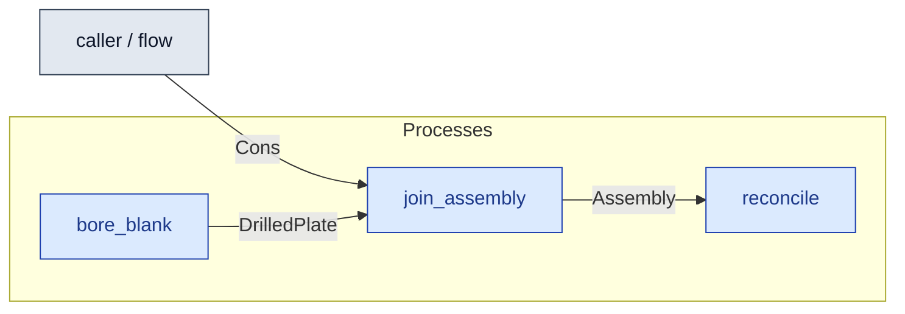

# `join_assembly` — process (R1)

> Generated by `tools/docgen.sh` from `model/cs4-stores` — **do not hand-edit**; regenerate after any model change. Links are into the defining source lines; Mermaid nodes carry absolute click urls, the legend table the same links as plain markdown.

**Joins two drilled plates and four stores-issued bolts into one assembly — the material transform inside the line's P4 (R1, R3, R13).**

- **Crate / subsystem:** `cs4-stores` — case study CS-4, the stores subsystem
- **Source:** [model/cs4-stores/src/resources.rs#L867](/model/cs4-stores/src/resources.rs#L867)
- **Requirements bound on the signature:** REQ-019

## Who and with what

No person in this signature: any time cost is drawn by an **adjacent** draw process in the flow (R15/F-048), or the step needs no actor.

## Inputs

| Parameter | Declared type | Resource kind | Unit | Magnitude |
|---|---|---|---|---|
| `a` | `DrilledPlate<PA>` | continuous (container, R15) | grams | `PA` (caller-stated) |
| `b` | `DrilledPlate<PB>` | continuous (container, R15) | grams | `PB` (caller-stated) |
| `bolts` | `FourOf<B>` | — | — | — |

## Outputs

| Output | Resource kind | Unit | Magnitude | Routing (who takes it) |
|---|---|---|---|---|
| `Assembly<B, OUT>` | discrete (consumable, R13) | — | `OUT` (caller-stated) | `reconcile` (process) |

## Balances (R1/R3/R15)

- **Compile-time assert:** `PA + PB + 4 * BOLT_G == OUT`
  - message: *mass conservation violated in join_assembly (R3, P4): the assembly must weigh exactly its two plates plus its four bolts (2 x 2240 + 4 x 30 = 4600)*
  - fires at monomorphization (F-001): `cargo build`/`cargo test` catch a violation; `cargo check` and editor diagnostics do not.

## Requirements (R10 — the compliance matrix)

| Requirement | Statement | Defined at | Satisfied by | Verified by |
|---|---|---|---|---|
| REQ-019 | Assemblies may be built only from stores-issued materials (provenance: the line cannot mint or source materials itself - enforced by the crate boundary). | [model/cs4-stores/src/requirements.rs#L36](/model/cs4-stores/src/requirements.rs#L36) | `IssuedBolt` | [`join_conserves_and_finished_goods_keeps_the_assembly`](/model/cs4-stores/src/resources.rs#L1146), [`issue_materials_issues_the_batch_stock`](/model/cs4-stores/src/resources.rs#L1194) |

This item is doc-tagged `Satisfies: REQ-019`.

## Where it fits (R9: needs / feeds)

The model states **connections, not sequences**: any order satisfying these dependencies is valid (R9).

**Needs:**

- **Cons** from `caller / flow` (flow input/output)
- **DrilledPlate** from `bore_blank` (process)

**Feeds:**

- **Assembly** to `reconcile` (process)

**Used across the crate edge by (R1 subsystem decomposition):**

- `cs4-line`'s `fasten` ([model/cs4-line/src/processes.rs#L69](/model/cs4-line/src/processes.rs#L69))

## Neighbourhood (one hop)

### Legend — node → source

| Node | Kind | Defined at |
|---|---|---|
| `n_bore_blank` (bore_blank) | process | [model/cs4-stores/src/resources.rs#L825](/model/cs4-stores/src/resources.rs#L825) |
| `n_join_assembly` (join_assembly) | process | [model/cs4-stores/src/resources.rs#L867](/model/cs4-stores/src/resources.rs#L867) |
| `n_reconcile` (reconcile) | process | [model/cs4-stores/src/resources.rs#L1021](/model/cs4-stores/src/resources.rs#L1021) |
| `n_caller` (caller / flow) | flow input/output | — |
