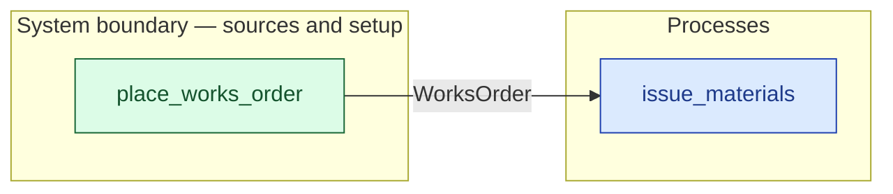

# `place_works_order` — boundary function (R12)

> Generated by `tools/docgen.sh` from `model/cs4-stores` — **do not hand-edit**; regenerate after any model change. Links are into the defining source lines; Mermaid nodes carry absolute click urls, the legend table the same links as plain markdown.

**The works order for the 25-unit batch enters the model (R12, SPEC §4).**

- **Crate / subsystem:** `cs4-stores` — case study CS-4, the stores subsystem
- **Source:** [model/cs4-stores/src/resources.rs#L602](/model/cs4-stores/src/resources.rs#L602)
- **Placeholder:** production planning — one order, quantity fixed by the

## Who and with what

No person in this signature: any time cost is drawn by an **adjacent** draw process in the flow (R15/F-048), or the step needs no actor.

## Inputs

| Parameter | Declared type | Resource kind | Unit | Magnitude |
|---|---|---|---|---|

## Outputs

| Output | Resource kind | Unit | Magnitude | Routing (who takes it) |
|---|---|---|---|---|
| `WorksOrder` | discrete (consumable, R13) | — | — | `issue_materials` (process) |

## Where it fits (R9: needs / feeds)

The model states **connections, not sequences**: any order satisfying these dependencies is valid (R9).

**Feeds:**

- **WorksOrder** to `issue_materials` (process)

**Used across the crate edge by (R1 subsystem decomposition):**

- `cs4-line`'s `run_batch` ([model/cs4-line/src/flows.rs#L72](/model/cs4-line/src/flows.rs#L72))

## Neighbourhood (one hop)

### Legend — node → source

| Node | Kind | Defined at |
|---|---|---|
| `n_issue_materials` (issue_materials) | process | [model/cs4-stores/src/resources.rs#L961](/model/cs4-stores/src/resources.rs#L961) |
| `n_place_works_order` (place_works_order) | boundary source | [model/cs4-stores/src/resources.rs#L602](/model/cs4-stores/src/resources.rs#L602) |

## Open items (`Placeholder:` tags, R12)

- this function is itself a placeholder (see the header above)
