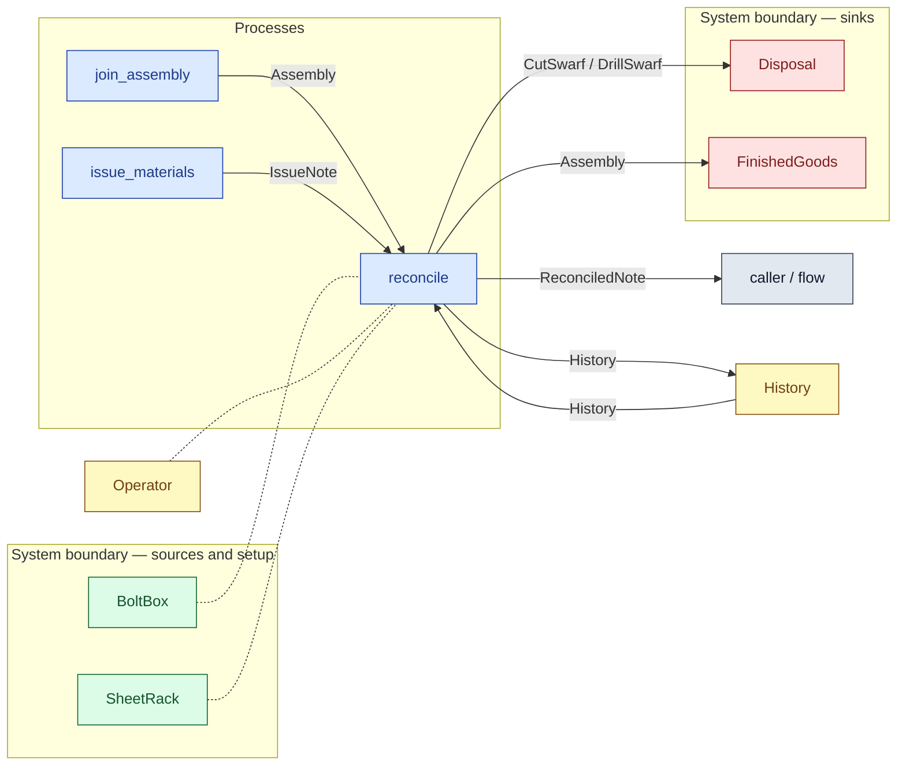

# `reconcile` — process (R1)

> Generated by `tools/docgen.sh` from `model/cs4-stores` — **do not hand-edit**; regenerate after any model change. Links are into the defining source lines; Mermaid nodes carry absolute click urls, the legend table the same links as plain markdown.

**P6 — return and reconcile at batch end (SPEC §5).**

- **Crate / subsystem:** `cs4-stores` — case study CS-4, the stores subsystem
- **Source:** [model/cs4-stores/src/resources.rs#L1022](/model/cs4-stores/src/resources.rs#L1022)
- **Requirements bound on the signature:** REQ-020, REQ-021, REQ-022

## Who and with what

No person in this signature: any time cost is drawn by an **adjacent** draw process in the flow (R15/F-048), or the step needs no actor.

Boundary objects used:

- `bolt_box`: `BoltBox` (boundary object (R12)), threaded by value (R2) — [model/cs4-stores/src/resources.rs#L347](/model/cs4-stores/src/resources.rs#L347)
- `sheet_rack`: `SheetRack` (boundary object (R12)), threaded by value (R2) — [model/cs4-stores/src/resources.rs#L314](/model/cs4-stores/src/resources.rs#L314)
- `operator`: `Operator` (boundary object (R12)), threaded by value (R2) — [model/cs4-stores/src/resources.rs#L435](/model/cs4-stores/src/resources.rs#L435)

## Inputs

| Parameter | Declared type | Resource kind | Unit | Magnitude |
|---|---|---|---|---|
| `assemblies` | `AS` → `Assembly` (via the requirement bound) | discrete (consumable, R13) | — | — |
| `finished_goods` | consumer of Assembly (sink `FinishedGoods`) | boundary object (R12) | — | — |
| `bin` | `FB` — unresolved: FB: SwarfReturn | — | — | — |
| `disposal` | consumer of CutSwarf / DrillSwarf (sink `Disposal`) | boundary object (R12) | — | — |
| `bolt_box` | `EmptyBoltBox` | boundary object (R12) | — | — |
| `sheet_rack` | `EmptySheetRack` | boundary object (R12) | — | — |
| `note` | `IssueNote` | discrete (consumable, R13) | — | — |
| `operator` | `Operator<Succ<Succ<Succ<Succ<Q>>>>>` | boundary object (R12) | — | — |
| `history` | `History` | execution record (model-core, R16) | — | — |

## Outputs

| Output | Resource kind | Unit | Magnitude | Routing (who takes it) |
|---|---|---|---|---|
| `FG::Next` | — | — | — | the same boundary object, returned in its advanced state (R2/R12) |
| `FB::Emptied` | — | — | — | returned to the flow (the caller must account for it, R1) |
| `DS::Next` | — | — | — | the same boundary object, returned in its advanced state (R2/R12) |
| `ReconciledNote` | reusable (R2) | — | — | `caller / flow` (flow input/output) |
| `Operator<Q>` | boundary object (R12) | — | — | moved in and returned (R2) |
| `History` | execution record (model-core, R16) | — | — | `History` (shared resource) |

Waste routed **inside** this process (never loose in a flow):

- `finished_goods` is a consumer parameter: **Assembly** is handed to `FinishedGoods` **inside this process** (Consumer/ConsumeList bound, R12) — [model/cs4-stores/src/resources.rs#L476](/model/cs4-stores/src/resources.rs#L476)
- `disposal` is a consumer parameter: **CutSwarf / DrillSwarf** is handed to `Disposal` **inside this process** (Consumer/ConsumeList bound, R12) — [model/cs4-stores/src/resources.rs#L514](/model/cs4-stores/src/resources.rs#L514)

## Balances (R1/R3/R15)

- **Compile-time assert:** `<FB::Contents as SwarfLoad>::GRAMS == SWARF_G`
  - message: *swarf mass reconciliation violated in reconcile (R3, REQ-020): the returned bin's swarf must weigh exactly the stated disposal total (the batch states 13 000 g)*
  - fires at monomorphization (F-001): `cargo build`/`cargo test` catch a violation; `cargo check` and editor diagnostics do not.
- **Compile-time assert:** `<FB::Contents as SwarfLoad>::PIECES == SWARF_PIECES`
  - message: *swarf piece-count reconciliation violated in reconcile (REQ-020): the returned bin must hold exactly the stated number of pieces (the batch states 75)*
  - fires at monomorphization (F-001): `cargo build`/`cargo test` catch a violation; `cargo check` and editor diagnostics do not.

## Requirements (R10 — the compliance matrix)

| Requirement | Statement | Defined at | Satisfied by | Verified by |
|---|---|---|---|---|
| REQ-020 | All swarf from a batch must be collected in the line's bin and returned to stores' disposal at batch end. | [model/cs4-stores/src/requirements.rs#L43](/model/cs4-stores/src/requirements.rs#L43) | `Disposal` | [`reconcile_accounts_for_everything_returned`](/model/cs4-stores/src/resources.rs#L1221), [`disposal_accepts_both_swarf_kinds`](/model/cs4-stores/src/resources.rs#L1252) |
| REQ-021 | The line may operate only against a current stores issue note (the subsystem interface evidence, threaded through the batch and reconciled at the end). | [model/cs4-stores/src/requirements.rs#L50](/model/cs4-stores/src/requirements.rs#L50) | `CurrentIssueNote` | [`issue_materials_issues_the_batch_stock`](/model/cs4-stores/src/resources.rs#L1195), [`reconcile_accounts_for_everything_returned`](/model/cs4-stores/src/resources.rs#L1221) |
| REQ-022 | Completed assemblies must be delivered to finished-goods stores. | [model/cs4-stores/src/requirements.rs#L57](/model/cs4-stores/src/requirements.rs#L57) | `FinishedGoods` | [`join_conserves_and_finished_goods_keeps_the_assembly`](/model/cs4-stores/src/resources.rs#L1147), [`reconcile_accounts_for_everything_returned`](/model/cs4-stores/src/resources.rs#L1221) |

This item is doc-tagged `Satisfies: REQ-020, REQ-021, REQ-022`.

## Where it fits (R9: needs / feeds)

The model states **connections, not sequences**: any order satisfying these dependencies is valid (R9).

**Needs:**

- **Assembly** from `join_assembly` (process)
- **History** from `History` (shared resource)
- **IssueNote** from `issue_materials` (process)
- `BoltBox` (boundary source) — threaded through, returned (R2)
- `Operator` (shared resource) — threaded through, returned (R2)
- `SheetRack` (boundary source) — threaded through, returned (R2)

**Feeds:**

- **Assembly** to `FinishedGoods` (boundary sink)
- **CutSwarf / DrillSwarf** to `Disposal` (boundary sink)
- **History** to `History` (shared resource)
- **ReconciledNote** to `caller / flow` (flow input/output)

**Used across the crate edge by (R1 subsystem decomposition):**

- `cs4-line`'s `run_batch` ([model/cs4-line/src/flows.rs#L72](/model/cs4-line/src/flows.rs#L72))

## Neighbourhood (one hop)

### Legend — node → source

| Node | Kind | Defined at |
|---|---|---|
| `n_join_assembly` (join_assembly) | process | [model/cs4-stores/src/resources.rs#L868](/model/cs4-stores/src/resources.rs#L868) |
| `n_issue_materials` (issue_materials) | process | [model/cs4-stores/src/resources.rs#L962](/model/cs4-stores/src/resources.rs#L962) |
| `n_reconcile` (reconcile) | process | [model/cs4-stores/src/resources.rs#L1022](/model/cs4-stores/src/resources.rs#L1022) |
| `n_caller` (caller / flow) | flow input/output | — |
| `n_Disposal` (Disposal) | boundary sink | [model/cs4-stores/src/resources.rs#L514](/model/cs4-stores/src/resources.rs#L514) |
| `n_FinishedGoods` (FinishedGoods) | boundary sink | [model/cs4-stores/src/resources.rs#L476](/model/cs4-stores/src/resources.rs#L476) |
| `n_History` (History) | shared resource | [model/model-core/src/history.rs#L158](/model/model-core/src/history.rs#L158) |
| `n_Operator` (Operator) | shared resource | [model/cs4-stores/src/resources.rs#L435](/model/cs4-stores/src/resources.rs#L435) |
| `n_SheetRack` (SheetRack) | boundary source | [model/cs4-stores/src/resources.rs#L314](/model/cs4-stores/src/resources.rs#L314) |
| `n_BoltBox` (BoltBox) | boundary source | [model/cs4-stores/src/resources.rs#L347](/model/cs4-stores/src/resources.rs#L347) |

## Open items (`Placeholder:` tags, R12)

- `BoltBox` — stores fastener stock — goods-in out of scope (SPEC §1). ([model/cs4-stores/src/resources.rs#L347](/model/cs4-stores/src/resources.rs#L347))
- `Disposal` — waste-disposal service — assumed able to take any amount. ([model/cs4-stores/src/resources.rs#L514](/model/cs4-stores/src/resources.rs#L514))
- `FinishedGoods` — finished-goods stores — onward delivery out of scope. ([model/cs4-stores/src/resources.rs#L476](/model/cs4-stores/src/resources.rs#L476))
- `SheetRack` — stores sheet stock — goods-in and procurement are out of ([model/cs4-stores/src/resources.rs#L314](/model/cs4-stores/src/resources.rs#L314))

<!-- WARN (docgen): `reconcile`: parameter `bin` not resolved (FB: SwarfReturn) -->
