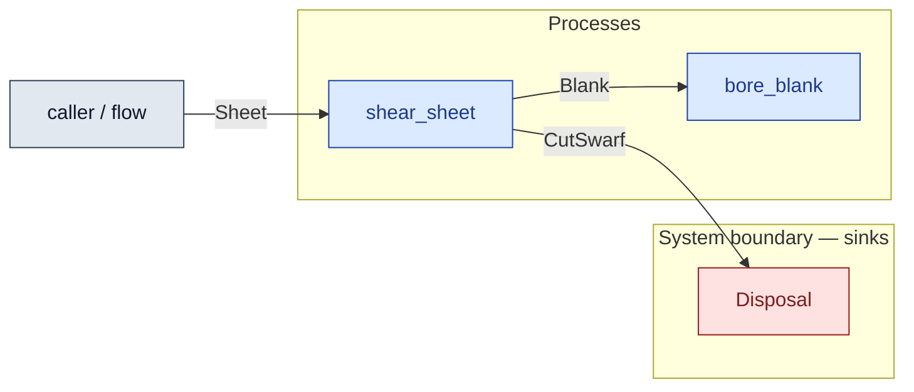

# `shear_sheet` — process (R1)

> Generated by `tools/docgen.sh` from `model/cs4-stores` — **do not hand-edit**; regenerate after any model change. Links are into the defining source lines; Mermaid nodes carry absolute click urls, the legend table the same links as plain markdown.

**Shears one sheet into two plate blanks plus cut swarf — the material transform inside the line's P2 (R1, R3, R9).**

- **Crate / subsystem:** `cs4-stores` — case study CS-4, the stores subsystem
- **Source:** [model/cs4-stores/src/resources.rs#L799](/model/cs4-stores/src/resources.rs#L799)

## Who and with what

No person in this signature: any time cost is drawn by an **adjacent** draw process in the flow (R15/F-048), or the step needs no actor.

## Inputs

| Parameter | Declared type | Resource kind | Unit | Magnitude |
|---|---|---|---|---|
| `sheet` | `Sheet<SHEET>` | continuous (container, R15) | grams | `SHEET` (caller-stated) |

## Outputs

| Output | Resource kind | Unit | Magnitude | Routing (who takes it) |
|---|---|---|---|---|
| `Blank<A>` | continuous (container, R15) | grams | `A` (caller-stated) | `bore_blank` (process) |
| `Blank<B>` | continuous (container, R15) | grams | `B` (caller-stated) | `bore_blank` (process) |
| `CutSwarf<SW>` | continuous (container, R15) | grams | `SW` (caller-stated) | `Disposal` (boundary sink) |

## Balances (R1/R3/R15)

- **Compile-time assert:** `A + B + SW == SHEET`
  - message: *mass conservation violated in shear_sheet (R3, P2): the two blanks plus the cut swarf must sum exactly to the sheet*
  - fires at monomorphization (F-001): `cargo build`/`cargo test` catch a violation; `cargo check` and editor diagnostics do not.

## Where it fits (R9: needs / feeds)

The model states **connections, not sequences**: any order satisfying these dependencies is valid (R9).

**Needs:**

- **Sheet** from `caller / flow` (flow input/output)

**Feeds:**

- **Blank** to `bore_blank` (process)
- **CutSwarf** to `Disposal` (boundary sink)

**Used across the crate edge by (R1 subsystem decomposition):**

- `cs4-line`'s `cut` ([model/cs4-line/src/processes.rs#L34](/model/cs4-line/src/processes.rs#L34))

## Neighbourhood (one hop)

### Legend — node → source

| Node | Kind | Defined at |
|---|---|---|
| `n_shear_sheet` (shear_sheet) | process | [model/cs4-stores/src/resources.rs#L799](/model/cs4-stores/src/resources.rs#L799) |
| `n_bore_blank` (bore_blank) | process | [model/cs4-stores/src/resources.rs#L826](/model/cs4-stores/src/resources.rs#L826) |
| `n_caller` (caller / flow) | flow input/output | — |
| `n_Disposal` (Disposal) | boundary sink | [model/cs4-stores/src/resources.rs#L514](/model/cs4-stores/src/resources.rs#L514) |
