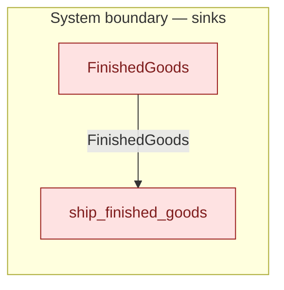

# `ship_finished_goods` — boundary function (R12)

> Generated by `tools/docgen.sh` from `model/cs4-stores` — **do not hand-edit**; regenerate after any model change. Links are into the defining source lines; Mermaid nodes carry absolute click urls, the legend table the same links as plain markdown.

**The stocked finished goods leave the model onward (R12, F-039): the only place kept assemblies are defused, which is what makes the tripwires on abandoned assemblies trustworthy (R1, F-008).**

- **Crate / subsystem:** `cs4-stores` — case study CS-4, the stores subsystem
- **Source:** [model/cs4-stores/src/resources.rs#L688](/model/cs4-stores/src/resources.rs#L688)
- **Placeholder:** onward delivery from finished goods — out of scope

## Who and with what

No person in this signature: any time cost is drawn by an **adjacent** draw process in the flow (R15/F-048), or the step needs no actor.

Boundary objects used:

- `store`: `FinishedGoods` (boundary object (R12)), threaded by value (R2) — [model/cs4-stores/src/resources.rs#L475](/model/cs4-stores/src/resources.rs#L475)

## Inputs

| Parameter | Declared type | Resource kind | Unit | Magnitude |
|---|---|---|---|---|
| `store` | `FinishedGoods<Space, Contents>` | boundary object (R12) | — | — |

## Outputs

| Output | Resource kind | Unit | Magnitude | Routing (who takes it) |
|---|---|---|---|---|

## Where it fits (R9: needs / feeds)

The model states **connections, not sequences**: any order satisfying these dependencies is valid (R9).

**Needs:**

- **FinishedGoods** from `FinishedGoods` (boundary sink)

**Used across the crate edge by (R1 subsystem decomposition):**

- `cs4-line`'s `the_batch_ends_fully_accounted` ([model/cs4-line/tests/flows.rs#L34](/model/cs4-line/tests/flows.rs#L34))

## Neighbourhood (one hop)

### Legend — node → source

| Node | Kind | Defined at |
|---|---|---|
| `n_FinishedGoods` (FinishedGoods) | boundary sink | [model/cs4-stores/src/resources.rs#L475](/model/cs4-stores/src/resources.rs#L475) |
| `n_ship_finished_goods` (ship_finished_goods) | boundary sink | [model/cs4-stores/src/resources.rs#L688](/model/cs4-stores/src/resources.rs#L688) |

## Open items (`Placeholder:` tags, R12)

- this function is itself a placeholder (see the header above)
- `FinishedGoods` — finished-goods stores — onward delivery out of scope. ([model/cs4-stores/src/resources.rs#L475](/model/cs4-stores/src/resources.rs#L475))
