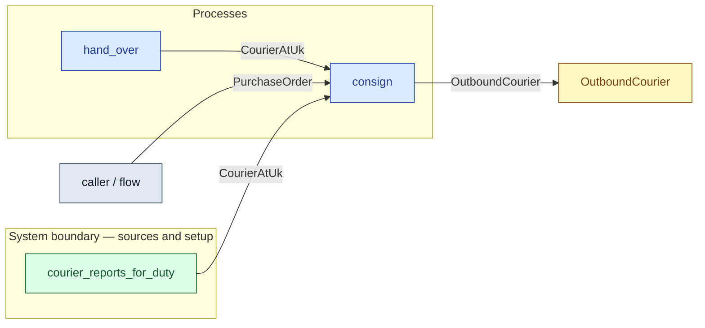

# `consign` — process (R1)

> Generated by `tools/docgen.sh` from `model/cs5-logistics` — **do not hand-edit**; regenerate after any model change. Links are into the defining source lines; Mermaid nodes carry absolute click urls, the legend table the same links as plain markdown.

**P2 — consigns the purchase order to the contracted courier (REQ-027; SPEC P2).**

- **Crate / subsystem:** `cs5-logistics` — case study CS-5, the logistics subsystem
- **Source:** [model/cs5-logistics/src/resources.rs#L132](/model/cs5-logistics/src/resources.rs#L132)
- **Requirements bound on the signature:** REQ-027

## Who and with what

No person in this signature: any time cost is drawn by an **adjacent** draw process in the flow (R15/F-048), or the step needs no actor.

## Inputs

| Parameter | Declared type | Resource kind | Unit | Magnitude |
|---|---|---|---|---|
| `courier` | `C` → `CourierAtUk` (via the requirement bound) | boundary object (R12) | — | — |
| `order` | `PurchaseOrder` | discrete (consumable, R13) | — | — |

## Outputs

| Output | Resource kind | Unit | Magnitude | Routing (who takes it) |
|---|---|---|---|---|
| `OutboundCourier` | boundary object (R12) | — | — | `OutboundCourier` (shared resource) |

## Requirements (R10 — the compliance matrix)

| Requirement | Statement | Defined at | Satisfied by | Verified by |
|---|---|---|---|---|
| REQ-027 | All inter-site transport must be by the contracted courier. | [model/cs5-logistics/src/requirements.rs#L15](/model/cs5-logistics/src/requirements.rs#L15) | `TheContractedCourier` | [`the_courier_loop_moves_order_out_and_goods_home`](/model/cs5-logistics/src/resources.rs#L199) |

This item is doc-tagged `Satisfies: REQ-027`.

## Where it fits (R9: needs / feeds)

The model states **connections, not sequences**: any order satisfying these dependencies is valid (R9).

**Needs:**

- **CourierAtUk** from `courier_reports_for_duty` (boundary source)
- **CourierAtUk** from `hand_over` (process)
- **PurchaseOrder** from `caller / flow` (flow input/output)

**Feeds:**

- **OutboundCourier** to `OutboundCourier` (shared resource)

**Used across the crate edge by (R1 subsystem decomposition):**

- `cs5-works`'s `fulfil_order_bin_last` ([model/cs5-works/src/flows.rs#L172](/model/cs5-works/src/flows.rs#L172))
- `cs5-works`'s `fulfil_order` ([model/cs5-works/src/flows.rs#L86](/model/cs5-works/src/flows.rs#L86))

## Neighbourhood (one hop)

### Legend — node → source

| Node | Kind | Defined at |
|---|---|---|
| `n_consign` (consign) | process | [model/cs5-logistics/src/resources.rs#L132](/model/cs5-logistics/src/resources.rs#L132) |
| `n_hand_over` (hand_over) | process | [model/cs5-logistics/src/resources.rs#L171](/model/cs5-logistics/src/resources.rs#L171) |
| `n_caller` (caller / flow) | flow input/output | — |
| `n_courier_reports_for_duty` (courier_reports_for_duty) | boundary source | [model/cs5-logistics/src/resources.rs#L103](/model/cs5-logistics/src/resources.rs#L103) |
| `n_OutboundCourier` (OutboundCourier) | shared resource | [model/cs5-logistics/src/resources.rs#L62](/model/cs5-logistics/src/resources.rs#L62) |
