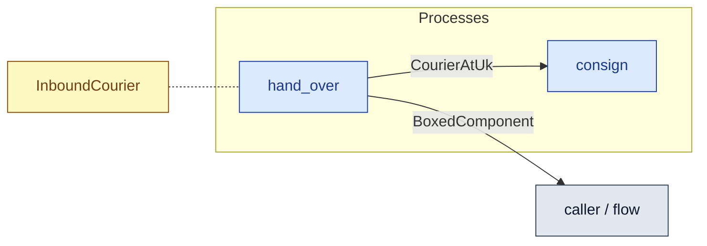

# `hand_over` — process (R1)

> Generated by `tools/docgen.sh` from `model/cs5-logistics` — **do not hand-edit**; regenerate after any model change. Links are into the defining source lines; Mermaid nodes carry absolute click urls, the legend table the same links as plain markdown.

**P4 (transport half) — the courier arrives back at the UK site, surrenders the boxed component at goods-in, and returns home for reuse (inbound → at-UK; SPEC P4).**

- **Crate / subsystem:** `cs5-logistics` — case study CS-5, the logistics subsystem
- **Source:** [model/cs5-logistics/src/resources.rs#L171](/model/cs5-logistics/src/resources.rs#L171)

## Who and with what

No person in this signature: any time cost is drawn by an **adjacent** draw process in the flow (R15/F-048), or the step needs no actor.

Boundary objects used:

- `courier`: `InboundCourier` (boundary object (R12)), threaded by value (R2) — [model/cs5-logistics/src/resources.rs#L79](/model/cs5-logistics/src/resources.rs#L79)

## Inputs

| Parameter | Declared type | Resource kind | Unit | Magnitude |
|---|---|---|---|---|
| `courier` | `InboundCourier` | boundary object (R12) | — | — |

## Outputs

| Output | Resource kind | Unit | Magnitude | Routing (who takes it) |
|---|---|---|---|---|
| `BoxedComponent` | discrete (consumable, R13) | — | — | `caller / flow` (flow input/output) |
| `CourierAtUk` | boundary object (R12) | — | — | `consign` (process) |

## Requirements (R10 — the compliance matrix)

| Requirement | Statement | Defined at | Satisfied by | Verified by |
|---|---|---|---|---|

This item is doc-tagged `Satisfies: REQ-027`.

## Where it fits (R9: needs / feeds)

The model states **connections, not sequences**: any order satisfying these dependencies is valid (R9).

**Needs:**

- `InboundCourier` (shared resource) — threaded through, returned (R2)

**Feeds:**

- **BoxedComponent** to `caller / flow` (flow input/output)
- **CourierAtUk** to `consign` (process)

**Used across the crate edge by (R1 subsystem decomposition):**

- `cs5-works`'s `fulfil_order_bin_last` ([model/cs5-works/src/flows.rs#L172](/model/cs5-works/src/flows.rs#L172))
- `cs5-works`'s `fulfil_order` ([model/cs5-works/src/flows.rs#L86](/model/cs5-works/src/flows.rs#L86))

## Neighbourhood (one hop)

### Legend — node → source

| Node | Kind | Defined at |
|---|---|---|
| `n_consign` (consign) | process | [model/cs5-logistics/src/resources.rs#L132](/model/cs5-logistics/src/resources.rs#L132) |
| `n_hand_over` (hand_over) | process | [model/cs5-logistics/src/resources.rs#L171](/model/cs5-logistics/src/resources.rs#L171) |
| `n_caller` (caller / flow) | flow input/output | — |
| `n_InboundCourier` (InboundCourier) | shared resource | [model/cs5-logistics/src/resources.rs#L79](/model/cs5-logistics/src/resources.rs#L79) |
