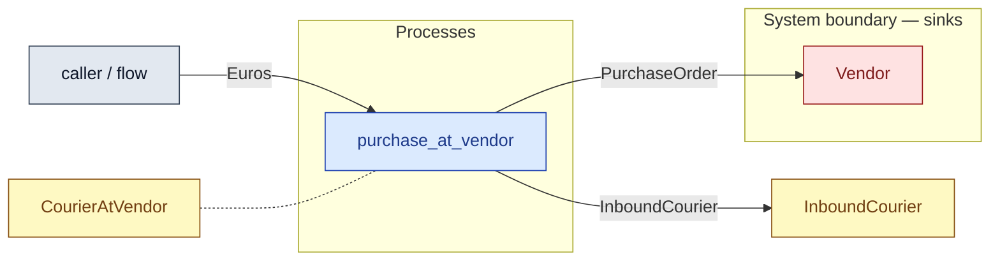

# `purchase_at_vendor` — process (R1)

> Generated by `tools/docgen.sh` from `model/cs5-logistics` — **do not hand-edit**; regenerate after any model change. Links are into the defining source lines; Mermaid nodes carry absolute click urls, the legend table the same links as plain markdown.

**P3 — the purchase at the vendor (SPEC P3; REQ-023 + REQ-027).**

- **Crate / subsystem:** `cs5-logistics` — case study CS-5, the logistics subsystem
- **Source:** [model/cs5-logistics/src/resources.rs#L159](/model/cs5-logistics/src/resources.rs#L159)
- **Requirements bound on the signature:** REQ-023

## Who and with what

No person in this signature: any time cost is drawn by an **adjacent** draw process in the flow (R15/F-048), or the step needs no actor.

Boundary objects used:

- `courier`: `CourierAtVendor` (boundary object (R12)), threaded by value (R2) — [model/cs5-logistics/src/resources.rs#L70](/model/cs5-logistics/src/resources.rs#L70)

## Inputs

| Parameter | Declared type | Resource kind | Unit | Magnitude |
|---|---|---|---|---|
| `courier` | `CourierAtVendor` | boundary object (R12) | — | — |
| `vendor` | consumer of PurchaseOrder (sink `Vendor`) | boundary object (R12) | — | — |
| `payment` | `Euros<COMPONENT_PRICE_EC>` | continuous (container, R15) | euro cents | COMPONENT_PRICE_EC = 2340 |

## Outputs

| Output | Resource kind | Unit | Magnitude | Routing (who takes it) |
|---|---|---|---|---|
| `InboundCourier` | boundary object (R12) | — | — | `InboundCourier` (shared resource) |
| `<<V::Next as Consumer<Euros<COMPONENT_PRICE_EC>>>::Next as Supplier>::Next` | — | — | — | the same boundary object, returned in its advanced state (R2/R12) |

Waste routed **inside** this process (never loose in a flow):

- `vendor` is a consumer parameter: **PurchaseOrder** is handed to `Vendor` **inside this process** (Consumer/ConsumeList bound, R12) — [model/cs5-supply/src/resources.rs#L237](/model/cs5-supply/src/resources.rs#L237)

## Requirements (R10 — the compliance matrix)

| Requirement | Statement | Defined at | Satisfied by | Verified by |
|---|---|---|---|---|
| REQ-023 | Foreign purchases must be paid in the supplier's currency (the vendor accepts euro cents only). | [model/cs5-supply/src/requirements.rs#L28](/model/cs5-supply/src/requirements.rs#L28) | `StockedVendor` | [`the_courier_loop_moves_order_out_and_goods_home`](/model/cs5-logistics/src/resources.rs#L199) |

This item is doc-tagged `Satisfies: REQ-027`.

## Where it fits (R9: needs / feeds)

The model states **connections, not sequences**: any order satisfying these dependencies is valid (R9).

**Needs:**

- **Euros** from `caller / flow` (flow input/output)
- `CourierAtVendor` (shared resource) — threaded through, returned (R2)

**Feeds:**

- **InboundCourier** to `InboundCourier` (shared resource)
- **PurchaseOrder** to `Vendor` (boundary sink)

**Used across the crate edge by (R1 subsystem decomposition):**

- `cs5-works`'s `fulfil_order_bin_last` ([model/cs5-works/src/flows.rs#L172](/model/cs5-works/src/flows.rs#L172))
- `cs5-works`'s `fulfil_order` ([model/cs5-works/src/flows.rs#L86](/model/cs5-works/src/flows.rs#L86))

## Neighbourhood (one hop)

### Legend — node → source

| Node | Kind | Defined at |
|---|---|---|
| `n_purchase_at_vendor` (purchase_at_vendor) | process | [model/cs5-logistics/src/resources.rs#L159](/model/cs5-logistics/src/resources.rs#L159) |
| `n_caller` (caller / flow) | flow input/output | — |
| `n_CourierAtVendor` (CourierAtVendor) | shared resource | [model/cs5-logistics/src/resources.rs#L70](/model/cs5-logistics/src/resources.rs#L70) |
| `n_InboundCourier` (InboundCourier) | shared resource | [model/cs5-logistics/src/resources.rs#L79](/model/cs5-logistics/src/resources.rs#L79) |
| `n_Vendor` (Vendor) | boundary sink | [model/cs5-supply/src/resources.rs#L237](/model/cs5-supply/src/resources.rs#L237) |
