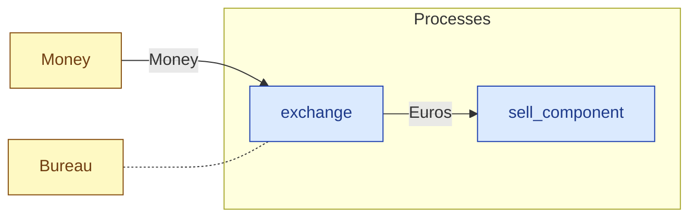

# `exchange` — process (R1)

> Generated by `tools/docgen.sh` from `model/cs5-supply` — **do not hand-edit**; regenerate after any model change. Links are into the defining source lines; Mermaid nodes carry absolute click urls, the legend table the same links as plain markdown.

**P1 (bureau side) — exchanges GBP for euro cents at the bureau's stated integer rate (REQ-024; SPEC P1: 2000 p → 2340 ec), const-asserted `OUT × 100 == IN × 117`.**

- **Crate / subsystem:** `cs5-supply` — case study CS-5, the supply subsystem
- **Source:** [model/cs5-supply/src/resources.rs#L607](/model/cs5-supply/src/resources.rs#L607)
- **Requirements bound on the signature:** REQ-024

## Who and with what

No person in this signature: any time cost is drawn by an **adjacent** draw process in the flow (R15/F-048), or the step needs no actor.

Reusables threaded — moved in and returned (R2): `bureau: Bureau`.

## Inputs

| Parameter | Declared type | Resource kind | Unit | Magnitude |
|---|---|---|---|---|
| `bureau` | `B` → `Bureau` (via the requirement bound) | reusable (R2) | — | — |
| `sterling` | `Money<IN>` | continuous (container, R15) | pence | `IN` (caller-stated) |

## Outputs

| Output | Resource kind | Unit | Magnitude | Routing (who takes it) |
|---|---|---|---|---|
| `Euros<OUT>` | continuous (container, R15) | euro cents | `OUT` (caller-stated) | `sell_component` (process) |
| `B` | — | — | — | moved in and returned (R2) |

## Balances (R1/R3/R15)

- **Compile-time assert:** `OUT * GBP_EUR_RATE_DEN == IN * GBP_EUR_RATE_NUM`
  - message: *exchange is not exact at the stated rate (R19/F-052, REQ-024): OUT euro cents x 100 must equal IN pence x 117 - integer exchange never rounds; split off an exchangeable amount first and keep the remainder in GBP*
  - fires at monomorphization (F-001): `cargo build`/`cargo test` catch a violation; `cargo check` and editor diagnostics do not.

## Requirements (R10 — the compliance matrix)

| Requirement | Statement | Defined at | Satisfied by | Verified by |
|---|---|---|---|---|
| REQ-024 | Currency may be exchanged only at the bureau, at its stated rate. | [model/cs5-supply/src/requirements.rs#L35](/model/cs5-supply/src/requirements.rs#L35) | `ExchangeBureau` | [`exchange_is_exact_and_the_vendor_takes_the_remittance`](/model/cs5-supply/src/resources.rs#L701), [`inexact_amounts_split_first_and_keep_the_remainder_in_gbp`](/model/cs5-supply/src/resources.rs#L717) |

This item is doc-tagged `Satisfies: REQ-024`.

## Where it fits (R9: needs / feeds)

The model states **connections, not sequences**: any order satisfying these dependencies is valid (R9).

**Needs:**

- **Money** from `Money` (shared resource)
- `Bureau` (shared resource) — threaded through, returned (R2)

**Feeds:**

- **Euros** to `sell_component` (process)

**Used across the crate edge by (R1 subsystem decomposition):**

- `cs5-works`'s `fulfil_order_bin_last` ([model/cs5-works/src/flows.rs#L172](/model/cs5-works/src/flows.rs#L172))
- `cs5-works`'s `fulfil_order` ([model/cs5-works/src/flows.rs#L86](/model/cs5-works/src/flows.rs#L86))

## Neighbourhood (one hop)

### Legend — node → source

| Node | Kind | Defined at |
|---|---|---|
| `n_exchange` (exchange) | process | [model/cs5-supply/src/resources.rs#L607](/model/cs5-supply/src/resources.rs#L607) |
| `n_sell_component` (sell_component) | process | [model/cs5-supply/src/resources.rs#L637](/model/cs5-supply/src/resources.rs#L637) |
| `n_Bureau` (Bureau) | shared resource | [model/cs5-supply/src/resources.rs#L97](/model/cs5-supply/src/resources.rs#L97) |
| `n_Money` (Money) | shared resource | [model/cs5-supply/src/resources.rs#L47](/model/cs5-supply/src/resources.rs#L47) |

## Open items (`Placeholder:` tags, R12)

- `Bureau` — bureau de change — assumed unbounded float in both ([model/cs5-supply/src/resources.rs#L97](/model/cs5-supply/src/resources.rs#L97))
