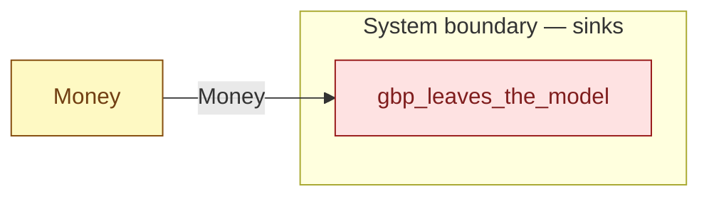

# `gbp_leaves_the_model` — boundary function (R12)

> Generated by `tools/docgen.sh` from `model/cs5-supply` — **do not hand-edit**; regenerate after any model change. Links are into the defining source lines; Mermaid nodes carry absolute click urls, the legend table the same links as plain markdown.

**GBP leaves the model at the system boundary (R12): the production-legal sink for [`Money`] (F-035) — the works banks its takings at flow end, whatever the amount.**

- **Crate / subsystem:** `cs5-supply` — case study CS-5, the supply subsystem
- **Source:** [model/cs5-supply/src/resources.rs#L390](/model/cs5-supply/src/resources.rs#L390)
- **Placeholder:** the GBP economy outside the model — an unbounded sink.

## Who and with what

No person in this signature: any time cost is drawn by an **adjacent** draw process in the flow (R15/F-048), or the step needs no actor.

## Inputs

| Parameter | Declared type | Resource kind | Unit | Magnitude |
|---|---|---|---|---|
| `cash` | `Money<PENCE>` | continuous (container, R15) | pence | `PENCE` (caller-stated) |

## Outputs

| Output | Resource kind | Unit | Magnitude | Routing (who takes it) |
|---|---|---|---|---|

## Where it fits (R9: needs / feeds)

The model states **connections, not sequences**: any order satisfying these dependencies is valid (R9).

**Needs:**

- **Money** from `Money` (shared resource)

**Used across the crate edge by (R1 subsystem decomposition):**

- `cs5-works`'s `settle_up` ([model/cs5-works/src/resources.rs#L315](/model/cs5-works/src/resources.rs#L315))

## Neighbourhood (one hop)

### Legend — node → source

| Node | Kind | Defined at |
|---|---|---|
| `n_Money` (Money) | shared resource | [model/cs5-supply/src/resources.rs#L47](/model/cs5-supply/src/resources.rs#L47) |
| `n_gbp_leaves_the_model` (gbp_leaves_the_model) | boundary sink | [model/cs5-supply/src/resources.rs#L390](/model/cs5-supply/src/resources.rs#L390) |

## Open items (`Placeholder:` tags, R12)

- this function is itself a placeholder (see the header above)
