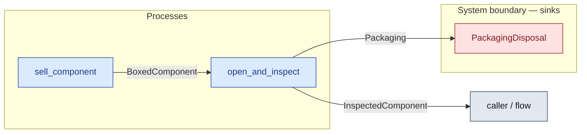

# `open_and_inspect` — process (R1)

> Generated by `tools/docgen.sh` from `model/cs5-supply` — **do not hand-edit**; regenerate after any model change. Links are into the defining source lines; Mermaid nodes carry absolute click urls, the legend table the same links as plain markdown.

**P5 (material half) — opens the box and inspects the component at goods-in (SPEC P5): the conserving transform the works' inspection process composes (the CS-4 cross-crate pattern — the mint site stays in this crate).**

- **Crate / subsystem:** `cs5-supply` — case study CS-5, the supply subsystem
- **Source:** [model/cs5-supply/src/resources.rs#L665](/model/cs5-supply/src/resources.rs#L665)

## Who and with what

No person in this signature: any time cost is drawn by an **adjacent** draw process in the flow (R15/F-048), or the step needs no actor.

## Inputs

| Parameter | Declared type | Resource kind | Unit | Magnitude |
|---|---|---|---|---|
| `boxed` | `BoxedComponent` | discrete (consumable, R13) | — | — |

## Outputs

| Output | Resource kind | Unit | Magnitude | Routing (who takes it) |
|---|---|---|---|---|
| `InspectedComponent` | discrete (consumable, R13) | — | — | `caller / flow` (flow input/output) |
| `Packaging<PACK>` | continuous (container, R15) | grams | `PACK` (caller-stated) | `PackagingDisposal` (boundary sink) |

## Balances (R1/R3/R15)

- **Compile-time assert:** `InspectedComponent::MASS_G + PACK == BoxedComponent::MASS_G`
  - message: *mass conservation violated in open_and_inspect (R3, P5): the inspected component plus the packaging must sum exactly to the boxed component (450 = 400 + 50)*
  - fires at monomorphization (F-001): `cargo build`/`cargo test` catch a violation; `cargo check` and editor diagnostics do not.

## Where it fits (R9: needs / feeds)

The model states **connections, not sequences**: any order satisfying these dependencies is valid (R9).

**Needs:**

- **BoxedComponent** from `sell_component` (process)

**Feeds:**

- **InspectedComponent** to `caller / flow` (flow input/output)
- **Packaging** to `PackagingDisposal` (boundary sink)

**Used across the crate edge by (R1 subsystem decomposition):**

- `cs5-works`'s `inspect` ([model/cs5-works/src/resources.rs#L417](/model/cs5-works/src/resources.rs#L417))

## Neighbourhood (one hop)

### Legend — node → source

| Node | Kind | Defined at |
|---|---|---|
| `n_sell_component` (sell_component) | process | [model/cs5-supply/src/resources.rs#L637](/model/cs5-supply/src/resources.rs#L637) |
| `n_open_and_inspect` (open_and_inspect) | process | [model/cs5-supply/src/resources.rs#L665](/model/cs5-supply/src/resources.rs#L665) |
| `n_caller` (caller / flow) | flow input/output | — |
| `n_PackagingDisposal` (PackagingDisposal) | boundary sink | [model/cs5-supply/src/resources.rs#L350](/model/cs5-supply/src/resources.rs#L350) |
