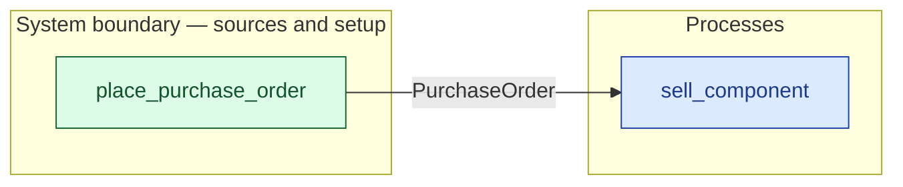

# `place_purchase_order` — boundary function (R12)

> Generated by `tools/docgen.sh` from `model/cs5-supply` — **do not hand-edit**; regenerate after any model change. Links are into the defining source lines; Mermaid nodes carry absolute click urls, the legend table the same links as plain markdown.

**A purchase order is raised against the vendor (R12; SPEC P2).**

- **Crate / subsystem:** `cs5-supply` — case study CS-5, the supply subsystem
- **Source:** [model/cs5-supply/src/resources.rs#L409](/model/cs5-supply/src/resources.rs#L409)
- **Placeholder:** the works' procurement paperwork — one order, one

## Who and with what

No person in this signature: any time cost is drawn by an **adjacent** draw process in the flow (R15/F-048), or the step needs no actor.

## Inputs

| Parameter | Declared type | Resource kind | Unit | Magnitude |
|---|---|---|---|---|

## Outputs

| Output | Resource kind | Unit | Magnitude | Routing (who takes it) |
|---|---|---|---|---|
| `PurchaseOrder` | discrete (consumable, R13) | — | — | `sell_component` (process) |

## Where it fits (R9: needs / feeds)

The model states **connections, not sequences**: any order satisfying these dependencies is valid (R9).

**Feeds:**

- **PurchaseOrder** to `sell_component` (process)

**Used across the crate edge by (R1 subsystem decomposition):**

- `cs5-works`'s `fulfil_order_bin_last` ([model/cs5-works/src/flows.rs#L172](/model/cs5-works/src/flows.rs#L172))
- `cs5-works`'s `fulfil_order` ([model/cs5-works/src/flows.rs#L86](/model/cs5-works/src/flows.rs#L86))

## Neighbourhood (one hop)

### Legend — node → source

| Node | Kind | Defined at |
|---|---|---|
| `n_sell_component` (sell_component) | process | [model/cs5-supply/src/resources.rs#L637](/model/cs5-supply/src/resources.rs#L637) |
| `n_place_purchase_order` (place_purchase_order) | boundary source | [model/cs5-supply/src/resources.rs#L409](/model/cs5-supply/src/resources.rs#L409) |

## Open items (`Placeholder:` tags, R12)

- this function is itself a placeholder (see the header above)
