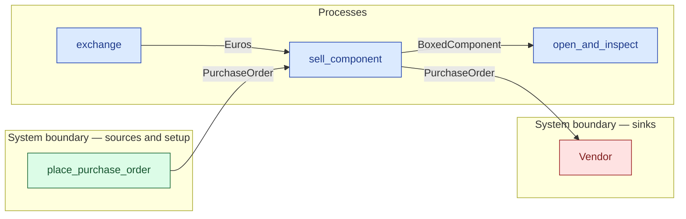

# `sell_component` — process (R1)

> Generated by `tools/docgen.sh` from `model/cs5-supply` — **do not hand-edit**; regenerate after any model change. Links are into the defining source lines; Mermaid nodes carry absolute click urls, the legend table the same links as plain markdown.

**P3 (vendor side) — the vendor sells one boxed component against the courier-presented purchase order and the **remitted** exact price (REQ-023; SPEC P3).**

- **Crate / subsystem:** `cs5-supply` — case study CS-5, the supply subsystem
- **Source:** [model/cs5-supply/src/resources.rs#L637](/model/cs5-supply/src/resources.rs#L637)
- **Requirements bound on the signature:** REQ-023

## Who and with what

No person in this signature: any time cost is drawn by an **adjacent** draw process in the flow (R15/F-048), or the step needs no actor.

## Inputs

| Parameter | Declared type | Resource kind | Unit | Magnitude |
|---|---|---|---|---|
| `vendor` | consumer of PurchaseOrder (sink `Vendor`) | boundary object (R12) | — | — |
| `order` | `PurchaseOrder` | discrete (consumable, R13) | — | — |
| `payment` | `Euros<COMPONENT_PRICE_EC>` | continuous (container, R15) | euro cents | COMPONENT_PRICE_EC = 2340 |

## Outputs

| Output | Resource kind | Unit | Magnitude | Routing (who takes it) |
|---|---|---|---|---|
| `BoxedComponent` | discrete (consumable, R13) | — | — | `open_and_inspect` (process) |
| `<<V::Next as Consumer<Euros<COMPONENT_PRICE_EC>>>::Next as Supplier>::Next` | — | — | — | the same boundary object, returned in its advanced state (R2/R12) |

Waste routed **inside** this process (never loose in a flow):

- `vendor` is a consumer parameter: **PurchaseOrder** is handed to `Vendor` **inside this process** (Consumer/ConsumeList bound, R12) — [model/cs5-supply/src/resources.rs#L237](/model/cs5-supply/src/resources.rs#L237)

## Requirements (R10 — the compliance matrix)

| Requirement | Statement | Defined at | Satisfied by | Verified by |
|---|---|---|---|---|
| REQ-023 | Foreign purchases must be paid in the supplier's currency (the vendor accepts euro cents only). | [model/cs5-supply/src/requirements.rs#L28](/model/cs5-supply/src/requirements.rs#L28) | `StockedVendor` | [`exchange_is_exact_and_the_vendor_takes_the_remittance`](/model/cs5-supply/src/resources.rs#L701), [`sell_component_takes_the_exact_price_and_depletes_the_stock`](/model/cs5-supply/src/resources.rs#L744), [`three_sales_exhaust_the_vendor`](/model/cs5-supply/src/resources.rs#L763) |

This item is doc-tagged `Satisfies: REQ-023`.

## Where it fits (R9: needs / feeds)

The model states **connections, not sequences**: any order satisfying these dependencies is valid (R9).

**Needs:**

- **Euros** from `exchange` (process)
- **PurchaseOrder** from `place_purchase_order` (boundary source)

**Feeds:**

- **BoxedComponent** to `open_and_inspect` (process)
- **PurchaseOrder** to `Vendor` (boundary sink)

**Used across the crate edge by (R1 subsystem decomposition):**

- `cs5-logistics`'s `purchase_at_vendor` ([model/cs5-logistics/src/resources.rs#L159](/model/cs5-logistics/src/resources.rs#L159))

## Neighbourhood (one hop)

### Legend — node → source

| Node | Kind | Defined at |
|---|---|---|
| `n_exchange` (exchange) | process | [model/cs5-supply/src/resources.rs#L607](/model/cs5-supply/src/resources.rs#L607) |
| `n_sell_component` (sell_component) | process | [model/cs5-supply/src/resources.rs#L637](/model/cs5-supply/src/resources.rs#L637) |
| `n_open_and_inspect` (open_and_inspect) | process | [model/cs5-supply/src/resources.rs#L665](/model/cs5-supply/src/resources.rs#L665) |
| `n_place_purchase_order` (place_purchase_order) | boundary source | [model/cs5-supply/src/resources.rs#L409](/model/cs5-supply/src/resources.rs#L409) |
| `n_Vendor` (Vendor) | boundary sink | [model/cs5-supply/src/resources.rs#L237](/model/cs5-supply/src/resources.rs#L237) |
