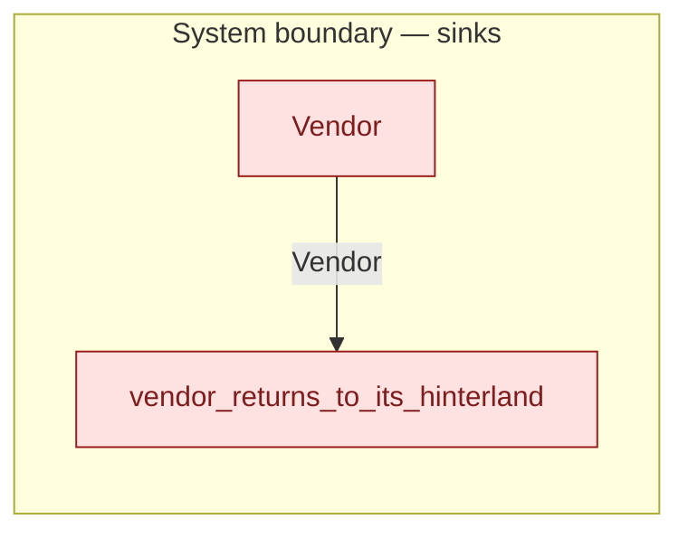

# `vendor_returns_to_its_hinterland` — boundary function (R12)

> Generated by `tools/docgen.sh` from `model/cs5-supply` — **do not hand-edit**; regenerate after any model change. Links are into the defining source lines; Mermaid nodes carry absolute click urls, the legend table the same links as plain markdown.

**The vendor withdraws to its hinterland with its remaining stock (R12, F-039): the boundary exit that accounts for the vendor's end-of-model state (SPEC §6: "vendor stock at 2 with its state accounted") — the only place unsold stock is defused, which is what makes the tripwires on abandoned components trustworthy (R1, F-008).**

- **Crate / subsystem:** `cs5-supply` — case study CS-5, the supply subsystem
- **Source:** [model/cs5-supply/src/resources.rs#L481](/model/cs5-supply/src/resources.rs#L481)
- **Placeholder:** the vendor's hinterland — restocking and onward trade

## Who and with what

No person in this signature: any time cost is drawn by an **adjacent** draw process in the flow (R15/F-048), or the step needs no actor.

Boundary objects used:

- `vendor`: `Vendor` (boundary object (R12)), threaded by value (R2) — [model/cs5-supply/src/resources.rs#L237](/model/cs5-supply/src/resources.rs#L237)

## Inputs

| Parameter | Declared type | Resource kind | Unit | Magnitude |
|---|---|---|---|---|
| `vendor` | `Vendor<Stock>` | boundary object (R12) | — | — |

## Outputs

| Output | Resource kind | Unit | Magnitude | Routing (who takes it) |
|---|---|---|---|---|

## Where it fits (R9: needs / feeds)

The model states **connections, not sequences**: any order satisfying these dependencies is valid (R9).

**Needs:**

- **Vendor** from `Vendor` (boundary sink)

## Neighbourhood (one hop)

### Legend — node → source

| Node | Kind | Defined at |
|---|---|---|
| `n_Vendor` (Vendor) | boundary sink | [model/cs5-supply/src/resources.rs#L237](/model/cs5-supply/src/resources.rs#L237) |
| `n_vendor_returns_to_its_hinterland` (vendor_returns_to_its_hinterland) | boundary sink | [model/cs5-supply/src/resources.rs#L481](/model/cs5-supply/src/resources.rs#L481) |

## Open items (`Placeholder:` tags, R12)

- this function is itself a placeholder (see the header above)
