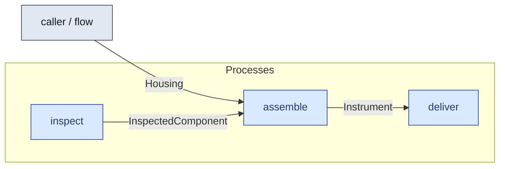

# `assemble` — process (R1)

> Generated by `tools/docgen.sh` from `model/cs5-works` — **do not hand-edit**; regenerate after any model change. Links are into the defining source lines; Mermaid nodes carry absolute click urls, the legend table the same links as plain markdown.

**P6 — assembles the instrument (REQ-025; SPEC P6): a housing from the rack plus an **inspected** component (style A: the requirement bounds the component, so a still-boxed part fails with the REQ-phrased message, F-044 — pinned by `tests/ui/fit_uninspected_component.rs`).**

- **Crate / subsystem:** `cs5-works` — case study CS-5, the works subsystem
- **Source:** [model/cs5-works/src/resources.rs#L447](/model/cs5-works/src/resources.rs#L447)
- **Requirements bound on the signature:** REQ-025

## Who and with what

No person in this signature: any time cost is drawn by an **adjacent** draw process in the flow (R15/F-048), or the step needs no actor.
Adjacent draw observed in the traced flows for this step: **180000 ms**.

## Inputs

| Parameter | Declared type | Resource kind | Unit | Magnitude |
|---|---|---|---|---|
| `housing` | `Housing` | discrete (consumable, R13) | — | — |
| `component` | `C` → `InspectedComponent` (via the requirement bound) | discrete (consumable, R13) | — | — |

Observed entering this step in the traced flows: `InspectedComponent`, `item`.

## Outputs

| Output | Resource kind | Unit | Magnitude | Routing (who takes it) |
|---|---|---|---|---|
| `Instrument<C, G>` | discrete (consumable, R13) | — | `G` (caller-stated) | `deliver` (process) |

Observed leaving this step in the traced flows: `Instrument`.

## Balances (R1/R3/R15)

- **Compile-time assert:** `Housing::MASS_G + <C as GoodsInInspected>::MASS_G == G`
  - message: *mass conservation violated in assemble (R3, P6): the instrument must weigh exactly its housing plus its inspected component (600 + 400 = 1000)*
  - fires at monomorphization (F-001): `cargo build`/`cargo test` catch a violation; `cargo check` and editor diagnostics do not.

## Requirements (R10 — the compliance matrix)

| Requirement | Statement | Defined at | Satisfied by | Verified by |
|---|---|---|---|---|
| REQ-025 | A component may be fitted only after goods-in inspection at the UK site. | [model/cs5-works/src/requirements.rs#L22](/model/cs5-works/src/requirements.rs#L22) | `InspectedPrecisionComponent` | [`inspect_feeds_the_bin_inside_the_process`](/model/cs5-works/src/resources.rs#L597), [`assemble_and_deliver_balance_mass_and_money`](/model/cs5-works/src/resources.rs#L614), [`fulfilment_with_early_housing_and_early_bin_accounts_for_everything`](/model/cs5-works/tests/flows.rs#L74), [`fulfilment_with_late_housing_and_late_bin_reaches_the_same_end_state`](/model/cs5-works/tests/flows.rs#L95), [`ui`](/model/cs5-works/tests/trybuild.rs#L22) |

This item is doc-tagged `Satisfies: REQ-025`.

## Where it fits (R9: needs / feeds)

The model states **connections, not sequences**: any order satisfying these dependencies is valid (R9).

**Needs:**

- **Housing** from `caller / flow` (flow input/output)
- **InspectedComponent** from `inspect` (process)

**Feeds:**

- **Instrument** to `deliver` (process)

## Neighbourhood (one hop)

### Legend — node → source

| Node | Kind | Defined at |
|---|---|---|
| `n_inspect` (inspect) | process | [model/cs5-works/src/resources.rs#L417](/model/cs5-works/src/resources.rs#L417) |
| `n_assemble` (assemble) | process | [model/cs5-works/src/resources.rs#L447](/model/cs5-works/src/resources.rs#L447) |
| `n_deliver` (deliver) | process | [model/cs5-works/src/resources.rs#L488](/model/cs5-works/src/resources.rs#L488) |
| `n_caller` (caller / flow) | flow input/output | — |
