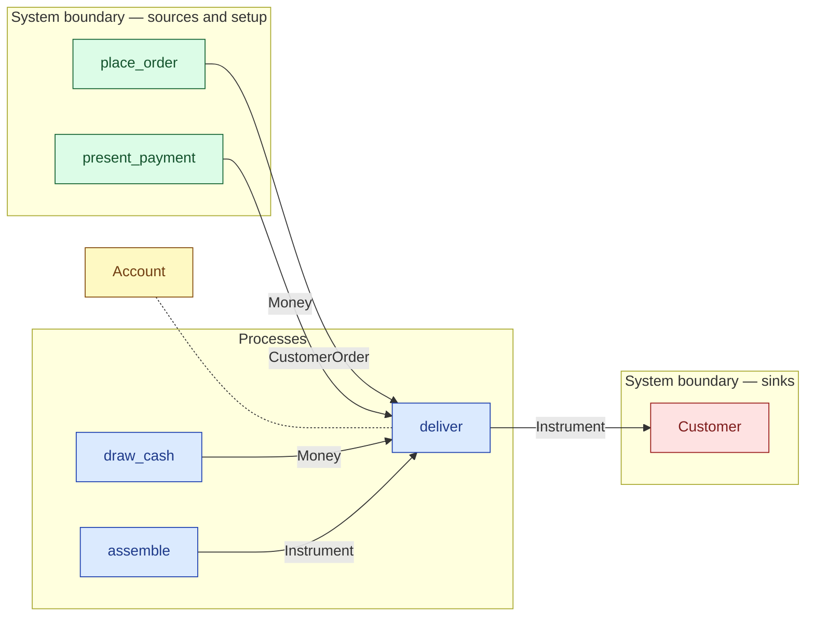

# `deliver` — process (R1)

> Generated by `tools/docgen.sh` from `model/cs5-works` — **do not hand-edit**; regenerate after any model change. Links are into the defining source lines; Mermaid nodes carry absolute click urls, the legend table the same links as plain markdown.

**P7 — delivers the instrument and takes payment (REQ-026; SPEC P7):**

- **Crate / subsystem:** `cs5-works` — case study CS-5, the works subsystem
- **Source:** [model/cs5-works/src/resources.rs#L488](/model/cs5-works/src/resources.rs#L488)
- **Requirements bound on the signature:** REQ-026

## Who and with what

No person in this signature: any time cost is drawn by an **adjacent** draw process in the flow (R15/F-048), or the step needs no actor.

Boundary objects used:

- `account`: `Account` (boundary object (R12)), threaded by value (R2) — [model/cs5-works/src/resources.rs#L75](/model/cs5-works/src/resources.rs#L75)

## Inputs

| Parameter | Declared type | Resource kind | Unit | Magnitude |
|---|---|---|---|---|
| `instrument` | `Instrument<C, IG>` | discrete (consumable, R13) | — | `IG` (caller-stated) |
| `order` | `O` → `CustomerOrder` (via the requirement bound) | discrete (consumable, R13) | — | — |
| `payment` | `Money<PAID>` | continuous (container, R15) | pence | `PAID` (caller-stated) |
| `customer` | consumer of Instrument (sink `Customer`) | boundary object (R12) | — | — |
| `account` | `Account<BAL>` | boundary object (R12) | — | `BAL` (caller-stated) |

Observed entering this step in the traced flows: `Account 3000`, `Customer`, `CustomerOrder`, `Instrument`, `Money`.

## Outputs

| Output | Resource kind | Unit | Magnitude | Routing (who takes it) |
|---|---|---|---|---|
| `Account<NEW>` | boundary object (R12) | — | `NEW` (caller-stated) | moved in and returned (R2) |
| `K::Next` | — | — | — | the same boundary object, returned in its advanced state (R2/R12) |

Waste routed **inside** this process (never loose in a flow):

- `customer` is a consumer parameter: **Instrument** is handed to `Customer` **inside this process** (Consumer/ConsumeList bound, R12) — [model/cs5-works/src/resources.rs#L274](/model/cs5-works/src/resources.rs#L274)

## Balances (R1/R3/R15)

- **Compile-time assert:** `BAL + PAID == NEW`
  - message: *money conservation violated in deliver (R3/R19, P7): the new balance must equal the old balance plus the payment taken on delivery - the flow states 3000 + 9000 = 12 000*
  - fires at monomorphization (F-001): `cargo build`/`cargo test` catch a violation; `cargo check` and editor diagnostics do not.
- **Inherited by composition:** this step calls [`combine_money`](/model/cs5-supply/src/resources.rs#L530), whose conservation asserts fire at every instantiation here (F-001):
  - `A + B == OUT`

## Requirements (R10 — the compliance matrix)

| Requirement | Statement | Defined at | Satisfied by | Verified by |
|---|---|---|---|---|
| REQ-026 | Delivery happens only against the customer's order, with payment taken on delivery. | [model/cs5-works/src/requirements.rs#L29](/model/cs5-works/src/requirements.rs#L29) | `CustomerOrderToken` | [`assemble_and_deliver_balance_mass_and_money`](/model/cs5-works/src/resources.rs#L614), [`fulfilment_with_early_housing_and_early_bin_accounts_for_everything`](/model/cs5-works/tests/flows.rs#L74), [`fulfilment_with_late_housing_and_late_bin_reaches_the_same_end_state`](/model/cs5-works/tests/flows.rs#L95), [`ui`](/model/cs5-works/tests/trybuild.rs#L22) |

This item is doc-tagged `Satisfies: REQ-026`.

## Where it fits (R9: needs / feeds)

The model states **connections, not sequences**: any order satisfying these dependencies is valid (R9).

**Needs:**

- **CustomerOrder** from `place_order` (boundary source)
- **Instrument** from `assemble` (process)
- **Money** from `draw_cash` (process)
- **Money** from `present_payment` (boundary source)
- `Account` (shared resource) — threaded through, returned (R2)

**Feeds:**

- **Instrument** to `Customer` (boundary sink)

## Neighbourhood (one hop)

### Legend — node → source

| Node | Kind | Defined at |
|---|---|---|
| `n_draw_cash` (draw_cash) | process | [model/cs5-works/src/resources.rs#L391](/model/cs5-works/src/resources.rs#L391) |
| `n_assemble` (assemble) | process | [model/cs5-works/src/resources.rs#L447](/model/cs5-works/src/resources.rs#L447) |
| `n_deliver` (deliver) | process | [model/cs5-works/src/resources.rs#L488](/model/cs5-works/src/resources.rs#L488) |
| `n_Account` (Account) | shared resource | [model/cs5-works/src/resources.rs#L75](/model/cs5-works/src/resources.rs#L75) |
| `n_Customer` (Customer) | boundary sink | [model/cs5-works/src/resources.rs#L274](/model/cs5-works/src/resources.rs#L274) |
| `n_place_order` (place_order) | boundary source | [model/cs5-works/src/resources.rs#L329](/model/cs5-works/src/resources.rs#L329) |
| `n_present_payment` (present_payment) | boundary source | [model/cs5-works/src/resources.rs#L336](/model/cs5-works/src/resources.rs#L336) |
