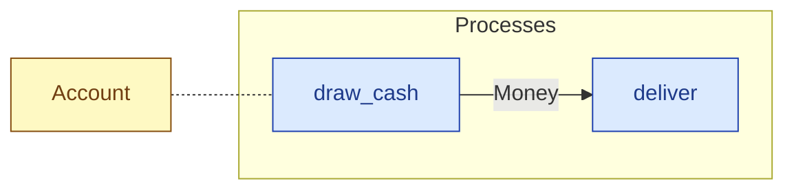

# `draw_cash` — process (R1)

> Generated by `tools/docgen.sh` from `model/cs5-works` — **do not hand-edit**; regenerate after any model change. Links are into the defining source lines; Mermaid nodes carry absolute click urls, the legend table the same links as plain markdown.

**P1 (account side) — draws `TAKE` pence from the account, leaving `LEFT` (R15 pattern over the crate edge: the draw opens the works' own container and splits the held supply-sealed cash with supply's conserving `split_money`, so nothing is minted here).**

- **Crate / subsystem:** `cs5-works` — case study CS-5, the works subsystem
- **Source:** [model/cs5-works/src/resources.rs#L391](/model/cs5-works/src/resources.rs#L391)

## Who and with what

No person in this signature: any time cost is drawn by an **adjacent** draw process in the flow (R15/F-048), or the step needs no actor.

Boundary objects used:

- `account`: `Account` (boundary object (R12)), threaded by value (R2) — [model/cs5-works/src/resources.rs#L75](/model/cs5-works/src/resources.rs#L75)

## Inputs

| Parameter | Declared type | Resource kind | Unit | Magnitude |
|---|---|---|---|---|
| `account` | `Account<FULL>` | boundary object (R12) | — | `FULL` (caller-stated) |

Observed entering this step in the traced flows: `Account`.

## Outputs

| Output | Resource kind | Unit | Magnitude | Routing (who takes it) |
|---|---|---|---|---|
| `Money<TAKE>` | continuous (container, R15) | pence | `TAKE` (caller-stated) | `deliver` (process) |
| `Account<LEFT>` | boundary object (R12) | — | `LEFT` (caller-stated) | moved in and returned (R2) |

Observed leaving this step in the traced flows: `Account 3000`, `Money 2000 pence`.

## Balances (R1/R3/R15)

- **Inherited by composition:** this step calls [`split_money`](/model/cs5-supply/src/resources.rs#L513), whose conservation asserts fire at every instantiation here (F-001):
  - `A + B == IN`

## Where it fits (R9: needs / feeds)

The model states **connections, not sequences**: any order satisfying these dependencies is valid (R9).

**Needs:**

- `Account` (shared resource) — threaded through, returned (R2)

**Feeds:**

- **Money** to `deliver` (process)

## Neighbourhood (one hop)

### Legend — node → source

| Node | Kind | Defined at |
|---|---|---|
| `n_draw_cash` (draw_cash) | process | [model/cs5-works/src/resources.rs#L391](/model/cs5-works/src/resources.rs#L391) |
| `n_deliver` (deliver) | process | [model/cs5-works/src/resources.rs#L488](/model/cs5-works/src/resources.rs#L488) |
| `n_Account` (Account) | shared resource | [model/cs5-works/src/resources.rs#L75](/model/cs5-works/src/resources.rs#L75) |
