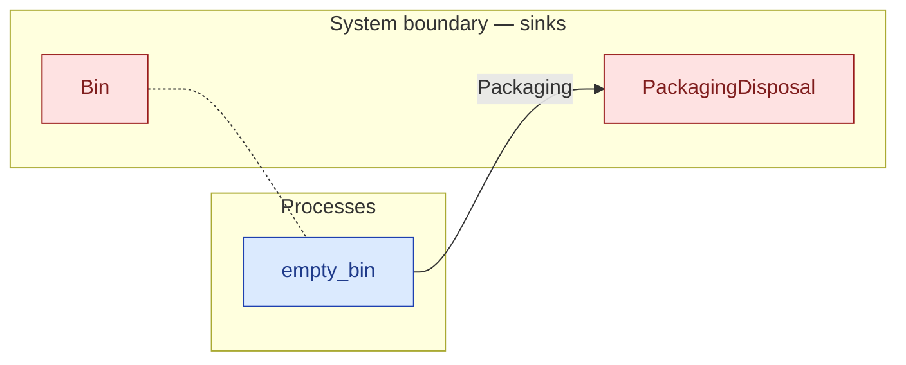

# `empty_bin` — process (R1)

> Generated by `tools/docgen.sh` from `model/cs5-works` — **do not hand-edit**; regenerate after any model change. Links are into the defining source lines; Mermaid nodes carry absolute click urls, the legend table the same links as plain markdown.

**P8 — empties the bin to disposal (SPEC P8; the F-039 sealed path across the crate edge): the bin is opened here (its contents are supply's tripwired packaging) and every piece is fed to supply's disposal sink through the recursive `ConsumeList`; the emptied bin returns with its full five spaces.**

- **Crate / subsystem:** `cs5-works` — case study CS-5, the works subsystem
- **Source:** [model/cs5-works/src/resources.rs#L537](/model/cs5-works/src/resources.rs#L537)

## Who and with what

No person in this signature: any time cost is drawn by an **adjacent** draw process in the flow (R15/F-048), or the step needs no actor.
Adjacent draw observed in the traced flows for this step: **30000 ms**.

Boundary objects used:

- `bin`: `Bin` (boundary object (R12)), threaded by value (R2) — [model/cs5-works/src/resources.rs#L186](/model/cs5-works/src/resources.rs#L186)

## Inputs

| Parameter | Declared type | Resource kind | Unit | Magnitude |
|---|---|---|---|---|
| `bin` | `Bin<Space, Contents>` | boundary object (R12) | — | — |
| `disposal` | consumer of Packaging (sink `PackagingDisposal`) | boundary object (R12) | — | — |

Observed entering this step in the traced flows: `EmptyBin`, `PackagingDisposal`.

## Outputs

| Output | Resource kind | Unit | Magnitude | Routing (who takes it) |
|---|---|---|---|---|
| `EmptyBin` | boundary object (R12) | — | — | moved in and returned (R2) |
| `D::Next` | — | — | — | the same boundary object, returned in its advanced state (R2/R12) |

Waste routed **inside** this process (never loose in a flow):

- `disposal` is a consumer parameter: **Packaging** is handed to `PackagingDisposal` **inside this process** (Consumer/ConsumeList bound, R12) — [model/cs5-supply/src/resources.rs#L350](/model/cs5-supply/src/resources.rs#L350)

## Balances (R1/R3/R15)

- **Compile-time assert:** `<Contents as PackagingLoad>::GRAMS == STATED_G`
  - message: *packaging mass reconciliation violated in empty_bin (R3, P8): the bin's contents must weigh exactly the stated disposal total (the flow states 50 g)*
  - fires at monomorphization (F-001): `cargo build`/`cargo test` catch a violation; `cargo check` and editor diagnostics do not.

## Where it fits (R9: needs / feeds)

The model states **connections, not sequences**: any order satisfying these dependencies is valid (R9).

**Needs:**

- `Bin` (boundary sink) — threaded through, returned (R2)

**Feeds:**

- **Packaging** to `PackagingDisposal` (boundary sink)

## Neighbourhood (one hop)

### Legend — node → source

| Node | Kind | Defined at |
|---|---|---|
| `n_empty_bin` (empty_bin) | process | [model/cs5-works/src/resources.rs#L537](/model/cs5-works/src/resources.rs#L537) |
| `n_PackagingDisposal` (PackagingDisposal) | boundary sink | [model/cs5-supply/src/resources.rs#L350](/model/cs5-supply/src/resources.rs#L350) |
| `n_Bin` (Bin) | boundary sink | [model/cs5-works/src/resources.rs#L186](/model/cs5-works/src/resources.rs#L186) |
