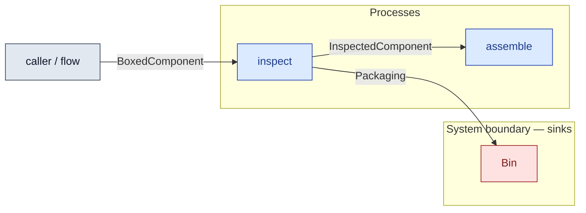

# `inspect` — process (R1)

> Generated by `tools/docgen.sh` from `model/cs5-works` — **do not hand-edit**; regenerate after any model change. Links are into the defining source lines; Mermaid nodes carry absolute click urls, the legend table the same links as plain markdown.

**P5 — goods-in inspection at the UK site (REQ-025; SPEC P5).**

- **Crate / subsystem:** `cs5-works` — case study CS-5, the works subsystem
- **Source:** [model/cs5-works/src/resources.rs#L417](/model/cs5-works/src/resources.rs#L417)

## Who and with what

No person in this signature: any time cost is drawn by an **adjacent** draw process in the flow (R15/F-048), or the step needs no actor.

## Inputs

| Parameter | Declared type | Resource kind | Unit | Magnitude |
|---|---|---|---|---|
| `boxed` | `BoxedComponent` | discrete (consumable, R13) | — | — |
| `bin` | consumer of Packaging (sink `Bin`) | boundary object (R12) | — | — |

Observed entering this step in the traced flows: `BoxedComponent`, `EmptyBin`.

## Outputs

| Output | Resource kind | Unit | Magnitude | Routing (who takes it) |
|---|---|---|---|---|
| `InspectedComponent` | discrete (consumable, R13) | — | — | `assemble` (process) |
| `B::Next` | — | — | — | the same boundary object, returned in its advanced state (R2/R12) |

Waste routed **inside** this process (never loose in a flow):

- `bin` is a consumer parameter: **Packaging** is handed to `Bin` **inside this process** (Consumer/ConsumeList bound, R12) — [model/cs5-works/src/resources.rs#L186](/model/cs5-works/src/resources.rs#L186)

Observed leaving this step in the traced flows: `EmptyBin`, `InspectedComponent`.

## Balances (R1/R3/R15)

- **Inherited by composition:** this step calls [`open_and_inspect`](/model/cs5-supply/src/resources.rs#L665), whose conservation asserts fire at every instantiation here (F-001):
  - `InspectedComponent::MASS_G + PACK == BoxedComponent::MASS_G`

## Requirements (R10 — the compliance matrix)

| Requirement | Statement | Defined at | Satisfied by | Verified by |
|---|---|---|---|---|

This item is doc-tagged `Satisfies: REQ-025`.

## Where it fits (R9: needs / feeds)

The model states **connections, not sequences**: any order satisfying these dependencies is valid (R9).

**Needs:**

- **BoxedComponent** from `caller / flow` (flow input/output)

**Feeds:**

- **InspectedComponent** to `assemble` (process)
- **Packaging** to `Bin` (boundary sink)

## Neighbourhood (one hop)

### Legend — node → source

| Node | Kind | Defined at |
|---|---|---|
| `n_inspect` (inspect) | process | [model/cs5-works/src/resources.rs#L417](/model/cs5-works/src/resources.rs#L417) |
| `n_assemble` (assemble) | process | [model/cs5-works/src/resources.rs#L447](/model/cs5-works/src/resources.rs#L447) |
| `n_caller` (caller / flow) | flow input/output | — |
| `n_Bin` (Bin) | boundary sink | [model/cs5-works/src/resources.rs#L186](/model/cs5-works/src/resources.rs#L186) |
