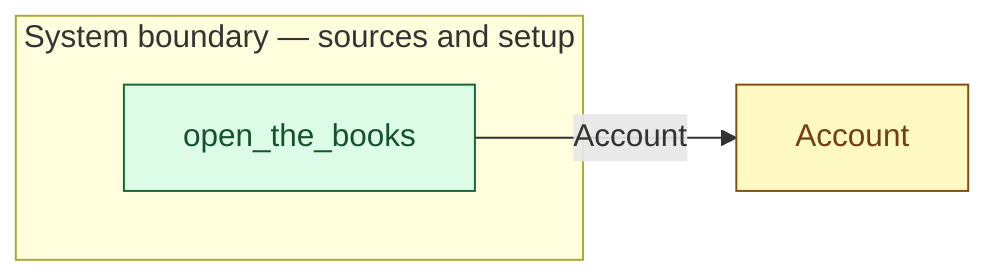

# `open_the_books` — boundary function (R12)

> Generated by `tools/docgen.sh` from `model/cs5-works` — **do not hand-edit**; regenerate after any model change. Links are into the defining source lines; Mermaid nodes carry absolute click urls, the legend table the same links as plain markdown.

**The works account opens with its float (R12; SPEC §3: 5000 p).**

- **Crate / subsystem:** `cs5-works` — case study CS-5, the works subsystem
- **Source:** [model/cs5-works/src/resources.rs#L303](/model/cs5-works/src/resources.rs#L303)
- **Placeholder:** the works' bank — the float is simply there.

## Who and with what

No person in this signature: any time cost is drawn by an **adjacent** draw process in the flow (R15/F-048), or the step needs no actor.

## Inputs

| Parameter | Declared type | Resource kind | Unit | Magnitude |
|---|---|---|---|---|

## Outputs

| Output | Resource kind | Unit | Magnitude | Routing (who takes it) |
|---|---|---|---|---|
| `Account<OPENING_FLOAT_PENCE>` | boundary object (R12) | — | OPENING_FLOAT_PENCE = 5000 | `Account` (shared resource) |

Observed leaving this step in the traced flows: `Account`.

## Where it fits (R9: needs / feeds)

The model states **connections, not sequences**: any order satisfying these dependencies is valid (R9).

**Feeds:**

- **Account** to `Account` (shared resource)

## Neighbourhood (one hop)

### Legend — node → source

| Node | Kind | Defined at |
|---|---|---|
| `n_Account` (Account) | shared resource | [model/cs5-works/src/resources.rs#L75](/model/cs5-works/src/resources.rs#L75) |
| `n_open_the_books` (open_the_books) | boundary source | [model/cs5-works/src/resources.rs#L303](/model/cs5-works/src/resources.rs#L303) |

## Open items (`Placeholder:` tags, R12)

- this function is itself a placeholder (see the header above)
