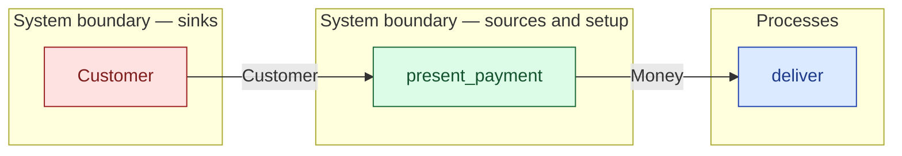

# `present_payment` — boundary function (R12)

> Generated by `tools/docgen.sh` from `model/cs5-works` — **do not hand-edit**; regenerate after any model change. Links are into the defining source lines; Mermaid nodes carry absolute click urls, the legend table the same links as plain markdown.

**The customer presents payment on delivery (R12; SPEC §3: 9000 p).**

- **Crate / subsystem:** `cs5-works` — case study CS-5, the works subsystem
- **Source:** [model/cs5-works/src/resources.rs#L336](/model/cs5-works/src/resources.rs#L336)

## Who and with what

No person in this signature: any time cost is drawn by an **adjacent** draw process in the flow (R15/F-048), or the step needs no actor.

Boundary objects used:

- `customer`: `Customer` (boundary object (R12)), threaded by value (R2) — [model/cs5-works/src/resources.rs#L274](/model/cs5-works/src/resources.rs#L274)

## Inputs

| Parameter | Declared type | Resource kind | Unit | Magnitude |
|---|---|---|---|---|
| `customer` | `Customer` | boundary object (R12) | — | — |

Observed entering this step in the traced flows: `Customer`.

## Outputs

| Output | Resource kind | Unit | Magnitude | Routing (who takes it) |
|---|---|---|---|---|
| `Money<SALE_PRICE_PENCE>` | continuous (container, R15) | pence | SALE_PRICE_PENCE = 9000 | `deliver` (process) |
| `Customer` | boundary object (R12) | — | — | moved in and returned (R2) |

Observed leaving this step in the traced flows: `Customer`, `Money`.

## Where it fits (R9: needs / feeds)

The model states **connections, not sequences**: any order satisfying these dependencies is valid (R9).

**Needs:**

- **Customer** from `Customer` (boundary sink)

**Feeds:**

- **Money** to `deliver` (process)

## Neighbourhood (one hop)

### Legend — node → source

| Node | Kind | Defined at |
|---|---|---|
| `n_deliver` (deliver) | process | [model/cs5-works/src/resources.rs#L488](/model/cs5-works/src/resources.rs#L488) |
| `n_Customer` (Customer) | boundary sink | [model/cs5-works/src/resources.rs#L274](/model/cs5-works/src/resources.rs#L274) |
| `n_present_payment` (present_payment) | boundary source | [model/cs5-works/src/resources.rs#L336](/model/cs5-works/src/resources.rs#L336) |

## Open items (`Placeholder:` tags, R12)

- `Customer` — the customer — their hinterland (what they do with the ([model/cs5-works/src/resources.rs#L274](/model/cs5-works/src/resources.rs#L274))
