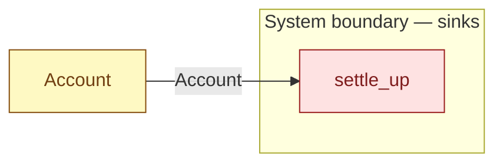

# `settle_up` — boundary function (R12)

> Generated by `tools/docgen.sh` from `model/cs5-works` — **do not hand-edit**; regenerate after any model change. Links are into the defining source lines; Mermaid nodes carry absolute click urls, the legend table the same links as plain markdown.

**The account settles up at flow end (R12): the boundary exit for [`Account`] at any balance — the held cash leaves through supply's GBP boundary sink (F-035).**

- **Crate / subsystem:** `cs5-works` — case study CS-5, the works subsystem
- **Source:** [model/cs5-works/src/resources.rs#L315](/model/cs5-works/src/resources.rs#L315)
- **Placeholder:** the works' bank — an unbounded sink for banked takings.

## Who and with what

No person in this signature: any time cost is drawn by an **adjacent** draw process in the flow (R15/F-048), or the step needs no actor.

Boundary objects used:

- `account`: `Account` (boundary object (R12)), threaded by value (R2) — [model/cs5-works/src/resources.rs#L75](/model/cs5-works/src/resources.rs#L75)

## Inputs

| Parameter | Declared type | Resource kind | Unit | Magnitude |
|---|---|---|---|---|
| `account` | `Account<PENCE>` | boundary object (R12) | — | `PENCE` (caller-stated) |

## Outputs

| Output | Resource kind | Unit | Magnitude | Routing (who takes it) |
|---|---|---|---|---|

## Where it fits (R9: needs / feeds)

The model states **connections, not sequences**: any order satisfying these dependencies is valid (R9).

**Needs:**

- **Account** from `Account` (shared resource)

## Neighbourhood (one hop)

### Legend — node → source

| Node | Kind | Defined at |
|---|---|---|
| `n_Account` (Account) | shared resource | [model/cs5-works/src/resources.rs#L75](/model/cs5-works/src/resources.rs#L75) |
| `n_settle_up` (settle_up) | boundary sink | [model/cs5-works/src/resources.rs#L315](/model/cs5-works/src/resources.rs#L315) |

## Open items (`Placeholder:` tags, R12)

- this function is itself a placeholder (see the header above)
