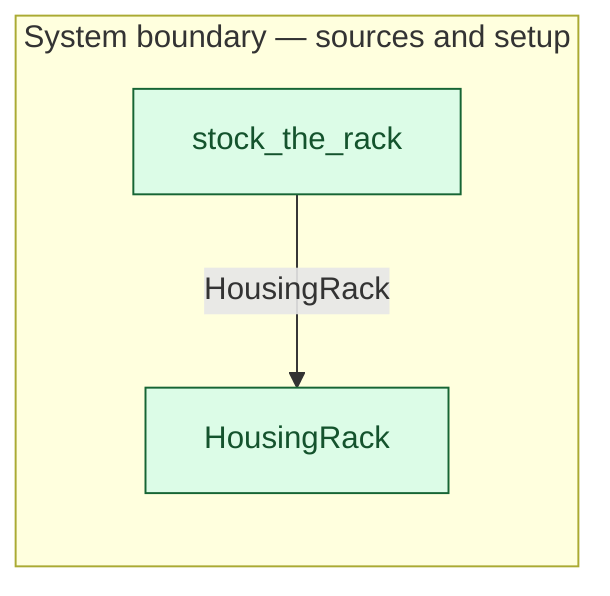

# `stock_the_rack` — boundary function (R12)

> Generated by `tools/docgen.sh` from `model/cs5-works` — **do not hand-edit**; regenerate after any model change. Links are into the defining source lines; Mermaid nodes carry absolute click urls, the legend table the same links as plain markdown.

**The fill function (R12): the stocked housing rack enters the model — three real housings come into existence here and nowhere else.**

- **Crate / subsystem:** `cs5-works` — case study CS-5, the works subsystem
- **Source:** [model/cs5-works/src/resources.rs#L345](/model/cs5-works/src/resources.rs#L345)
- **Placeholder:** works housing stock (SPEC §1: housing procurement out of

## Who and with what

No person in this signature: any time cost is drawn by an **adjacent** draw process in the flow (R15/F-048), or the step needs no actor.

## Inputs

| Parameter | Declared type | Resource kind | Unit | Magnitude |
|---|---|---|---|---|

## Outputs

| Output | Resource kind | Unit | Magnitude | Routing (who takes it) |
|---|---|---|---|---|
| `FullHousingRack` | boundary object (R12) | — | — | `HousingRack` (boundary source) |

Observed leaving this step in the traced flows: `FullHousingRack`.

## Where it fits (R9: needs / feeds)

The model states **connections, not sequences**: any order satisfying these dependencies is valid (R9).

**Feeds:**

- **HousingRack** to `HousingRack` (boundary source)

## Neighbourhood (one hop)

### Legend — node → source

| Node | Kind | Defined at |
|---|---|---|
| `n_HousingRack` (HousingRack) | boundary source | [model/cs5-works/src/resources.rs#L127](/model/cs5-works/src/resources.rs#L127) |
| `n_stock_the_rack` (stock_the_rack) | boundary source | [model/cs5-works/src/resources.rs#L345](/model/cs5-works/src/resources.rs#L345) |

## Open items (`Placeholder:` tags, R12)

- this function is itself a placeholder (see the header above)
- `HousingRack` — works housing stock — goods-in for housings is out of scope ([model/cs5-works/src/resources.rs#L127](/model/cs5-works/src/resources.rs#L127))
