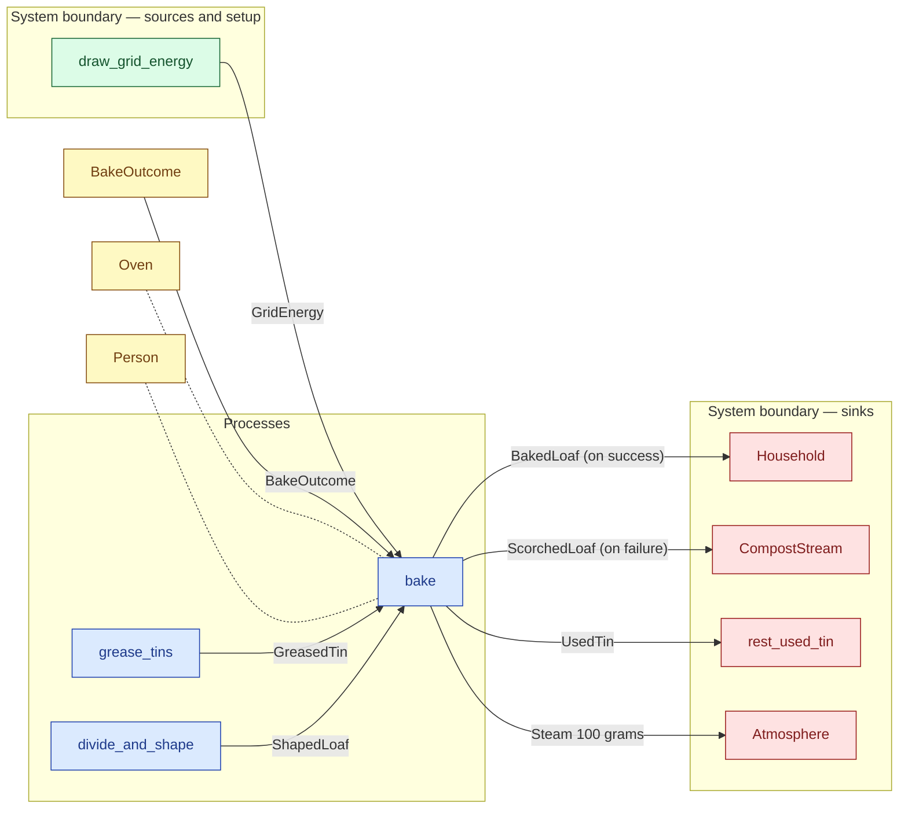

# `bake` — process (R1)

> Generated by `tools/docgen.sh` from `model/cs6-bread-batch` — **do not hand-edit**; regenerate after any model change. Links are into the defining source lines; Mermaid nodes carry absolute click urls, the legend table the same links as plain markdown.

**P6 — Bake (SPEC.md §5 P6, line 142): **fallible (R17), one loaf per bake, run twice** — one shaped loaf seated in a greased tin goes into the oven with 2_500_000 J of grid energy and one outcome token (the only way variability enters, F-042), and comes out baked, or — finally, with no rework (the dough is consumed) — scorched.**

- **Crate / subsystem:** `cs6-bread-batch` — case study CS-6: baking a batch of bread
- **Source:** [model/cs6-bread-batch/src/resources.rs#L998](/model/cs6-bread-batch/src/resources.rs#L998)
- **Requirements bound on the signature:** REQ-029

## Who and with what

| Actor | Type | Budget at entry | This step's adjacent draw (F-048) |
|---|---|---|---|
| `person` | `Person` | `B` (caller-stated) | 300000 ms |

Reusables threaded — moved in and returned (R2): `oven: Oven`.

## Inputs

| Parameter | Declared type | Resource kind | Unit | Magnitude |
|---|---|---|---|---|
| `person` | `Person<B>` | reusable (model-core, R2/R15) | ms | `B` (caller-stated) |
| `oven` | `Oven` | reusable (R2) | — | — |
| `shaped_loaf` | `ShapedLoaf` | discrete (consumable, R13) | — | — |
| `greased_tin` | `T` → `GreasedTin` (via the requirement bound) | continuous (container, R15) | grams | — |
| `grid_energy` | `GridEnergy<2_500_000>` | continuous (container, R15) | joules | 2500000 |
| `bake_outcome` | `BakeOutcome` | outcome token (R17) | — | — |
| `atmosphere` | consumer of Steam 100 grams (sink `Atmosphere`) | boundary object (R12) | — | — |

Observed entering this step in the traced flows: `Atmosphere`, `BakeOutcome`, `GreasedTin 456 grams`, `GridEnergy 2500000 joules`, `Oven`, `Person 1200000 ms`, `Person 900000 ms`, `ShapedLoaf`, `atmosphere`.

## Outputs

| Output | Resource kind | Unit | Magnitude | Routing (who takes it) |
|---|---|---|---|---|
| `BakeOk` (on success) | outcome bundle (R17 grouping, F-046) | — | — | destructured by the handling arm |
| `BakeOk.person: Person` (on success) | reusable (model-core, R2/R15) | ms | `B` (caller-stated) | returned in the bundle |
| `BakeOk.baked_loaf: BakedLoaf` (on success) | discrete (consumable, R13) | — | — | `Household` (boundary sink) |
| `BakeOk.used_tin: UsedTin` (on success) | continuous (container, R15) | grams | 453 | `rest_used_tin` (boundary sink) |
| `BakeOk.oven: Oven` (on success) | reusable (R2) | — | — | returned in the bundle |
| `BakeOk.atmosphere: A` (on success) | — | — | — | returned in the bundle |
| `BakeFail` (on failure) | outcome bundle (R17 grouping, F-046) | — | — | destructured by the handling arm |
| `BakeFail.person: Person` (on failure) | reusable (model-core, R2/R15) | ms | `B` (caller-stated) | returned in the bundle |
| `BakeFail.scorched_loaf: ScorchedLoaf` (on failure) | discrete (consumable, R13) | — | — | `CompostStream` (boundary sink) |
| `BakeFail.used_tin: UsedTin` (on failure) | continuous (container, R15) | grams | 453 | `rest_used_tin` (boundary sink) |
| `BakeFail.oven: Oven` (on failure) | reusable (R2) | — | — | returned in the bundle |
| `BakeFail.atmosphere: A` (on failure) | — | — | — | returned in the bundle |

Waste routed **inside** this process (never loose in a flow):

- `atmosphere` is a consumer parameter: **Steam 100 grams** is handed to `Atmosphere` **inside this process** (Consumer/ConsumeList bound, R12) — [model/cs6-bread-batch/src/resources.rs#L532](/model/cs6-bread-batch/src/resources.rs#L532)

Observed leaving this step in the traced flows: `BakedLoaf`, `Oven`, `Person`, `ScorchedLoaf`, `UsedTin 453 grams`, `atmosphere`.

## Balances (R1/R3/R15)

- **Compile-time assert:** `ShapedLoaf::MASS_G + T::MASS_G == BakedLoaf::MASS_G + 453 + 100`
  - message: *success-arm mass conservation violated in bake (SPEC.md §5 P6 line 158): the baked loaf*
  - fires at monomorphization (F-001): `cargo build`/`cargo test` catch a violation; `cargo check` and editor diagnostics do not.
- **Compile-time assert:** `ShapedLoaf::MASS_G + T::MASS_G == ScorchedLoaf::MASS_G + 453 + 100`
  - message: *failure-arm mass conservation violated in bake (SPEC.md §5 P6 line 158): the scorched loaf*
  - fires at monomorphization (F-001): `cargo build`/`cargo test` catch a violation; `cargo check` and editor diagnostics do not.
- **Compile-time assert:** `2_500_000 == BakedLoaf::EMBODIED_J + 2_200_000`
  - message: *energy conservation violated in bake (SPEC.md §5 P6 line 158): energy 2_500_000 = 300_000 + 2_200_000 (assert)*
  - fires at monomorphization (F-001): `cargo build`/`cargo test` catch a violation; `cargo check` and editor diagnostics do not.
- **Structural:** the const parameter `B` appears in an input and an output — the magnitude flows through unchanged, checked by the shared type parameter (no assert needed).

## Requirements (R10 — the compliance matrix)

| Requirement | Statement | Defined at | Satisfied by | Verified by |
|---|---|---|---|---|
| REQ-029 | The oven may bake only a loaf seated in a greased tin. | [model/cs6-bread-batch/src/requirements.rs#L51](/model/cs6-bread-batch/src/requirements.rs#L51) | `TinReadyToBake` | [`bake_success_arm_balances_and_the_loaf_reaches_the_household`](/model/cs6-bread-batch/src/resources.rs#L1188), [`bake_failure_arm_balances_and_the_scorched_loaf_reaches_compost`](/model/cs6-bread-batch/src/resources.rs#L1220), [`order_a_both_baked_accounts_for_everything`](/model/cs6-bread-batch/tests/flows.rs#L124), [`order_a_first_scorched_accounts_for_everything`](/model/cs6-bread-batch/tests/flows.rs#L159), [`order_a_second_scorched_accounts_for_everything`](/model/cs6-bread-batch/tests/flows.rs#L193), [`order_a_both_scorched_accounts_for_everything`](/model/cs6-bread-batch/tests/flows.rs#L228), [`order_b_both_baked_ends_in_the_identical_state`](/model/cs6-bread-batch/tests/flows.rs#L264), [`order_b_both_scorched_ends_in_the_identical_state`](/model/cs6-bread-batch/tests/flows.rs#L299) |

This item is doc-tagged `Satisfies: REQ-029, REQ-031`.

## Where it fits (R9: needs / feeds)

The model states **connections, not sequences**: any order satisfying these dependencies is valid (R9).

**Needs:**

- **BakeOutcome** from `BakeOutcome` (shared resource)
- **GreasedTin** from `grease_tins` (process)
- **GridEnergy** from `draw_grid_energy` (boundary source)
- **ShapedLoaf** from `divide_and_shape` (process)
- `Oven` (shared resource) — threaded through, returned (R2)
- `Person` (shared resource) — threaded through, returned (R2)

**Feeds:**

- **BakedLoaf (on success)** to `Household` (boundary sink)
- **ScorchedLoaf (on failure)** to `CompostStream` (boundary sink)
- **Steam 100 grams** to `Atmosphere` (boundary sink)
- **UsedTin** to `rest_used_tin` (boundary sink)

## Neighbourhood (one hop)

### Legend — node → source

| Node | Kind | Defined at |
|---|---|---|
| `n_grease_tins` (grease_tins) | process | [model/cs6-bread-batch/src/resources.rs#L918](/model/cs6-bread-batch/src/resources.rs#L918) |
| `n_divide_and_shape` (divide_and_shape) | process | [model/cs6-bread-batch/src/resources.rs#L948](/model/cs6-bread-batch/src/resources.rs#L948) |
| `n_bake` (bake) | process | [model/cs6-bread-batch/src/resources.rs#L998](/model/cs6-bread-batch/src/resources.rs#L998) |
| `n_BakeOutcome` (BakeOutcome) | shared resource | [model/cs6-bread-batch/src/resources.rs#L305](/model/cs6-bread-batch/src/resources.rs#L305) |
| `n_Household` (Household) | boundary sink | [model/cs6-bread-batch/src/resources.rs#L473](/model/cs6-bread-batch/src/resources.rs#L473) |
| `n_draw_grid_energy` (draw_grid_energy) | boundary source | [model/cs6-bread-batch/src/resources.rs#L640](/model/cs6-bread-batch/src/resources.rs#L640) |
| `n_Oven` (Oven) | shared resource | [model/cs6-bread-batch/src/resources.rs#L274](/model/cs6-bread-batch/src/resources.rs#L274) |
| `n_CompostStream` (CompostStream) | boundary sink | [model/cs6-bread-batch/src/resources.rs#L503](/model/cs6-bread-batch/src/resources.rs#L503) |
| `n_rest_used_tin` (rest_used_tin) | boundary sink | [model/cs6-bread-batch/src/resources.rs#L776](/model/cs6-bread-batch/src/resources.rs#L776) |
| `n_Atmosphere` (Atmosphere) | boundary sink | [model/cs6-bread-batch/src/resources.rs#L532](/model/cs6-bread-batch/src/resources.rs#L532) |
| `n_Person` (Person) | shared resource | — |
