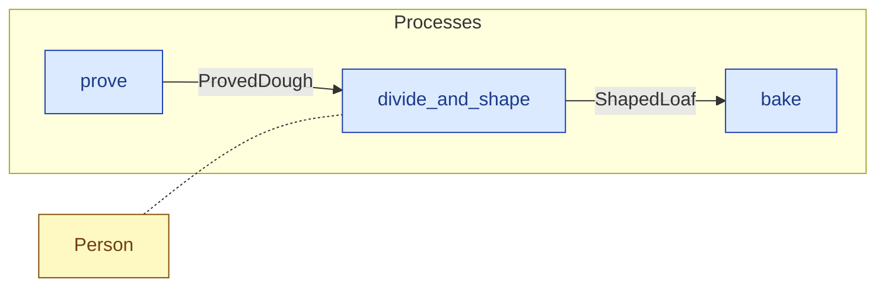

# `divide_and_shape` — process (R1)

> Generated by `tools/docgen.sh` from `model/cs6-bread-batch` — **do not hand-edit**; regenerate after any model change. Links are into the defining source lines; Mermaid nodes carry absolute click urls, the legend table the same links as plain markdown.

**P5 — Divide and shape (SPEC.md §5 P5, line 134): the proved batch is divided and shaped into the two 841 g loaves.**

- **Crate / subsystem:** `cs6-bread-batch` — case study CS-6: baking a batch of bread
- **Source:** [model/cs6-bread-batch/src/resources.rs#L948](/model/cs6-bread-batch/src/resources.rs#L948)
- **Requirements bound on the signature:** REQ-028

## Who and with what

| Actor | Type | Budget at entry | This step's adjacent draw (F-048) |
|---|---|---|---|
| `person` | `Person` | `B` (caller-stated) | 480000 ms |

## Inputs

| Parameter | Declared type | Resource kind | Unit | Magnitude |
|---|---|---|---|---|
| `person` | `Person<B>` | reusable (model-core, R2/R15) | ms | `B` (caller-stated) |
| `dough` | `D` → `ProvedDough` (via the requirement bound) | discrete (consumable, R13) | — | — |

Observed entering this step in the traced flows: `Person 1980000 ms`, `ProvedDough`.

## Outputs

| Output | Resource kind | Unit | Magnitude | Routing (who takes it) |
|---|---|---|---|---|
| `Person<B>` | reusable (model-core, R2/R15) | ms | `B` (caller-stated) | moved in and returned (R2) |
| `ShapedLoaf` | discrete (consumable, R13) | — | — | `bake` (process) |
| `ShapedLoaf` | discrete (consumable, R13) | — | — | `bake` (process) |

Observed leaving this step in the traced flows: `Person 1980000 ms`, `ShapedLoaf`.

## Balances (R1/R3/R15)

- **Compile-time assert:** `D::MASS_G == ShapedLoaf::MASS_G + ShapedLoaf::MASS_G`
  - message: *mass conservation violated in divide_and_shape (SPEC.md §5 P5 line 139): mass 1_682 = 841 + 841 (assert)*
  - fires at monomorphization (F-001): `cargo build`/`cargo test` catch a violation; `cargo check` and editor diagnostics do not.
- **Structural:** the const parameter `B` appears in an input and an output — the magnitude flows through unchanged, checked by the shared type parameter (no assert needed).

## Requirements (R10 — the compliance matrix)

| Requirement | Statement | Defined at | Satisfied by | Verified by |
|---|---|---|---|---|
| REQ-028 | Dough may be divided and shaped only once it is proved. | [model/cs6-bread-batch/src/requirements.rs#L44](/model/cs6-bread-batch/src/requirements.rs#L44) | `DoughReadyToShape` | [`divide_and_shape_splits_the_proved_dough_exactly`](/model/cs6-bread-batch/src/resources.rs#L1168), [`order_a_both_baked_accounts_for_everything`](/model/cs6-bread-batch/tests/flows.rs#L124), [`order_a_first_scorched_accounts_for_everything`](/model/cs6-bread-batch/tests/flows.rs#L159), [`order_a_second_scorched_accounts_for_everything`](/model/cs6-bread-batch/tests/flows.rs#L193), [`order_a_both_scorched_accounts_for_everything`](/model/cs6-bread-batch/tests/flows.rs#L228), [`order_b_both_baked_ends_in_the_identical_state`](/model/cs6-bread-batch/tests/flows.rs#L264), [`order_b_both_scorched_ends_in_the_identical_state`](/model/cs6-bread-batch/tests/flows.rs#L299) |

This item is doc-tagged `Satisfies: REQ-028`.

## Where it fits (R9: needs / feeds)

The model states **connections, not sequences**: any order satisfying these dependencies is valid (R9).

**Needs:**

- **ProvedDough** from `prove` (process)
- `Person` (shared resource) — threaded through, returned (R2)

**Feeds:**

- **ShapedLoaf** to `bake` (process)

## Neighbourhood (one hop)

### Legend — node → source

| Node | Kind | Defined at |
|---|---|---|
| `n_prove` (prove) | process | [model/cs6-bread-batch/src/resources.rs#L897](/model/cs6-bread-batch/src/resources.rs#L897) |
| `n_divide_and_shape` (divide_and_shape) | process | [model/cs6-bread-batch/src/resources.rs#L948](/model/cs6-bread-batch/src/resources.rs#L948) |
| `n_bake` (bake) | process | [model/cs6-bread-batch/src/resources.rs#L998](/model/cs6-bread-batch/src/resources.rs#L998) |
| `n_Person` (Person) | shared resource | — |
