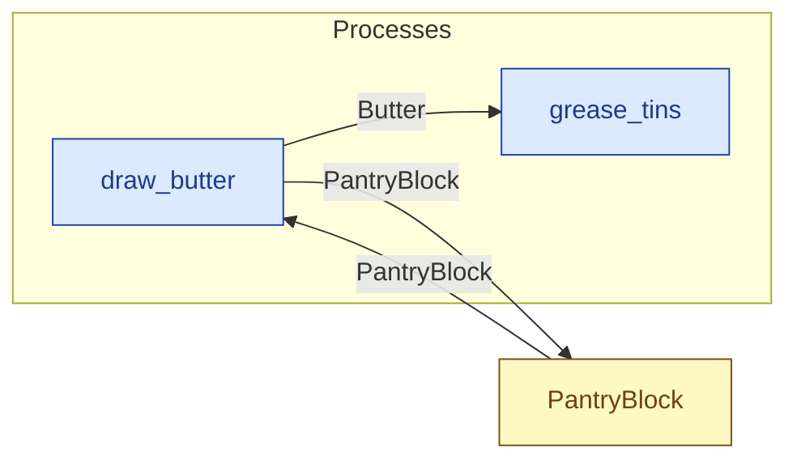

# `draw_butter` — process (R1)

> Generated by `tools/docgen.sh` from `model/cs6-bread-batch` — **do not hand-edit**; regenerate after any model change. Links are into the defining source lines; Mermaid nodes carry absolute click urls, the legend table the same links as plain markdown.

**Draws `TAKE` of Butter from the PantryBlock (R15), leaving `LEFT` of `FULL` (SPEC.md §4 line 72); the remainder is caller-stated and checked at compile time (F-022, F-030).**

- **Crate / subsystem:** `cs6-bread-batch` — case study CS-6: baking a batch of bread
- **Source:** [model/cs6-bread-batch/src/resources.rs#L825](/model/cs6-bread-batch/src/resources.rs#L825)

## Who and with what

No person in this signature: any time cost is drawn by an **adjacent** draw process in the flow (R15/F-048), or the step needs no actor.

## Inputs

| Parameter | Declared type | Resource kind | Unit | Magnitude |
|---|---|---|---|---|
| `container` | `PantryBlock<FULL>` | continuous (container, R15) | grams remaining | `FULL` (caller-stated) |

Observed entering this step in the traced flows: `PantryBlock 250 grams`.

## Outputs

| Output | Resource kind | Unit | Magnitude | Routing (who takes it) |
|---|---|---|---|---|
| `Butter<TAKE>` | continuous (container, R15) | grams | `TAKE` (caller-stated) | `grease_tins` (process) |
| `PantryBlock<LEFT>` | continuous (container, R15) | grams remaining | `LEFT` (caller-stated) | `PantryBlock` (shared resource) |

Observed leaving this step in the traced flows: `Butter 12 grams`, `PantryBlock 238 grams`.

## Where it fits (R9: needs / feeds)

The model states **connections, not sequences**: any order satisfying these dependencies is valid (R9).

**Needs:**

- **PantryBlock** from `PantryBlock` (shared resource)

**Feeds:**

- **Butter** to `grease_tins` (process)
- **PantryBlock** to `PantryBlock` (shared resource)

## Neighbourhood (one hop)

### Legend — node → source

| Node | Kind | Defined at |
|---|---|---|
| `n_draw_butter` (draw_butter) | process | [model/cs6-bread-batch/src/resources.rs#L825](/model/cs6-bread-batch/src/resources.rs#L825) |
| `n_grease_tins` (grease_tins) | process | [model/cs6-bread-batch/src/resources.rs#L918](/model/cs6-bread-batch/src/resources.rs#L918) |
| `n_PantryBlock` (PantryBlock) | shared resource | [model/cs6-bread-batch/src/resources.rs#L350](/model/cs6-bread-batch/src/resources.rs#L350) |
