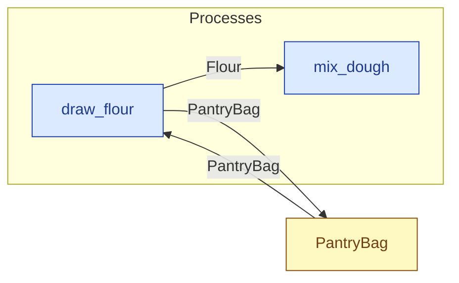

# `draw_flour` — process (R1)

> Generated by `tools/docgen.sh` from `model/cs6-bread-batch` — **do not hand-edit**; regenerate after any model change. Links are into the defining source lines; Mermaid nodes carry absolute click urls, the legend table the same links as plain markdown.

**Draws `TAKE` of Flour from the PantryBag (R15), leaving `LEFT` of `FULL` (SPEC.md §4 line 69); the remainder is caller-stated and checked at compile time (F-022, F-030).**

- **Crate / subsystem:** `cs6-bread-batch` — case study CS-6: baking a batch of bread
- **Source:** [model/cs6-bread-batch/src/resources.rs#L809](/model/cs6-bread-batch/src/resources.rs#L809)

## Who and with what

No person in this signature: any time cost is drawn by an **adjacent** draw process in the flow (R15/F-048), or the step needs no actor.

## Inputs

| Parameter | Declared type | Resource kind | Unit | Magnitude |
|---|---|---|---|---|
| `container` | `PantryBag<FULL>` | continuous (container, R15) | grams remaining | `FULL` (caller-stated) |

Observed entering this step in the traced flows: `PantryBag 1500 grams`.

## Outputs

| Output | Resource kind | Unit | Magnitude | Routing (who takes it) |
|---|---|---|---|---|
| `Flour<TAKE>` | continuous (container, R15) | grams | `TAKE` (caller-stated) | `mix_dough` (process) |
| `PantryBag<LEFT>` | continuous (container, R15) | grams remaining | `LEFT` (caller-stated) | `PantryBag` (shared resource) |

Observed leaving this step in the traced flows: `Flour 1000 grams`, `PantryBag 500 grams`.

## Where it fits (R9: needs / feeds)

The model states **connections, not sequences**: any order satisfying these dependencies is valid (R9).

**Needs:**

- **PantryBag** from `PantryBag` (shared resource)

**Feeds:**

- **Flour** to `mix_dough` (process)
- **PantryBag** to `PantryBag` (shared resource)

## Neighbourhood (one hop)

### Legend — node → source

| Node | Kind | Defined at |
|---|---|---|
| `n_draw_flour` (draw_flour) | process | [model/cs6-bread-batch/src/resources.rs#L809](/model/cs6-bread-batch/src/resources.rs#L809) |
| `n_mix_dough` (mix_dough) | process | [model/cs6-bread-batch/src/resources.rs#L845](/model/cs6-bread-batch/src/resources.rs#L845) |
| `n_PantryBag` (PantryBag) | shared resource | [model/cs6-bread-batch/src/resources.rs#L332](/model/cs6-bread-batch/src/resources.rs#L332) |
