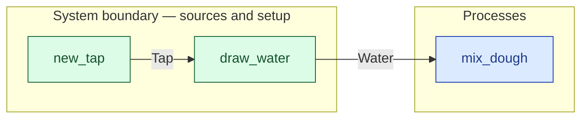

# `draw_water` — boundary function (R12)

> Generated by `tools/docgen.sh` from `model/cs6-bread-batch` — **do not hand-edit**; regenerate after any model change. Links are into the defining source lines; Mermaid nodes carry absolute click urls, the legend table the same links as plain markdown.

**Draws `TAKE` of Water from the boundary (R15: an unbounded source of continuous material is a draw-style boundary process, never a `Supplier` impl, F-028).**

- **Crate / subsystem:** `cs6-bread-batch` — case study CS-6: baking a batch of bread
- **Source:** [model/cs6-bread-batch/src/resources.rs#L624](/model/cs6-bread-batch/src/resources.rs#L624)
- **Placeholder:** unbounded boundary source (SPEC.md §4 line 70).

## Who and with what

No person in this signature: any time cost is drawn by an **adjacent** draw process in the flow (R15/F-048), or the step needs no actor.

Reusables threaded — moved in and returned (R2): `source: Tap`.

## Inputs

| Parameter | Declared type | Resource kind | Unit | Magnitude |
|---|---|---|---|---|
| `source` | `Tap` | reusable (R2) | — | — |

Observed entering this step in the traced flows: `Tap`.

## Outputs

| Output | Resource kind | Unit | Magnitude | Routing (who takes it) |
|---|---|---|---|---|
| `Water<TAKE>` | continuous (container, R15) | grams | `TAKE` (caller-stated) | `mix_dough` (process) |
| `Tap` | reusable (R2) | — | — | moved in and returned (R2) |

Observed leaving this step in the traced flows: `Tap`, `Water 650 grams`.

## Where it fits (R9: needs / feeds)

The model states **connections, not sequences**: any order satisfying these dependencies is valid (R9).

**Needs:**

- **Tap** from `new_tap` (boundary source)

**Feeds:**

- **Water** to `mix_dough` (process)

## Neighbourhood (one hop)

### Legend — node → source

| Node | Kind | Defined at |
|---|---|---|
| `n_mix_dough` (mix_dough) | process | [model/cs6-bread-batch/src/resources.rs#L845](/model/cs6-bread-batch/src/resources.rs#L845) |
| `n_new_tap` (new_tap) | boundary source | [model/cs6-bread-batch/src/resources.rs#L615](/model/cs6-bread-batch/src/resources.rs#L615) |
| `n_draw_water` (draw_water) | boundary source | [model/cs6-bread-batch/src/resources.rs#L624](/model/cs6-bread-batch/src/resources.rs#L624) |

## Open items (`Placeholder:` tags, R12)

- this function is itself a placeholder (see the header above)
- `Tap` — unbounded boundary source (R15). ([model/cs6-bread-batch/src/resources.rs#L316](/model/cs6-bread-batch/src/resources.rs#L316))
