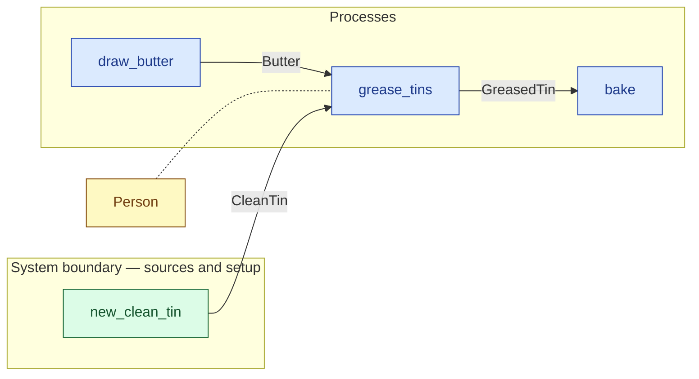

# `grease_tins` — process (R1)

> Generated by `tools/docgen.sh` from `model/cs6-bread-batch` — **do not hand-edit**; regenerate after any model change. Links are into the defining source lines; Mermaid nodes carry absolute click urls, the legend table the same links as plain markdown.

**P4 — Grease the tins (SPEC.md §5 P4, line 125): 12 g of butter, 6 g per tin, turns the two clean tins into greased ones — independent of P1–P3, the flow's only ordering freedom (SPEC.md §6).**

- **Crate / subsystem:** `cs6-bread-batch` — case study CS-6: baking a batch of bread
- **Source:** [model/cs6-bread-batch/src/resources.rs#L918](/model/cs6-bread-batch/src/resources.rs#L918)

## Who and with what

| Actor | Type | Budget at entry | This step's adjacent draw (F-048) |
|---|---|---|---|
| `person` | `Person` | `B` (caller-stated) | 120000 ms |

## Inputs

| Parameter | Declared type | Resource kind | Unit | Magnitude |
|---|---|---|---|---|
| `person` | `Person<B>` | reusable (model-core, R2/R15) | ms | `B` (caller-stated) |
| `clean_tin_1` | `CleanTin<450>` | continuous (container, R15) | grams | 450 |
| `clean_tin_2` | `CleanTin<450>` | continuous (container, R15) | grams | 450 |
| `butter` | `Butter<12>` | continuous (container, R15) | grams | 12 |

Observed entering this step in the traced flows: `Butter 12 grams`, `CleanTin 450 grams`, `Person 2100000 ms`, `Person 7200000 ms`.

## Outputs

| Output | Resource kind | Unit | Magnitude | Routing (who takes it) |
|---|---|---|---|---|
| `Person<B>` | reusable (model-core, R2/R15) | ms | `B` (caller-stated) | moved in and returned (R2) |
| `GreasedTin<456>` | continuous (container, R15) | grams | 456 | `bake` (process) |
| `GreasedTin<456>` | continuous (container, R15) | grams | 456 | `bake` (process) |

Observed leaving this step in the traced flows: `GreasedTin 456 grams`, `Person 2100000 ms`, `Person 7200000 ms`.

## Balances (R1/R3/R15)

- **Compile-time assert:** `2 * CleanTin::<450>::VALUE + Butter::<12>::VALUE == 2 * GreasedTin::<456>::VALUE`
  - message: *mass conservation violated in grease_tins (SPEC.md §5 P4 line 131): mass 450 + 450 + 12 = 456 + 456 (assert)*
  - fires at monomorphization (F-001): `cargo build`/`cargo test` catch a violation; `cargo check` and editor diagnostics do not.
- **Structural:** the const parameter `B` appears in an input and an output — the magnitude flows through unchanged, checked by the shared type parameter (no assert needed).

## Where it fits (R9: needs / feeds)

The model states **connections, not sequences**: any order satisfying these dependencies is valid (R9).

**Needs:**

- **Butter** from `draw_butter` (process)
- **CleanTin** from `new_clean_tin` (boundary source)
- `Person` (shared resource) — threaded through, returned (R2)

**Feeds:**

- **GreasedTin** to `bake` (process)

## Neighbourhood (one hop)

### Legend — node → source

| Node | Kind | Defined at |
|---|---|---|
| `n_draw_butter` (draw_butter) | process | [model/cs6-bread-batch/src/resources.rs#L825](/model/cs6-bread-batch/src/resources.rs#L825) |
| `n_grease_tins` (grease_tins) | process | [model/cs6-bread-batch/src/resources.rs#L918](/model/cs6-bread-batch/src/resources.rs#L918) |
| `n_bake` (bake) | process | [model/cs6-bread-batch/src/resources.rs#L998](/model/cs6-bread-batch/src/resources.rs#L998) |
| `n_new_clean_tin` (new_clean_tin) | boundary source | [model/cs6-bread-batch/src/resources.rs#L608](/model/cs6-bread-batch/src/resources.rs#L608) |
| `n_Person` (Person) | shared resource | — |
