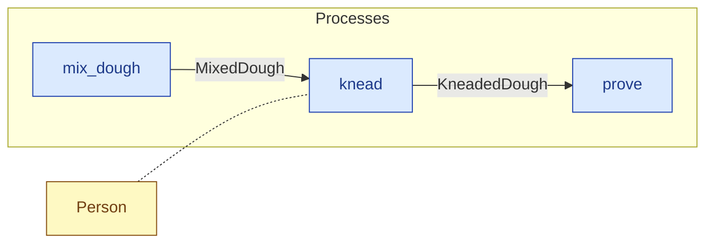

# `knead` — process (R1)

> Generated by `tools/docgen.sh` from `model/cs6-bread-batch` — **do not hand-edit**; regenerate after any model change. Links are into the defining source lines; Mermaid nodes carry absolute click urls, the legend table the same links as plain markdown.

**P2 — Knead (SPEC.md §5 P2, line 109): a pure state change — the 1_682 g batch is unchanged in mass (structural).**

- **Crate / subsystem:** `cs6-bread-batch` — case study CS-6: baking a batch of bread
- **Source:** [model/cs6-bread-batch/src/resources.rs#L878](/model/cs6-bread-batch/src/resources.rs#L878)

## Who and with what

| Actor | Type | Budget at entry | This step's adjacent draw (F-048) |
|---|---|---|---|
| `person` | `Person` | `B` (caller-stated) | 600000 ms |

## Inputs

| Parameter | Declared type | Resource kind | Unit | Magnitude |
|---|---|---|---|---|
| `person` | `Person<B>` | reusable (model-core, R2/R15) | ms | `B` (caller-stated) |
| `mixed_dough` | `MixedDough` | discrete (consumable, R13) | — | — |

Observed entering this step in the traced flows: `MixedDough`, `Person 6180000 ms`, `Person 6300000 ms`.

## Outputs

| Output | Resource kind | Unit | Magnitude | Routing (who takes it) |
|---|---|---|---|---|
| `Person<B>` | reusable (model-core, R2/R15) | ms | `B` (caller-stated) | moved in and returned (R2) |
| `KneadedDough` | discrete (consumable, R13) | — | — | `prove` (process) |

Observed leaving this step in the traced flows: `KneadedDough`, `Person 6180000 ms`, `Person 6300000 ms`.

## Balances (R1/R3/R15)

- **Structural:** the const parameter `B` appears in an input and an output — the magnitude flows through unchanged, checked by the shared type parameter (no assert needed).

## Where it fits (R9: needs / feeds)

The model states **connections, not sequences**: any order satisfying these dependencies is valid (R9).

**Needs:**

- **MixedDough** from `mix_dough` (process)
- `Person` (shared resource) — threaded through, returned (R2)

**Feeds:**

- **KneadedDough** to `prove` (process)

## Neighbourhood (one hop)

### Legend — node → source

| Node | Kind | Defined at |
|---|---|---|
| `n_mix_dough` (mix_dough) | process | [model/cs6-bread-batch/src/resources.rs#L845](/model/cs6-bread-batch/src/resources.rs#L845) |
| `n_knead` (knead) | process | [model/cs6-bread-batch/src/resources.rs#L878](/model/cs6-bread-batch/src/resources.rs#L878) |
| `n_prove` (prove) | process | [model/cs6-bread-batch/src/resources.rs#L897](/model/cs6-bread-batch/src/resources.rs#L897) |
| `n_Person` (Person) | shared resource | — |
