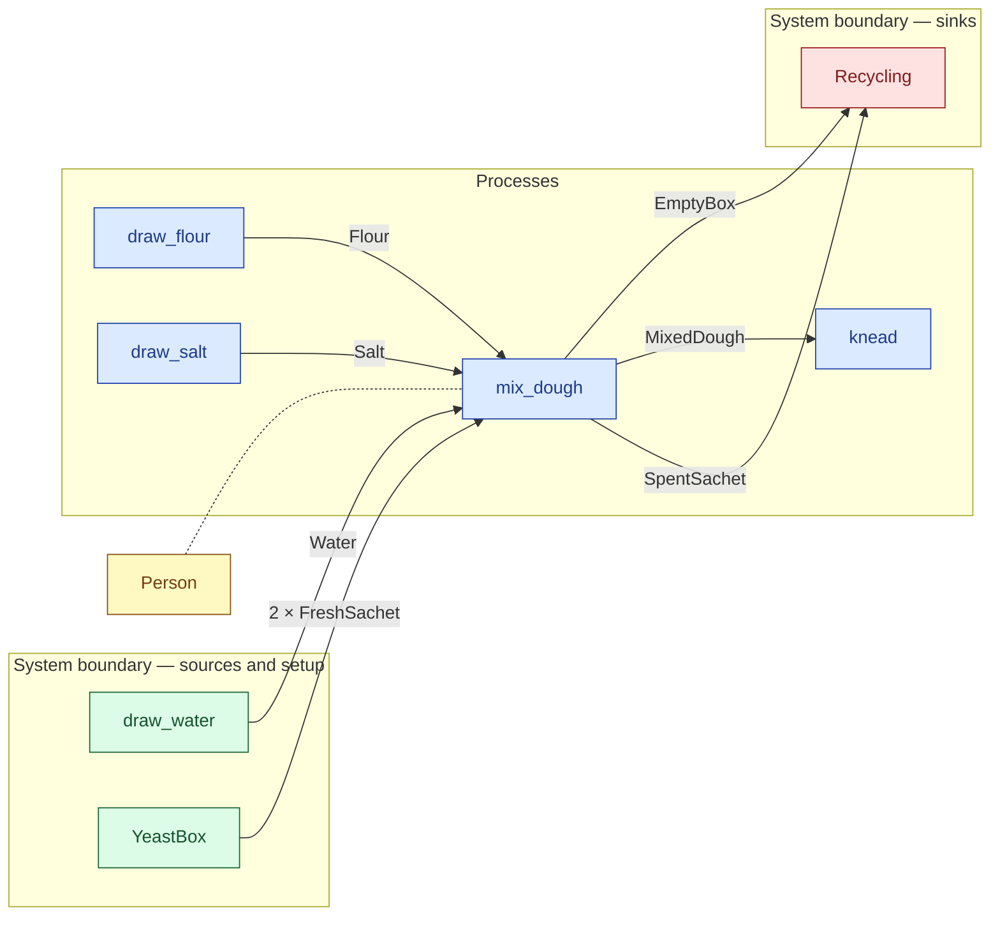

# `mix_dough` — process (R1)

> Generated by `tools/docgen.sh` from `model/cs6-bread-batch` — **do not hand-edit**; regenerate after any model change. Links are into the defining source lines; Mermaid nodes carry absolute click urls, the legend table the same links as plain markdown.

**P1 — Mix the dough (SPEC.md §5 P1, line 95): the drawn flour, water and salt plus both sachets' yeast become the 1_682 g mixed batch, and taking both sachets exhausts the box.**

- **Crate / subsystem:** `cs6-bread-batch` — case study CS-6: baking a batch of bread
- **Source:** [model/cs6-bread-batch/src/resources.rs#L845](/model/cs6-bread-batch/src/resources.rs#L845)

## Who and with what

| Actor | Type | Budget at entry | This step's adjacent draw (F-048) |
|---|---|---|---|
| `person` | `Person` | `B` (caller-stated) | 900000 ms |

Boundary objects used:

- `yeast_box` supplies **2 × FreshSachet** from `YeastBox` — [model/cs6-bread-batch/src/resources.rs#L433](/model/cs6-bread-batch/src/resources.rs#L433) (SupplyN bound, R12)

## Inputs

| Parameter | Declared type | Resource kind | Unit | Magnitude |
|---|---|---|---|---|
| `person` | `Person<B>` | reusable (model-core, R2/R15) | ms | `B` (caller-stated) |
| `flour` | `Flour<1_000>` | continuous (container, R15) | grams | 1000 |
| `water` | `Water<650>` | continuous (container, R15) | grams | 650 |
| `salt` | `Salt<18>` | continuous (container, R15) | grams | 18 |
| `yeast_box` | supplier of 2 × FreshSachet | boundary object (R12) | — | — |

Observed entering this step in the traced flows: `Flour 1000 grams`, `FullYeastBox`, `Person 7080000 ms`, `Person 7200000 ms`, `Salt 18 grams`, `Water 650 grams`.

## Outputs

| Output | Resource kind | Unit | Magnitude | Routing (who takes it) |
|---|---|---|---|---|
| `Person<B>` | reusable (model-core, R2/R15) | ms | `B` (caller-stated) | moved in and returned (R2) |
| `MixedDough` | discrete (consumable, R13) | — | — | `knead` (process) |
| `SpentSachet` | discrete (consumable, R13) | — | — | `Recycling` (boundary sink) |
| `SpentSachet` | discrete (consumable, R13) | — | — | `Recycling` (boundary sink) |
| `EmptyBox` | discrete (consumable, R13) | — | — | `Recycling` (boundary sink) |

Observed leaving this step in the traced flows: `EmptyBox`, `MixedDough`, `Person 7080000 ms`, `Person 7200000 ms`, `SpentSachet`.

## Balances (R1/R3/R15)

- **Compile-time assert:** `Flour::<1_000>::VALUE + Water::<650>::VALUE + Salt::<18>::VALUE + 2 * FreshSachet::MASS_G + EmptyBox::MASS_G == MixedDough::MASS_G + 2 * SpentSachet::MASS_G + EmptyBox::MASS_G`
  - message: *mass conservation violated in mix_dough (SPEC.md §5 P1 line 105): mass 1_000 + 650 + 18 + 8 + 8 + 30 = 1_682 + 1 + 1 + 30 (assert)*
  - fires at monomorphization (F-001): `cargo build`/`cargo test` catch a violation; `cargo check` and editor diagnostics do not.
- **Structural:** the const parameter `B` appears in an input and an output — the magnitude flows through unchanged, checked by the shared type parameter (no assert needed).

## Where it fits (R9: needs / feeds)

The model states **connections, not sequences**: any order satisfying these dependencies is valid (R9).

**Needs:**

- **2 × FreshSachet** from `YeastBox` (boundary source)
- **Flour** from `draw_flour` (process)
- **Salt** from `draw_salt` (process)
- **Water** from `draw_water` (boundary source)
- `Person` (shared resource) — threaded through, returned (R2)

**Feeds:**

- **EmptyBox** to `Recycling` (boundary sink)
- **MixedDough** to `knead` (process)
- **SpentSachet** to `Recycling` (boundary sink)

## Neighbourhood (one hop)

### Legend — node → source

| Node | Kind | Defined at |
|---|---|---|
| `n_draw_flour` (draw_flour) | process | [model/cs6-bread-batch/src/resources.rs#L809](/model/cs6-bread-batch/src/resources.rs#L809) |
| `n_draw_salt` (draw_salt) | process | [model/cs6-bread-batch/src/resources.rs#L817](/model/cs6-bread-batch/src/resources.rs#L817) |
| `n_mix_dough` (mix_dough) | process | [model/cs6-bread-batch/src/resources.rs#L845](/model/cs6-bread-batch/src/resources.rs#L845) |
| `n_knead` (knead) | process | [model/cs6-bread-batch/src/resources.rs#L878](/model/cs6-bread-batch/src/resources.rs#L878) |
| `n_Recycling` (Recycling) | boundary sink | [model/cs6-bread-batch/src/resources.rs#L563](/model/cs6-bread-batch/src/resources.rs#L563) |
| `n_draw_water` (draw_water) | boundary source | [model/cs6-bread-batch/src/resources.rs#L624](/model/cs6-bread-batch/src/resources.rs#L624) |
| `n_YeastBox` (YeastBox) | boundary source | [model/cs6-bread-batch/src/resources.rs#L433](/model/cs6-bread-batch/src/resources.rs#L433) |
| `n_Person` (Person) | shared resource | — |
