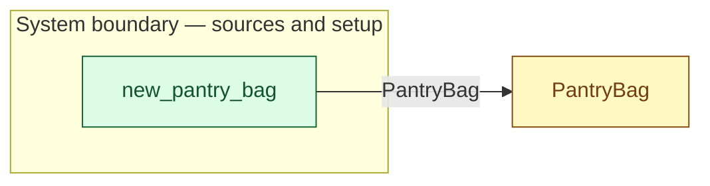

# `new_pantry_bag` — boundary function (R12)

> Generated by `tools/docgen.sh` from `model/cs6-bread-batch` — **do not hand-edit**; regenerate after any model change. Links are into the defining source lines; Mermaid nodes carry absolute click urls, the legend table the same links as plain markdown.

**The PantryBag enters the model full (R12): a bounded continuous source with remainder, capacity 1_500 (SPEC.md §4 line 69).**

- **Crate / subsystem:** `cs6-bread-batch` — case study CS-6: baking a batch of bread
- **Source:** [model/cs6-bread-batch/src/resources.rs#L648](/model/cs6-bread-batch/src/resources.rs#L648)
- **Placeholder:** vendor/stock not modelled (SPEC.md §4).

## Who and with what

No person in this signature: any time cost is drawn by an **adjacent** draw process in the flow (R15/F-048), or the step needs no actor.

## Inputs

| Parameter | Declared type | Resource kind | Unit | Magnitude |
|---|---|---|---|---|

## Outputs

| Output | Resource kind | Unit | Magnitude | Routing (who takes it) |
|---|---|---|---|---|
| `PantryBag<1_500>` | continuous (container, R15) | grams remaining | 1500 | `PantryBag` (shared resource) |

## Where it fits (R9: needs / feeds)

The model states **connections, not sequences**: any order satisfying these dependencies is valid (R9).

**Feeds:**

- **PantryBag** to `PantryBag` (shared resource)

## Neighbourhood (one hop)

### Legend — node → source

| Node | Kind | Defined at |
|---|---|---|
| `n_PantryBag` (PantryBag) | shared resource | [model/cs6-bread-batch/src/resources.rs#L332](/model/cs6-bread-batch/src/resources.rs#L332) |
| `n_new_pantry_bag` (new_pantry_bag) | boundary source | [model/cs6-bread-batch/src/resources.rs#L648](/model/cs6-bread-batch/src/resources.rs#L648) |

## Open items (`Placeholder:` tags, R12)

- this function is itself a placeholder (see the header above)
