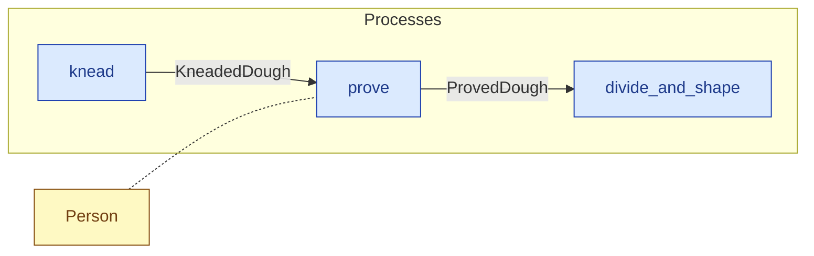

# `prove` — process (R1)

> Generated by `tools/docgen.sh` from `model/cs6-bread-batch` — **do not hand-edit**; regenerate after any model change. Links are into the defining source lines; Mermaid nodes carry absolute click urls, the legend table the same links as plain markdown.

**P3 — Prove (SPEC.md §5 P3, line 117): the attended proving hour as a pure state change — the mass is unchanged (structural); the person's 3_600_000 ms draw (adjacent in the flow, F-048, recorded to the History under this process's name) stands in for the elapsed hour — wall-clock time is out of scope (SPEC.md §1).**

- **Crate / subsystem:** `cs6-bread-batch` — case study CS-6: baking a batch of bread
- **Source:** [model/cs6-bread-batch/src/resources.rs#L897](/model/cs6-bread-batch/src/resources.rs#L897)

## Who and with what

| Actor | Type | Budget at entry | This step's adjacent draw (F-048) |
|---|---|---|---|
| `person` | `Person` | `B` (caller-stated) | 3600000 ms |

## Inputs

| Parameter | Declared type | Resource kind | Unit | Magnitude |
|---|---|---|---|---|
| `person` | `Person<B>` | reusable (model-core, R2/R15) | ms | `B` (caller-stated) |
| `kneaded_dough` | `KneadedDough` | discrete (consumable, R13) | — | — |

Observed entering this step in the traced flows: `KneadedDough`, `Person 5580000 ms`, `Person 5700000 ms`.

## Outputs

| Output | Resource kind | Unit | Magnitude | Routing (who takes it) |
|---|---|---|---|---|
| `Person<B>` | reusable (model-core, R2/R15) | ms | `B` (caller-stated) | moved in and returned (R2) |
| `ProvedDough` | discrete (consumable, R13) | — | — | `divide_and_shape` (process) |

Observed leaving this step in the traced flows: `Person 5580000 ms`, `Person 5700000 ms`, `ProvedDough`.

## Balances (R1/R3/R15)

- **Structural:** the const parameter `B` appears in an input and an output — the magnitude flows through unchanged, checked by the shared type parameter (no assert needed).

## Where it fits (R9: needs / feeds)

The model states **connections, not sequences**: any order satisfying these dependencies is valid (R9).

**Needs:**

- **KneadedDough** from `knead` (process)
- `Person` (shared resource) — threaded through, returned (R2)

**Feeds:**

- **ProvedDough** to `divide_and_shape` (process)

## Neighbourhood (one hop)

### Legend — node → source

| Node | Kind | Defined at |
|---|---|---|
| `n_knead` (knead) | process | [model/cs6-bread-batch/src/resources.rs#L878](/model/cs6-bread-batch/src/resources.rs#L878) |
| `n_prove` (prove) | process | [model/cs6-bread-batch/src/resources.rs#L897](/model/cs6-bread-batch/src/resources.rs#L897) |
| `n_divide_and_shape` (divide_and_shape) | process | [model/cs6-bread-batch/src/resources.rs#L948](/model/cs6-bread-batch/src/resources.rs#L948) |
| `n_Person` (Person) | shared resource | — |
