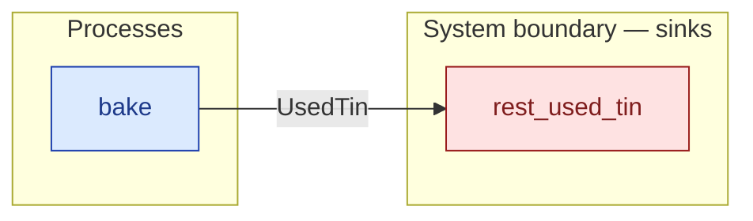

# `rest_used_tin` — boundary function (R12)

> Generated by `tools/docgen.sh` from `model/cs6-bread-batch` — **do not hand-edit**; regenerate after any model change. Links are into the defining source lines; Mermaid nodes carry absolute click urls, the legend table the same links as plain markdown.

**Flow-end rest for UsedTin (R12 exit): the §6 account leaves it resting at the boundary ("everything accounted"), and an integration test cannot hold a tripwired resource past its end — the accounted counterpart of a constructor (the CS-2 `take_wallet_home` shape).**

- **Crate / subsystem:** `cs6-bread-batch` — case study CS-6: baking a batch of bread
- **Source:** [model/cs6-bread-batch/src/resources.rs#L776](/model/cs6-bread-batch/src/resources.rs#L776)

## Who and with what

No person in this signature: any time cost is drawn by an **adjacent** draw process in the flow (R15/F-048), or the step needs no actor.

## Inputs

| Parameter | Declared type | Resource kind | Unit | Magnitude |
|---|---|---|---|---|
| `resting` | `UsedTin<C0>` | continuous (container, R15) | grams | `C0` (caller-stated) |

## Outputs

| Output | Resource kind | Unit | Magnitude | Routing (who takes it) |
|---|---|---|---|---|

## Where it fits (R9: needs / feeds)

The model states **connections, not sequences**: any order satisfying these dependencies is valid (R9).

**Needs:**

- **UsedTin** from `bake` (process)

## Neighbourhood (one hop)

### Legend — node → source

| Node | Kind | Defined at |
|---|---|---|
| `n_bake` (bake) | process | [model/cs6-bread-batch/src/resources.rs#L998](/model/cs6-bread-batch/src/resources.rs#L998) |
| `n_rest_used_tin` (rest_used_tin) | boundary sink | [model/cs6-bread-batch/src/resources.rs#L776](/model/cs6-bread-batch/src/resources.rs#L776) |
