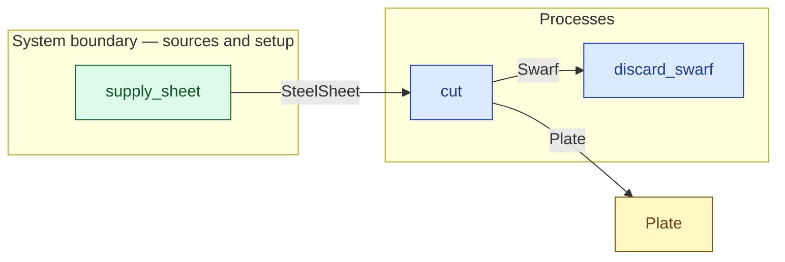

# `cut` — process (R1)

> Generated by `tools/docgen.sh` from `model/pilot-workshop` — **do not hand-edit**; regenerate after any model change. Links are into the defining source lines; Mermaid nodes carry absolute click urls, the legend table the same links as plain markdown.

**Cuts a steel sheet into two plate blanks plus swarf (R1, R3).**

- **Crate / subsystem:** `pilot-workshop` — the downstream pilot model
- **Source:** [model/pilot-workshop/src/resources.rs#L585](/model/pilot-workshop/src/resources.rs#L585)

## Who and with what

No person in this signature: any time cost is drawn by an **adjacent** draw process in the flow (R15/F-048), or the step needs no actor.

## Inputs

| Parameter | Declared type | Resource kind | Unit | Magnitude |
|---|---|---|---|---|
| `sheet` | `SteelSheet<SHEET>` | continuous (container, R15) | grams | `SHEET` (caller-stated) |

Observed entering this step in the traced flows: `SteelSheet 2000 grams`.

## Outputs

| Output | Resource kind | Unit | Magnitude | Routing (who takes it) |
|---|---|---|---|---|
| `Plate<PA>` | continuous (container, R15) | grams | `PA` (caller-stated) | `Plate` (shared resource) |
| `Plate<PB>` | continuous (container, R15) | grams | `PB` (caller-stated) | `Plate` (shared resource) |
| `Swarf<SW>` | continuous (container, R15) | grams | `SW` (caller-stated) | `discard_swarf` (process) |

Observed leaving this step in the traced flows: `Plate 900 grams`, `Swarf 200 grams`.

## Balances (R1/R3/R15)

- **Compile-time assert:** `PA + PB + SW == SHEET`
  - message: *mass conservation violated in cut (R3): the two plates plus the swarf must sum exactly to the sheet*
  - in numbers (observed instantiation): `900 + 900 + 200 == 2000` → 2000 = 2000 (holds)
  - fires at monomorphization (F-001): `cargo build`/`cargo test` catch a violation; `cargo check` and editor diagnostics do not.

## Where it fits (R9: needs / feeds)

The model states **connections, not sequences**: any order satisfying these dependencies is valid (R9).

**Needs:**

- **SteelSheet** from `supply_sheet` (boundary source)

**Feeds:**

- **Plate** to `Plate` (shared resource)
- **Swarf** to `discard_swarf` (process)

## Neighbourhood (one hop)

### Legend — node → source

| Node | Kind | Defined at |
|---|---|---|
| `n_cut` (cut) | process | [model/pilot-workshop/src/resources.rs#L585](/model/pilot-workshop/src/resources.rs#L585) |
| `n_discard_swarf` (discard_swarf) | process | [model/pilot-workshop/src/resources.rs#L821](/model/pilot-workshop/src/resources.rs#L821) |
| `n_Plate` (Plate) | shared resource | [model/pilot-workshop/src/resources.rs#L47](/model/pilot-workshop/src/resources.rs#L47) |
| `n_supply_sheet` (supply_sheet) | boundary source | [model/pilot-workshop/src/resources.rs#L424](/model/pilot-workshop/src/resources.rs#L424) |
