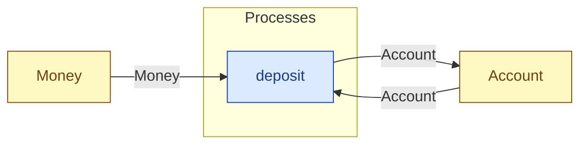

# `deposit` — process (R1)

> Generated by `tools/docgen.sh` from `model/pilot-workshop` — **do not hand-edit**; regenerate after any model change. Links are into the defining source lines; Mermaid nodes carry absolute click urls, the legend table the same links as plain markdown.

**Banks cash into an account (R3 combine, caller-stated total, F-022):**

- **Crate / subsystem:** `pilot-workshop` — the downstream pilot model
- **Source:** [model/pilot-workshop/src/money.rs#L181](/model/pilot-workshop/src/money.rs#L181)

## Who and with what

No person in this signature: any time cost is drawn by an **adjacent** draw process in the flow (R15/F-048), or the step needs no actor.

## Inputs

| Parameter | Declared type | Resource kind | Unit | Magnitude |
|---|---|---|---|---|
| `account` | `Account<BALANCE>` | continuous (container, R15) | pence remaining | `BALANCE` (caller-stated) |
| `cash` | `Money<ADD>` | continuous (container, R15) | pence | `ADD` (caller-stated) |

Observed entering this step in the traced flows: `Account 500 pence`, `Money 100 pence`.

## Outputs

| Output | Resource kind | Unit | Magnitude | Routing (who takes it) |
|---|---|---|---|---|
| `Account<NEW>` | continuous (container, R15) | pence remaining | `NEW` (caller-stated) | `Account` (shared resource) |

Observed leaving this step in the traced flows: `Account 600 pence`.

## Balances (R1/R3/R15)

- **Compile-time assert:** `BALANCE + ADD == NEW`
  - message: *money conservation violated in deposit (R3/R19): BALANCE + ADD must equal NEW - is the stated new balance wrong?*
  - in numbers (observed instantiation): `500 + 100 == 600` → 600 = 600 (holds)
  - fires at monomorphization (F-001): `cargo build`/`cargo test` catch a violation; `cargo check` and editor diagnostics do not.

## Where it fits (R9: needs / feeds)

The model states **connections, not sequences**: any order satisfying these dependencies is valid (R9).

**Needs:**

- **Account** from `Account` (shared resource)
- **Money** from `Money` (shared resource)

**Feeds:**

- **Account** to `Account` (shared resource)

## Neighbourhood (one hop)

### Legend — node → source

| Node | Kind | Defined at |
|---|---|---|
| `n_deposit` (deposit) | process | [model/pilot-workshop/src/money.rs#L181](/model/pilot-workshop/src/money.rs#L181) |
| `n_Account` (Account) | shared resource | [model/pilot-workshop/src/money.rs#L54](/model/pilot-workshop/src/money.rs#L54) |
| `n_Money` (Money) | shared resource | [model/pilot-workshop/src/money.rs#L45](/model/pilot-workshop/src/money.rs#L45) |
