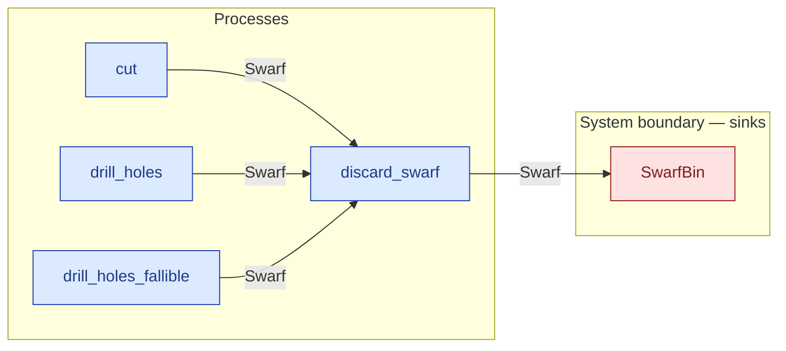

# `discard_swarf` — process (R1)

> Generated by `tools/docgen.sh` from `model/pilot-workshop` — **do not hand-edit**; regenerate after any model change. Links are into the defining source lines; Mermaid nodes carry absolute click urls, the legend table the same links as plain markdown.

**Hands one piece of swarf to a dedicated swarf waste consumer — the only sanctioned route for swarf out of a flow, and the process form of REQ-003.**

- **Crate / subsystem:** `pilot-workshop` — the downstream pilot model
- **Source:** [model/pilot-workshop/src/resources.rs#L820](/model/pilot-workshop/src/resources.rs#L820)
- **Requirements bound on the signature:** REQ-003

## Who and with what

No person in this signature: any time cost is drawn by an **adjacent** draw process in the flow (R15/F-048), or the step needs no actor.

## Inputs

| Parameter | Declared type | Resource kind | Unit | Magnitude |
|---|---|---|---|---|
| `consumer` | consumer of Swarf (sink `SwarfBin`) | boundary object (R12) | — | — |
| `swarf` | `Swarf<G>` | continuous (container, R15) | grams | `G` (caller-stated) |

Observed entering this step in the traced flows: `Swarf 20 grams`, `Swarf 200 grams`, `SwarfBin`, `SwarfBin 2`, `SwarfBin 3`.

## Outputs

| Output | Resource kind | Unit | Magnitude | Routing (who takes it) |
|---|---|---|---|---|
| `C::Next` | — | — | — | the same boundary object, returned in its advanced state (R2/R12) |

Waste routed **inside** this process (never loose in a flow):

- `consumer` is a consumer parameter: **Swarf** is handed to `SwarfBin` **inside this process** (Consumer/ConsumeList bound, R12) — [model/pilot-workshop/src/resources.rs#L333](/model/pilot-workshop/src/resources.rs#L333)

Observed leaving this step in the traced flows: `BinAfterOneSwarf`, `BinAfterTwoSwarf`, `SwarfBin`.

## Requirements (R10 — the compliance matrix)

| Requirement | Statement | Defined at | Satisfied by | Verified by |
|---|---|---|---|---|
| REQ-003 | All swarf must reach a dedicated swarf waste consumer. | [model/pilot-workshop/src/requirements.rs#L53](/model/pilot-workshop/src/requirements.rs#L53) | `SwarfBin` | [`swarf_bin_keeps_swarf_until_disposal`](/model/pilot-workshop/src/resources.rs#L1042), [`converging_flow_success_arm`](/model/pilot-workshop/tests/fallible_flows.rs#L37), [`converging_flow_failure_arm`](/model/pilot-workshop/tests/fallible_flows.rs#L68), [`retry_flow_first_try_success_returns_the_reserves`](/model/pilot-workshop/tests/fallible_flows.rs#L95), [`retry_flow_fail_then_success_recovers`](/model/pilot-workshop/tests/fallible_flows.rs#L141), [`retry_flow_gives_up_after_the_bounded_rework`](/model/pilot-workshop/tests/fallible_flows.rs#L181), [`flow_order_a_type_checks_and_accounts_for_everything`](/model/pilot-workshop/tests/flows.rs#L55), [`flow_order_b_type_checks_and_accounts_for_everything`](/model/pilot-workshop/tests/flows.rs#L136), [`abandoned_swarf_trips_the_tripwire`](/model/pilot-workshop/tests/flows.rs#L185), [`fixtures_construct_sealed_resources_for_downstream_tests`](/model/pilot-workshop/tests/flows.rs#L222) |

## Where it fits (R9: needs / feeds)

The model states **connections, not sequences**: any order satisfying these dependencies is valid (R9).

**Needs:**

- **Swarf** from `cut` (process)
- **Swarf** from `drill_holes_fallible` (process)
- **Swarf** from `drill_holes` (process)

**Feeds:**

- **Swarf** to `SwarfBin` (boundary sink)

## Neighbourhood (one hop)

### Legend — node → source

| Node | Kind | Defined at |
|---|---|---|
| `n_cut` (cut) | process | [model/pilot-workshop/src/resources.rs#L584](/model/pilot-workshop/src/resources.rs#L584) |
| `n_drill_holes` (drill_holes) | process | [model/pilot-workshop/src/resources.rs#L668](/model/pilot-workshop/src/resources.rs#L668) |
| `n_drill_holes_fallible` (drill_holes_fallible) | process | [model/pilot-workshop/src/resources.rs#L747](/model/pilot-workshop/src/resources.rs#L747) |
| `n_discard_swarf` (discard_swarf) | process | [model/pilot-workshop/src/resources.rs#L820](/model/pilot-workshop/src/resources.rs#L820) |
| `n_SwarfBin` (SwarfBin) | boundary sink | [model/pilot-workshop/src/resources.rs#L333](/model/pilot-workshop/src/resources.rs#L333) |

## Open items (`Placeholder:` tags, R12)

- `SwarfBin` — generic swarf bin — refine to a named scrap-metal stream. ([model/pilot-workshop/src/resources.rs#L333](/model/pilot-workshop/src/resources.rs#L333))
