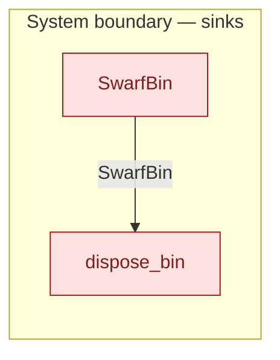

# `dispose_bin` — boundary function (R12)

> Generated by `tools/docgen.sh` from `model/pilot-workshop` — **do not hand-edit**; regenerate after any model change. Links are into the defining source lines; Mermaid nodes carry absolute click urls, the legend table the same links as plain markdown.

**A bin — in any fill state — leaves the model to waste disposal (R12):**

- **Crate / subsystem:** `pilot-workshop` — the downstream pilot model
- **Source:** [model/pilot-workshop/src/resources.rs#L535](/model/pilot-workshop/src/resources.rs#L535)
- **Placeholder:** waste-disposal service — assumed able to take any bin.

## Who and with what

No person in this signature: any time cost is drawn by an **adjacent** draw process in the flow (R15/F-048), or the step needs no actor.

Boundary objects used:

- `bin`: `SwarfBin` (boundary object (R12)), threaded by value (R2) — [model/pilot-workshop/src/resources.rs#L334](/model/pilot-workshop/src/resources.rs#L334)

## Inputs

| Parameter | Declared type | Resource kind | Unit | Magnitude |
|---|---|---|---|---|
| `bin` | `SwarfBin<Space, Contents>` | boundary object (R12) | — | — |

Observed entering this step in the traced flows: `SwarfBin`.

## Outputs

| Output | Resource kind | Unit | Magnitude | Routing (who takes it) |
|---|---|---|---|---|

## Where it fits (R9: needs / feeds)

The model states **connections, not sequences**: any order satisfying these dependencies is valid (R9).

**Needs:**

- **SwarfBin** from `SwarfBin` (boundary sink)

## Neighbourhood (one hop)

### Legend — node → source

| Node | Kind | Defined at |
|---|---|---|
| `n_SwarfBin` (SwarfBin) | boundary sink | [model/pilot-workshop/src/resources.rs#L334](/model/pilot-workshop/src/resources.rs#L334) |
| `n_dispose_bin` (dispose_bin) | boundary sink | [model/pilot-workshop/src/resources.rs#L535](/model/pilot-workshop/src/resources.rs#L535) |

## Open items (`Placeholder:` tags, R12)

- this function is itself a placeholder (see the header above)
- `SwarfBin` — generic swarf bin — refine to a named scrap-metal stream. ([model/pilot-workshop/src/resources.rs#L334](/model/pilot-workshop/src/resources.rs#L334))
