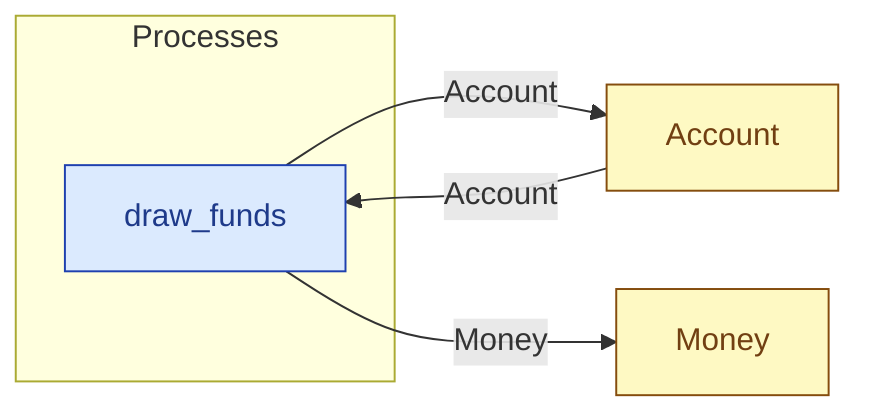

# `draw_funds` — process (R1)

> Generated by `tools/docgen.sh` from `model/pilot-workshop` — **do not hand-edit**; regenerate after any model change. Links are into the defining source lines; Mermaid nodes carry absolute click urls, the legend table the same links as plain markdown.

**Draws `TAKE` pence from an account holding `FULL`, leaving `LEFT` (R15 pattern, caller-stated remainder, F-022/F-030).**

- **Crate / subsystem:** `pilot-workshop` — the downstream pilot model
- **Source:** [model/pilot-workshop/src/money.rs#L173](/model/pilot-workshop/src/money.rs#L173)

## Who and with what

No person in this signature: any time cost is drawn by an **adjacent** draw process in the flow (R15/F-048), or the step needs no actor.

## Inputs

| Parameter | Declared type | Resource kind | Unit | Magnitude |
|---|---|---|---|---|
| `container` | `Account<FULL>` | continuous (container, R15) | pence remaining | `FULL` (caller-stated) |

Observed entering this step in the traced flows: `Account 1000 pence`.

## Outputs

| Output | Resource kind | Unit | Magnitude | Routing (who takes it) |
|---|---|---|---|---|
| `Money<TAKE>` | continuous (container, R15) | pence | `TAKE` (caller-stated) | `Money` (shared resource) |
| `Account<LEFT>` | continuous (container, R15) | pence remaining | `LEFT` (caller-stated) | `Account` (shared resource) |

Observed leaving this step in the traced flows: `Account 500 pence`, `Money 500 pence`.

## Where it fits (R9: needs / feeds)

The model states **connections, not sequences**: any order satisfying these dependencies is valid (R9).

**Needs:**

- **Account** from `Account` (shared resource)

**Feeds:**

- **Account** to `Account` (shared resource)
- **Money** to `Money` (shared resource)

## Neighbourhood (one hop)

### Legend — node → source

| Node | Kind | Defined at |
|---|---|---|
| `n_draw_funds` (draw_funds) | process | [model/pilot-workshop/src/money.rs#L173](/model/pilot-workshop/src/money.rs#L173) |
| `n_Account` (Account) | shared resource | [model/pilot-workshop/src/money.rs#L54](/model/pilot-workshop/src/money.rs#L54) |
| `n_Money` (Money) | shared resource | [model/pilot-workshop/src/money.rs#L45](/model/pilot-workshop/src/money.rs#L45) |
