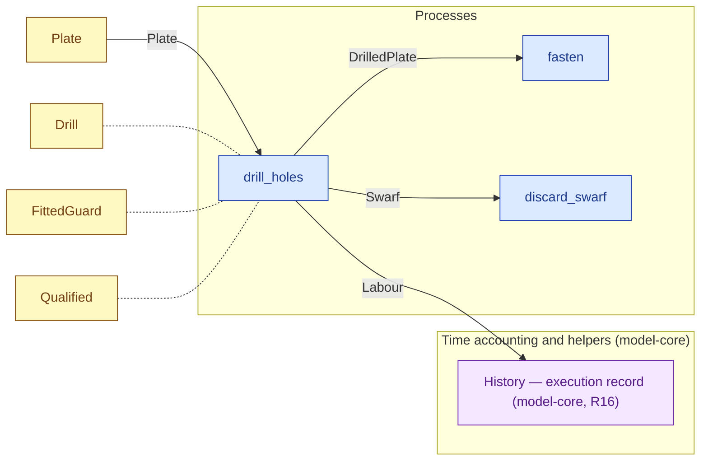

# `drill_holes` — process (R1)

> Generated by `tools/docgen.sh` from `model/pilot-workshop` — **do not hand-edit**; regenerate after any model change. Links are into the defining source lines; Mermaid nodes carry absolute click urls, the legend table the same links as plain markdown.

**Drills the bolt holes in one plate (R1, R2, R15, R18): the operator, the drill and the guard are moved in and returned; `SPEND_MS` of the operator's time budget is drawn down (model-core's `qualified_draw_time`, R15/R18) and leaves as conserved [`Labour`] that must reach a consumer; the removed material leaves as swarf (`P_LEFT + SW == PLATE`, checked at compile time).**

- **Crate / subsystem:** `pilot-workshop` — the downstream pilot model
- **Source:** [model/pilot-workshop/src/resources.rs#L669](/model/pilot-workshop/src/resources.rs#L669)
- **Requirements bound on the signature:** REQ-004, REQ-005

## Who and with what

| Actor | Type | Budget at entry | This step's adjacent draw (F-048) |
|---|---|---|---|
| `operator` | `Qualified` | `BUDGET` (caller-stated) | — (no adjacent draw found in the traced flows) |

Reusables threaded — moved in and returned (R2): `drill: Drill`, `guard: FittedGuard`.

## Inputs

| Parameter | Declared type | Resource kind | Unit | Magnitude |
|---|---|---|---|---|
| `operator` | `Qualified<DrillingCert, BUDGET>` | reusable (model-core, R2/R15) | ms | `BUDGET` (caller-stated) |
| `drill` | `Drill` | reusable (R2) | — | — |
| `guard` | `G` → `FittedGuard` (via the requirement bound) | reusable (R2) | — | — |
| `plate` | `Plate<PLATE>` | continuous (container, R15) | grams | `PLATE` (caller-stated) |

Observed entering this step in the traced flows: `Drill`, `FittedGuard`, `Plate 900 grams`, `Qualified 10000 ms`, `Qualified 8000 ms`.

## Outputs

| Output | Resource kind | Unit | Magnitude | Routing (who takes it) |
|---|---|---|---|---|
| `Qualified<DrillingCert, T_LEFT>` | reusable (model-core, R2/R15) | ms | `T_LEFT` (caller-stated) | moved in and returned (R2) |
| `Drill` | reusable (R2) | — | — | moved in and returned (R2) |
| `G` | — | — | — | moved in and returned (R2) |
| `DrilledPlate<P_LEFT>` | continuous (container, R15) | grams | `P_LEFT` (caller-stated) | `fasten` (process) |
| `Swarf<SW>` | continuous (container, R15) | grams | `SW` (caller-stated) | `discard_swarf` (process) |
| `Labour<SPEND_MS>` | — | ms | `SPEND_MS` (caller-stated) | `History — execution record (model-core, R16)` (model-core helper) |

Observed leaving this step in the traced flows: `Drill`, `DrilledPlate 880 grams`, `FittedGuard`, `Labour 2000 ms`, `Qualified 6000 ms`, `Qualified 8000 ms`, `Swarf 20 grams`.

## Balances (R1/R3/R15)

- **Compile-time assert:** `P_LEFT + SW == PLATE`
  - message: *mass conservation violated in drill_holes (R3): the drilled plate plus the swarf must sum exactly to the plate blank*
  - in numbers (observed instantiation): `880 + 20 == 900` → 900 = 900 (holds)
  - fires at monomorphization (F-001): `cargo build`/`cargo test` catch a violation; `cargo check` and editor diagnostics do not.

## Requirements (R10 — the compliance matrix)

| Requirement | Statement | Defined at | Satisfied by | Verified by |
|---|---|---|---|---|
| REQ-004 | Drilling must be performed by an operator certified for drilling. | [model/pilot-workshop/src/requirements.rs#L60](/model/pilot-workshop/src/requirements.rs#L60) | `DrillingOperator` | [`drill_holes_conserves_mass_and_draws_time`](/model/pilot-workshop/src/resources.rs#L883), [`fallible_success_arm_conserves_mass`](/model/pilot-workshop/src/resources.rs#L920), [`fallible_failure_arm_conserves_the_same_inputs`](/model/pilot-workshop/src/resources.rs#L952), [`converging_flow_success_arm`](/model/pilot-workshop/tests/fallible_flows.rs#L37), [`converging_flow_failure_arm`](/model/pilot-workshop/tests/fallible_flows.rs#L68), [`retry_flow_first_try_success_returns_the_reserves`](/model/pilot-workshop/tests/fallible_flows.rs#L95), [`retry_flow_fail_then_success_recovers`](/model/pilot-workshop/tests/fallible_flows.rs#L141), [`retry_flow_gives_up_after_the_bounded_rework`](/model/pilot-workshop/tests/fallible_flows.rs#L181), [`flow_order_a_type_checks_and_accounts_for_everything`](/model/pilot-workshop/tests/flows.rs#L55), [`flow_order_b_type_checks_and_accounts_for_everything`](/model/pilot-workshop/tests/flows.rs#L136) |
| REQ-005 | Drilling must happen behind a machine guard fitted to the drill. | [model/pilot-workshop/src/requirements.rs#L67](/model/pilot-workshop/src/requirements.rs#L67) | `DrillReadyGuard` | [`drill_holes_conserves_mass_and_draws_time`](/model/pilot-workshop/src/resources.rs#L883), [`fallible_success_arm_conserves_mass`](/model/pilot-workshop/src/resources.rs#L920), [`fallible_failure_arm_conserves_the_same_inputs`](/model/pilot-workshop/src/resources.rs#L952), [`converging_flow_success_arm`](/model/pilot-workshop/tests/fallible_flows.rs#L37), [`converging_flow_failure_arm`](/model/pilot-workshop/tests/fallible_flows.rs#L68), [`retry_flow_first_try_success_returns_the_reserves`](/model/pilot-workshop/tests/fallible_flows.rs#L95), [`retry_flow_fail_then_success_recovers`](/model/pilot-workshop/tests/fallible_flows.rs#L141), [`retry_flow_gives_up_after_the_bounded_rework`](/model/pilot-workshop/tests/fallible_flows.rs#L181), [`flow_order_a_type_checks_and_accounts_for_everything`](/model/pilot-workshop/tests/flows.rs#L55), [`flow_order_b_type_checks_and_accounts_for_everything`](/model/pilot-workshop/tests/flows.rs#L136) |

This item is doc-tagged `Satisfies: REQ-004, REQ-005`.

## Where it fits (R9: needs / feeds)

The model states **connections, not sequences**: any order satisfying these dependencies is valid (R9).

**Needs:**

- **Plate** from `Plate` (shared resource)
- `Drill` (shared resource) — threaded through, returned (R2)
- `FittedGuard` (shared resource) — threaded through, returned (R2)
- `Qualified` (shared resource) — threaded through, returned (R2)

**Feeds:**

- **DrilledPlate** to `fasten` (process)
- **Labour** to `History — execution record (model-core, R16)` (model-core helper)
- **Swarf** to `discard_swarf` (process)

## Neighbourhood (one hop)

### Legend — node → source

| Node | Kind | Defined at |
|---|---|---|
| `n_drill_holes` (drill_holes) | process | [model/pilot-workshop/src/resources.rs#L669](/model/pilot-workshop/src/resources.rs#L669) |
| `n_fasten` (fasten) | process | [model/pilot-workshop/src/resources.rs#L800](/model/pilot-workshop/src/resources.rs#L800) |
| `n_discard_swarf` (discard_swarf) | process | [model/pilot-workshop/src/resources.rs#L821](/model/pilot-workshop/src/resources.rs#L821) |
| `n_Drill` (Drill) | shared resource | [model/pilot-workshop/src/resources.rs#L82](/model/pilot-workshop/src/resources.rs#L82) |
| `n_FittedGuard` (FittedGuard) | shared resource | [model/pilot-workshop/src/resources.rs#L155](/model/pilot-workshop/src/resources.rs#L155) |
| `n_History` (History — execution record (model-core, R16)) | model-core helper | — |
| `n_Plate` (Plate) | shared resource | [model/pilot-workshop/src/resources.rs#L47](/model/pilot-workshop/src/resources.rs#L47) |
| `n_Qualified` (Qualified) | shared resource | — |
