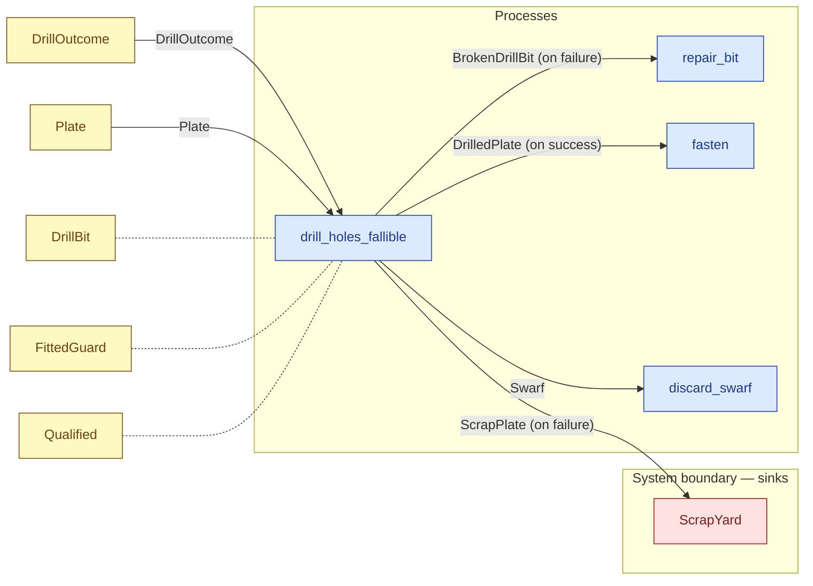

# `drill_holes_fallible` — process (R1)

> Generated by `tools/docgen.sh` from `model/pilot-workshop` — **do not hand-edit**; regenerate after any model change. Links are into the defining source lines; Mermaid nodes carry absolute click urls, the legend table the same links as plain markdown.

**Drills one plate **fallibly** (R17): returns `Ok` with the success bundle or `Err` with the failure bundle, and **both arms conserve the same inputs** — the operator and the guard come back in both arms, the plate's mass continues either as drilled-plate-plus-swarf or as scrap-plus-swarf, and the bit comes back working or broken (one type per state, R9).**

- **Crate / subsystem:** `pilot-workshop` — the downstream pilot model
- **Source:** [model/pilot-workshop/src/resources.rs#L748](/model/pilot-workshop/src/resources.rs#L748)
- **Requirements bound on the signature:** REQ-004, REQ-005

## Who and with what

| Actor | Type | Budget at entry | This step's adjacent draw (F-048) |
|---|---|---|---|
| `operator` | `Qualified` | — | 1000 ms |

Reusables threaded — moved in and returned (R2): `guard: FittedGuard`, `bit: DrillBit`.

## Inputs

| Parameter | Declared type | Resource kind | Unit | Magnitude |
|---|---|---|---|---|
| `operator` | `O` → `Qualified` (via the requirement bound) | reusable (model-core, R2/R15) | ms | — |
| `guard` | `G` → `FittedGuard` (via the requirement bound) | reusable (R2) | — | — |
| `bit` | `DrillBit` | reusable (R2) | — | — |
| `plate` | `Plate<PLATE>` | continuous (container, R15) | grams | `PLATE` (caller-stated) |
| `outcome` | `DrillOutcome` | outcome token (R17) | — | — |

Observed entering this step in the traced flows: `DrillBit`, `DrillOutcome`, `FittedGuard`, `Plate 900 grams`, `Qualified 4000 ms`, `Qualified 8000 ms`, `Qualified 9000 ms`, `guard`.

## Outputs

| Output | Resource kind | Unit | Magnitude | Routing (who takes it) |
|---|---|---|---|---|
| `DrillOk` (on success) | outcome bundle (R17 grouping, F-046) | — | — | destructured by the handling arm |
| `DrillOk.operator: O` (on success) | — | — | — | returned in the bundle |
| `DrillOk.guard: G` (on success) | — | — | — | returned in the bundle |
| `DrillOk.bit: DrillBit` (on success) | reusable (R2) | — | — | returned in the bundle |
| `DrillOk.plate: DrilledPlate` (on success) | continuous (container, R15) | grams | `P_LEFT` (caller-stated) | `fasten` (process) |
| `DrillOk.swarf: Swarf` (on success) | continuous (container, R15) | grams | `SW` (caller-stated) | `discard_swarf` (process) |
| `DrillFail` (on failure) | outcome bundle (R17 grouping, F-046) | — | — | destructured by the handling arm |
| `DrillFail.operator: O` (on failure) | — | — | — | returned in the bundle |
| `DrillFail.guard: G` (on failure) | — | — | — | returned in the bundle |
| `DrillFail.broken_bit: BrokenDrillBit` (on failure) | discrete (consumable, R13) | — | — | `repair_bit` (process) |
| `DrillFail.scrap: ScrapPlate` (on failure) | continuous (container, R15) | grams | `SCRAP` (caller-stated) | `ScrapYard` (boundary sink) |
| `DrillFail.swarf: Swarf` (on failure) | continuous (container, R15) | grams | `FSW` (caller-stated) | `discard_swarf` (process) |

Observed leaving this step in the traced flows: `BrokenDrillBit`, `DrillBit`, `DrillFail 880, 20`, `DrilledPlate 880 grams`, `FittedGuard`, `Qualified 8000 ms`, `Qualified 9000 ms`, `ScrapPlate 880 grams`, `Swarf 20 grams`, `guard`, `operator`.

## Balances (R1/R3/R15)

- **Compile-time assert:** `P_LEFT + SW == PLATE`
  - message: *success-branch mass conservation violated in drill_holes_fallible (R3, R17): the drilled plate plus its swarf must sum exactly to the plate blank*
  - in numbers (observed instantiation): `880 + 20 == 900` → 900 = 900 (holds)
  - fires at monomorphization (F-001): `cargo build`/`cargo test` catch a violation; `cargo check` and editor diagnostics do not.
- **Compile-time assert:** `SCRAP + FSW == PLATE`
  - message: *failure-branch mass conservation violated in drill_holes_fallible (R3, R17): the scrap plate plus its swarf must sum exactly to the plate blank*
  - in numbers (observed instantiation): `880 + 20 == 900` → 900 = 900 (holds)
  - fires at monomorphization (F-001): `cargo build`/`cargo test` catch a violation; `cargo check` and editor diagnostics do not.

## Requirements (R10 — the compliance matrix)

| Requirement | Statement | Defined at | Satisfied by | Verified by |
|---|---|---|---|---|
| REQ-004 | Drilling must be performed by an operator certified for drilling. | [model/pilot-workshop/src/requirements.rs#L60](/model/pilot-workshop/src/requirements.rs#L60) | `DrillingOperator` | [`drill_holes_conserves_mass_and_draws_time`](/model/pilot-workshop/src/resources.rs#L883), [`fallible_success_arm_conserves_mass`](/model/pilot-workshop/src/resources.rs#L920), [`fallible_failure_arm_conserves_the_same_inputs`](/model/pilot-workshop/src/resources.rs#L952), [`converging_flow_success_arm`](/model/pilot-workshop/tests/fallible_flows.rs#L37), [`converging_flow_failure_arm`](/model/pilot-workshop/tests/fallible_flows.rs#L68), [`retry_flow_first_try_success_returns_the_reserves`](/model/pilot-workshop/tests/fallible_flows.rs#L95), [`retry_flow_fail_then_success_recovers`](/model/pilot-workshop/tests/fallible_flows.rs#L141), [`retry_flow_gives_up_after_the_bounded_rework`](/model/pilot-workshop/tests/fallible_flows.rs#L181), [`flow_order_a_type_checks_and_accounts_for_everything`](/model/pilot-workshop/tests/flows.rs#L55), [`flow_order_b_type_checks_and_accounts_for_everything`](/model/pilot-workshop/tests/flows.rs#L136) |
| REQ-005 | Drilling must happen behind a machine guard fitted to the drill. | [model/pilot-workshop/src/requirements.rs#L67](/model/pilot-workshop/src/requirements.rs#L67) | `DrillReadyGuard` | [`drill_holes_conserves_mass_and_draws_time`](/model/pilot-workshop/src/resources.rs#L883), [`fallible_success_arm_conserves_mass`](/model/pilot-workshop/src/resources.rs#L920), [`fallible_failure_arm_conserves_the_same_inputs`](/model/pilot-workshop/src/resources.rs#L952), [`converging_flow_success_arm`](/model/pilot-workshop/tests/fallible_flows.rs#L37), [`converging_flow_failure_arm`](/model/pilot-workshop/tests/fallible_flows.rs#L68), [`retry_flow_first_try_success_returns_the_reserves`](/model/pilot-workshop/tests/fallible_flows.rs#L95), [`retry_flow_fail_then_success_recovers`](/model/pilot-workshop/tests/fallible_flows.rs#L141), [`retry_flow_gives_up_after_the_bounded_rework`](/model/pilot-workshop/tests/fallible_flows.rs#L181), [`flow_order_a_type_checks_and_accounts_for_everything`](/model/pilot-workshop/tests/flows.rs#L55), [`flow_order_b_type_checks_and_accounts_for_everything`](/model/pilot-workshop/tests/flows.rs#L136) |

This item is doc-tagged `Satisfies: REQ-004, REQ-005`.

## Where it fits (R9: needs / feeds)

The model states **connections, not sequences**: any order satisfying these dependencies is valid (R9).

**Needs:**

- **DrillOutcome** from `DrillOutcome` (shared resource)
- **Plate** from `Plate` (shared resource)
- `DrillBit` (shared resource) — threaded through, returned (R2)
- `FittedGuard` (shared resource) — threaded through, returned (R2)
- `Qualified` (shared resource) — threaded through, returned (R2)

**Feeds:**

- **BrokenDrillBit (on failure)** to `repair_bit` (process)
- **DrilledPlate (on success)** to `fasten` (process)
- **ScrapPlate (on failure)** to `ScrapYard` (boundary sink)
- **Swarf** to `discard_swarf` (process)

## Neighbourhood (one hop)

### Legend — node → source

| Node | Kind | Defined at |
|---|---|---|
| `n_repair_bit` (repair_bit) | process | [model/pilot-workshop/src/resources.rs#L619](/model/pilot-workshop/src/resources.rs#L619) |
| `n_drill_holes_fallible` (drill_holes_fallible) | process | [model/pilot-workshop/src/resources.rs#L748](/model/pilot-workshop/src/resources.rs#L748) |
| `n_fasten` (fasten) | process | [model/pilot-workshop/src/resources.rs#L800](/model/pilot-workshop/src/resources.rs#L800) |
| `n_discard_swarf` (discard_swarf) | process | [model/pilot-workshop/src/resources.rs#L821](/model/pilot-workshop/src/resources.rs#L821) |
| `n_DrillBit` (DrillBit) | shared resource | [model/pilot-workshop/src/resources.rs#L107](/model/pilot-workshop/src/resources.rs#L107) |
| `n_DrillOutcome` (DrillOutcome) | shared resource | [model/pilot-workshop/src/resources.rs#L185](/model/pilot-workshop/src/resources.rs#L185) |
| `n_FittedGuard` (FittedGuard) | shared resource | [model/pilot-workshop/src/resources.rs#L155](/model/pilot-workshop/src/resources.rs#L155) |
| `n_Plate` (Plate) | shared resource | [model/pilot-workshop/src/resources.rs#L47](/model/pilot-workshop/src/resources.rs#L47) |
| `n_ScrapYard` (ScrapYard) | boundary sink | [model/pilot-workshop/src/resources.rs#L249](/model/pilot-workshop/src/resources.rs#L249) |
| `n_Qualified` (Qualified) | shared resource | — |
