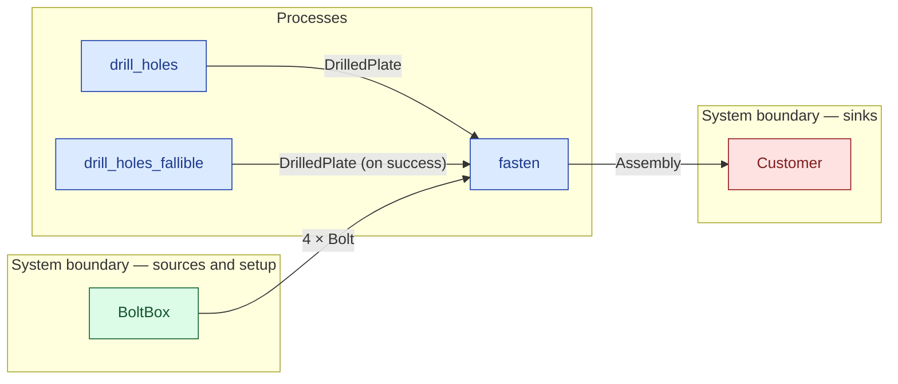

# `fasten` — process (R1)

> Generated by `tools/docgen.sh` from `model/pilot-workshop` — **do not hand-edit**; regenerate after any model change. Links are into the defining source lines; Mermaid nodes carry absolute click urls, the legend table the same links as plain markdown.

**Fastens two drilled plates into an [`Assembly`] with four bolts taken from ONE supplier in a single `SupplyN` bound (R12, F-014).**

- **Crate / subsystem:** `pilot-workshop` — the downstream pilot model
- **Source:** [model/pilot-workshop/src/resources.rs#L799](/model/pilot-workshop/src/resources.rs#L799)
- **Requirements bound on the signature:** REQ-001, REQ-002

## Who and with what

No person in this signature: any time cost is drawn by an **adjacent** draw process in the flow (R15/F-048), or the step needs no actor.

Boundary objects used:

- `bolts` supplies **4 × Bolt** from `BoltBox` — [model/pilot-workshop/src/catalogue.rs#L139](/model/pilot-workshop/src/catalogue.rs#L139) (SupplyN bound, R12)

## Inputs

| Parameter | Declared type | Resource kind | Unit | Magnitude |
|---|---|---|---|---|
| `a` | `DrilledPlate<PA>` | continuous (container, R15) | grams | `PA` (caller-stated) |
| `b` | `DrilledPlate<PB>` | continuous (container, R15) | grams | `PB` (caller-stated) |
| `bolts` | supplier of 4 × Bolt | boundary object (R12) | — | — |

Observed entering this step in the traced flows: `BoltBox`, `DrilledPlate 880 grams`.

## Outputs

| Output | Resource kind | Unit | Magnitude | Routing (who takes it) |
|---|---|---|---|---|
| `Assembly<B, OUT>` | discrete (consumable, R13) | — | `OUT` (caller-stated) | `Customer` (boundary sink) |
| `S::Rest` | — | — | — | the same boundary object, returned in its advanced state (R2/R12) |

Observed leaving this step in the traced flows: `Assembly 1760`, `EmptyBoltBox`.

## Balances (R1/R3/R15)

- **Compile-time assert:** `PA + PB == OUT`
  - message: *mass conservation violated in fasten (R3): the assembly's plate mass must sum the two drilled plates exactly*
  - fires at monomorphization (F-001): `cargo build`/`cargo test` catch a violation; `cargo check` and editor diagnostics do not.

## Requirements (R10 — the compliance matrix)

| Requirement | Statement | Defined at | Satisfied by | Verified by |
|---|---|---|---|---|
| REQ-001 | Fastening bolts must be M8 steel, 15 mm long. | [model/pilot-workshop/src/requirements.rs#L39](/model/pilot-workshop/src/requirements.rs#L39) | `FasteningBolt` | [`fasten_joins_two_drilled_plates_with_four_bolts`](/model/pilot-workshop/src/resources.rs#L1025), [`flow_order_a_type_checks_and_accounts_for_everything`](/model/pilot-workshop/tests/flows.rs#L55), [`flow_order_b_type_checks_and_accounts_for_everything`](/model/pilot-workshop/tests/flows.rs#L136) |
| REQ-002 | Plates must be drilled before they are fastened. | [model/pilot-workshop/src/requirements.rs#L46](/model/pilot-workshop/src/requirements.rs#L46) | `DrilledPlate` | [`fasten_joins_two_drilled_plates_with_four_bolts`](/model/pilot-workshop/src/resources.rs#L1025), [`flow_order_a_type_checks_and_accounts_for_everything`](/model/pilot-workshop/tests/flows.rs#L55), [`flow_order_b_type_checks_and_accounts_for_everything`](/model/pilot-workshop/tests/flows.rs#L136) |

This item is doc-tagged `Satisfies: REQ-002`.

## Where it fits (R9: needs / feeds)

The model states **connections, not sequences**: any order satisfying these dependencies is valid (R9).

**Needs:**

- **4 × Bolt** from `BoltBox` (boundary source)
- **DrilledPlate (on success)** from `drill_holes_fallible` (process)
- **DrilledPlate** from `drill_holes` (process)

**Feeds:**

- **Assembly** to `Customer` (boundary sink)

## Neighbourhood (one hop)

### Legend — node → source

| Node | Kind | Defined at |
|---|---|---|
| `n_drill_holes` (drill_holes) | process | [model/pilot-workshop/src/resources.rs#L668](/model/pilot-workshop/src/resources.rs#L668) |
| `n_drill_holes_fallible` (drill_holes_fallible) | process | [model/pilot-workshop/src/resources.rs#L747](/model/pilot-workshop/src/resources.rs#L747) |
| `n_fasten` (fasten) | process | [model/pilot-workshop/src/resources.rs#L799](/model/pilot-workshop/src/resources.rs#L799) |
| `n_Customer` (Customer) | boundary sink | [model/pilot-workshop/src/resources.rs#L377](/model/pilot-workshop/src/resources.rs#L377) |
| `n_BoltBox` (BoltBox) | boundary source | [model/pilot-workshop/src/catalogue.rs#L139](/model/pilot-workshop/src/catalogue.rs#L139) |
