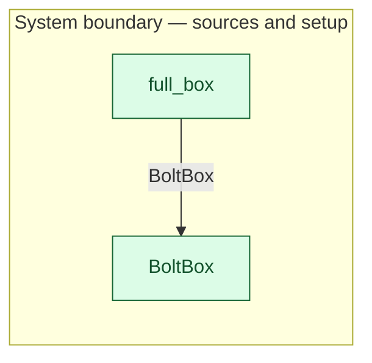

# `full_box` — boundary function (R12)

> Generated by `tools/docgen.sh` from `model/pilot-workshop` — **do not hand-edit**; regenerate after any model change. Links are into the defining source lines; Mermaid nodes carry absolute click urls, the legend table the same links as plain markdown.

**The fill function (R12): a full box of `N` real catalogue bolts of type `B` enters the model here — `full_box::<FasteningBolt, N4>()`.**

- **Crate / subsystem:** `pilot-workshop` — the downstream pilot model
- **Source:** [model/pilot-workshop/src/catalogue.rs#L229](/model/pilot-workshop/src/catalogue.rs#L229)
- **Placeholder:** generic bolt supplier — refine to a named fastener

## Who and with what

No person in this signature: any time cost is drawn by an **adjacent** draw process in the flow (R15/F-048), or the step needs no actor.

## Inputs

| Parameter | Declared type | Resource kind | Unit | Magnitude |
|---|---|---|---|---|

## Outputs

| Output | Resource kind | Unit | Magnitude | Routing (who takes it) |
|---|---|---|---|---|
| `BoltBox<BoltsOf<B, N>>` | boundary object (R12) | — | — | `BoltBox` (boundary source) |

Observed leaving this step in the traced flows: `BoltBox`.

## Where it fits (R9: needs / feeds)

The model states **connections, not sequences**: any order satisfying these dependencies is valid (R9).

**Feeds:**

- **BoltBox** to `BoltBox` (boundary source)

## Neighbourhood (one hop)

### Legend — node → source

| Node | Kind | Defined at |
|---|---|---|
| `n_BoltBox` (BoltBox) | boundary source | [model/pilot-workshop/src/catalogue.rs#L139](/model/pilot-workshop/src/catalogue.rs#L139) |
| `n_full_box` (full_box) | boundary source | [model/pilot-workshop/src/catalogue.rs#L229](/model/pilot-workshop/src/catalogue.rs#L229) |

## Open items (`Placeholder:` tags, R12)

- this function is itself a placeholder (see the header above)
- `BoltBox` — generic bolt supplier — refine to a named fastener supplier. ([model/pilot-workshop/src/catalogue.rs#L139](/model/pilot-workshop/src/catalogue.rs#L139))
