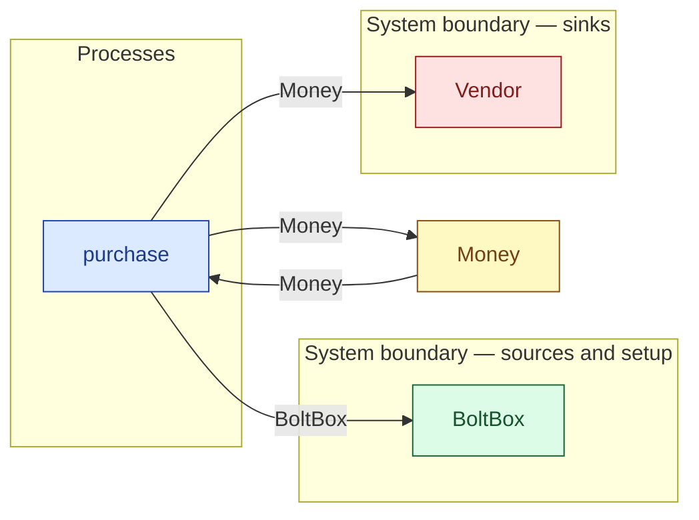

# `purchase` — process (R1)

> Generated by `tools/docgen.sh` from `model/pilot-workshop` — **do not hand-edit**; regenerate after any model change. Links are into the defining source lines; Mermaid nodes carry absolute click urls, the legend table the same links as plain markdown.

**Purchase as a process chain (R19; R12 strictness: payment is **not** part of a supplier/consumer step, so buying is its own process).**

- **Crate / subsystem:** `pilot-workshop` — the downstream pilot model
- **Source:** [model/pilot-workshop/src/money.rs#L243](/model/pilot-workshop/src/money.rs#L243)

## Who and with what

No person in this signature: any time cost is drawn by an **adjacent** draw process in the flow (R15/F-048), or the step needs no actor.

## Inputs

| Parameter | Declared type | Resource kind | Unit | Magnitude |
|---|---|---|---|---|
| `vendor` | consumer of Money (sink `Vendor`) | reusable (R2) | — | — |
| `tendered` | `Money<TENDERED>` | continuous (container, R15) | pence | `TENDERED` (caller-stated) |

Observed entering this step in the traced flows: `Money 500 pence`, `Vendor`.

## Outputs

| Output | Resource kind | Unit | Magnitude | Routing (who takes it) |
|---|---|---|---|---|
| `<V::Next as Supplier>::Item` | — | — | — | — |
| `Money<CHANGE>` | continuous (container, R15) | pence | `CHANGE` (caller-stated) | `Money` (shared resource); `Vendor` (boundary sink) |
| `<V::Next as Supplier>::Next` | — | — | — | the same boundary object, returned in its advanced state (R2/R12) |

Waste routed **inside** this process (never loose in a flow):

- `vendor` is a consumer parameter: **Money** is handed to `Vendor` **inside this process** (Consumer/ConsumeList bound, R12) — [model/pilot-workshop/src/money.rs#L77](/model/pilot-workshop/src/money.rs#L77)

Observed leaving this step in the traced flows: `BoltBox`, `Money 100 pence`, `Vendor`.

## Balances (R1/R3/R15)

- **Compile-time assert:** `TENDERED == PRICE + CHANGE`
  - message: *money conservation violated in purchase (R1/R19): TENDERED must equal PRICE + CHANGE - is the stated change wrong for this price?*
  - in numbers (observed instantiation): `500 == 400 + 100` → 500 = 500 (holds)
  - fires at monomorphization (F-001): `cargo build`/`cargo test` catch a violation; `cargo check` and editor diagnostics do not.
- **Inherited by composition:** this step calls [`split_money`](/model/pilot-workshop/src/money.rs#L200), whose conservation asserts fire at every instantiation here (F-001):
  - `A + B == IN`

## Where it fits (R9: needs / feeds)

The model states **connections, not sequences**: any order satisfying these dependencies is valid (R9).

**Needs:**

- **Money** from `Money` (shared resource)

**Feeds:**

- **BoltBox** to `BoltBox` (boundary source)
- **Money** to `Money` (shared resource)
- **Money** to `Vendor` (boundary sink)

## Neighbourhood (one hop)

### Legend — node → source

| Node | Kind | Defined at |
|---|---|---|
| `n_purchase` (purchase) | process | [model/pilot-workshop/src/money.rs#L243](/model/pilot-workshop/src/money.rs#L243) |
| `n_Money` (Money) | shared resource | [model/pilot-workshop/src/money.rs#L45](/model/pilot-workshop/src/money.rs#L45) |
| `n_Vendor` (Vendor) | boundary sink | [model/pilot-workshop/src/money.rs#L77](/model/pilot-workshop/src/money.rs#L77) |
| `n_BoltBox` (BoltBox) | boundary source | [model/pilot-workshop/src/catalogue.rs#L139](/model/pilot-workshop/src/catalogue.rs#L139) |
